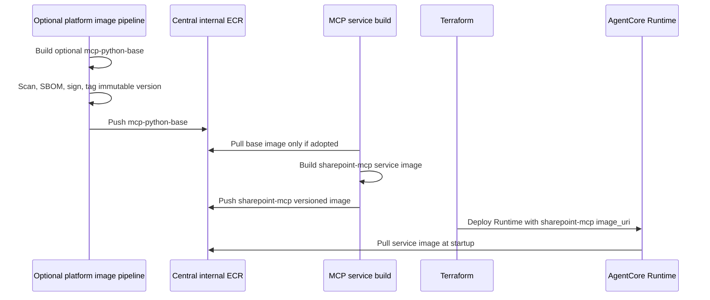
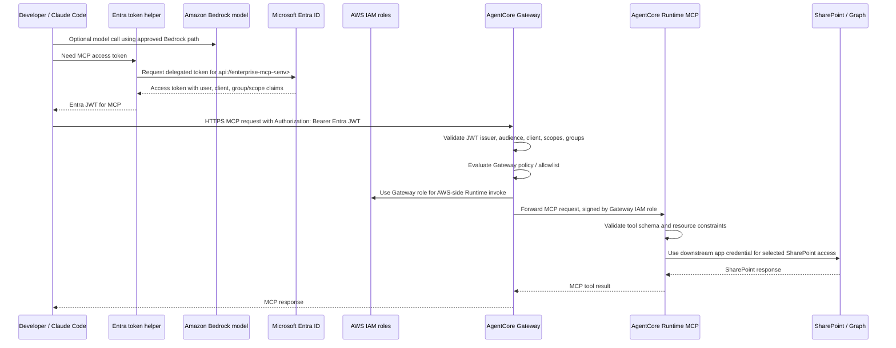
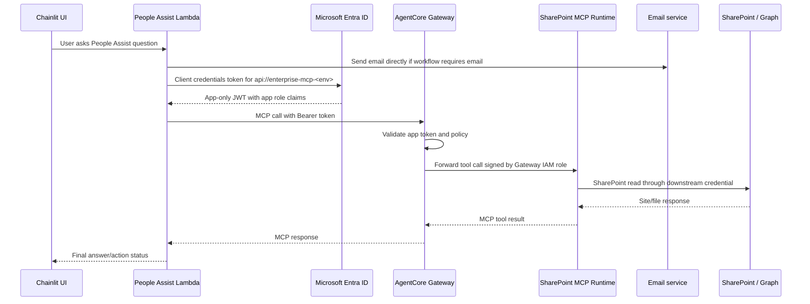

# MCP Agent Platform on AWS

This repository is the planning and proof-of-concept workspace for an
enterprise MCP platform on AWS.

Current decision: build one shared Amazon Bedrock AgentCore Gateway endpoint
configured for MCP, with separate Runtime-hosted MCP servers behind it.
SharePoint is the first enabled server. CRM, internal software, and future MCP
servers get their own folders, images, runtimes, policies, and target
registrations instead of being mixed into the SharePoint code.

## Executive Summary

- Use Amazon Bedrock AgentCore Runtime to host each MCP server container.
- Use Amazon Bedrock AgentCore Gateway as the single MCP protocol front door.
- Attach each Runtime-hosted MCP server to Gateway as an MCP server target,
  signed by the Gateway IAM role.
- Do not use CloudFront or a CDN-backed custom domain. Public-sector workloads
  should avoid global edge caching for this MCP path.
- Use the AWS-managed AgentCore Gateway URL directly, with AgentCore Gateway
  PrivateLink/private DNS for private VPC access where possible.
- Use Microsoft Entra ID JWTs for MCP caller identity. Claude Code obtains a
  delegated Entra access token and sends it to the AWS-side MCP endpoint as
  `Authorization: Bearer <token>`.
- Keep AWS IAM roles on the AWS side of the boundary for Bedrock, Gateway,
  Runtime, logging, and downstream credential access. IAM is not the credential
  Claude Code uses to call MCP.
- Let People Assist Lambda send email itself. MCP is optional for People Assist
  and should only be used when it needs governed SharePoint tool access.
- Keep every MCP server as a separate service image. A centrally owned
  `mcp-python-base` image is a good optional hardening pattern, but it is not
  required for the current PoC.
- Manage tool access through an allowlist/policy matrix as code.
- Deploy infrastructure with Terraform. The central image pipeline is out of
  scope here, but the image contract and Dockerfiles are documented.

## Terminology

There is no separate custom MCP gateway in this design.

When this repository says "gateway", it means **Amazon Bedrock AgentCore
Gateway configured with `protocol_type = "MCP"`**. AgentCore Gateway replaces
the need to build and operate our own MCP gateway/router.

The backend components are MCP servers, each hosted in its own AgentCore
Runtime. Gateway targets register those Runtime-hosted MCP servers behind the
single AgentCore Gateway URL.

When a discussion says "AWS API Gateway" for this MCP path, treat it as the
AWS-side MCP ingress unless a separate architecture decision explicitly adds the
AWS API Gateway service. In this PoC, the AWS-side ingress is AgentCore Gateway
with `CUSTOM_JWT` validation against Microsoft Entra ID.

## Target Architecture

```mermaid
flowchart LR
    subgraph Clients["MCP clients and agents"]
        Claude["Claude Code / VS Code\ngets Entra delegated JWT\nMCP bearer token"]
        Lambda["People Assist Lambda\noptional MCP caller\nemail handled locally"]
        Other["Other internal agents"]
    end

    subgraph Identity["Identity"]
        Entra["Microsoft Entra ID\nenterprise-mcp-api\nscopes/app roles/groups"]
        IAM["AWS IAM\nserver-side roles\nGateway-to-Runtime signing\nRuntime AWS access"]
    end

    subgraph Access["Private access path"]
        VPCEndpoint["Interface VPC endpoint\ncom.amazonaws.region.bedrock-agentcore.gateway\nprivate DNS enabled"]
        GatewayURL["AWS-side MCP endpoint\nAgentCore Gateway URL\nhttps://gateway-id.gateway.bedrock-agentcore.region.amazonaws.com/mcp"]
    end

    subgraph AgentCore["Amazon Bedrock AgentCore"]
        GW["AgentCore Gateway\nMCP protocol\nCUSTOM_JWT inbound auth\nPolicy engine + semantic search"]
        SPTarget["Gateway target\nsharepoint-mcp\ninvoked by Gateway IAM role"]
        CRMTarget["Gateway target\ncrm-mcp\nfuture / disabled"]
        InternalTarget["Gateway target\ninternal-software-mcp\nfuture / disabled"]
        SPRuntime["AgentCore Runtime\nsharepoint-mcp\n0.0.0.0:8000/mcp"]
        CRMRuntime["AgentCore Runtime\ncrm-mcp\nseparate image / disabled"]
        InternalRuntime["AgentCore Runtime\ninternal-software-mcp\nseparate image / disabled"]
    end

    subgraph Network["Private runtime network"]
        VPC["Runtime VPC mode\nprivate subnets + SG"]
        VPCE["PrivateLink / VPC endpoints"]
    end

    subgraph Downstream["Downstream systems"]
        Graph["Microsoft Graph / SharePoint\nSites.Selected or selected permissions"]
        CRM["CRM / Dataverse\nfuture selected operations"]
        InternalAPI["Internal software APIs\nfuture selected operations"]
    end

    Claude -->|HTTPS MCP bearer Entra JWT| GatewayURL
    Lambda -->|Bearer app-only Entra JWT| VPCEndpoint
    Other -->|Bearer Entra JWT| VPCEndpoint
    VPCEndpoint --> GatewayURL
    GatewayURL --> GW
    Entra -->|issues JWTs| Claude
    Entra -->|issues app token| Lambda
    IAM -->|server-side Gateway role| SPTarget
    IAM -->|Runtime role for AWS services| SPRuntime
    GW --> SPTarget
    GW -.future.-> CRMTarget
    GW -.future.-> InternalTarget
    SPTarget --> SPRuntime
    CRMTarget -.future.-> CRMRuntime
    InternalTarget -.future.-> InternalRuntime
    SPRuntime --> VPC
    VPC --> VPCE
    SPRuntime -->|downstream app credential| Graph
    CRMRuntime -.future.-> CRM
    InternalRuntime -.future.-> InternalAPI
```



## Main Runtime Pattern

Preferred MCP path:

```text
Claude Code or Lambda
  -> obtain Entra JWT for the Enterprise MCP API
  -> send HTTPS MCP request with Authorization: Bearer <Entra JWT>
  -> AWS-managed AgentCore Gateway MCP URL
  -> AgentCore Gateway PrivateLink path where available
  -> AgentCore Gateway with CUSTOM_JWT inbound auth
  -> Gateway MCP target: sharepoint-mcp, crm-mcp, internal-software-mcp, ...
  -> selected AgentCore Runtime invocation endpoint, signed by Gateway role
  -> selected MCP server at /mcp
```

Claude Code does not SigV4-sign the MCP call and does not pass an AWS IAM role
to Gateway for MCP authorization. AWS IAM starts after the request reaches AWS:
Gateway uses its role to invoke Runtime, and Runtime uses its role for AWS-side
operations such as logs, metrics, secrets, and approved downstream credentials.

This is different from the direct HTTP Runtime target pattern. The HTTP Runtime
target is useful for direct target invocation, but the preferred MCP-client
pattern is Gateway `protocol_type = "MCP"` with a `mcp_server` target pointing
at the Runtime invocation endpoint.

## Enterprise Repo Layout

The example now uses an enterprise platform layout:

```text
examples/enterprise_mcp_platform/
  images/
    mcp_python_base/
      Dockerfile
      container_healthcheck.py
  common/
    mcp_runtime/
      audit.py
      authz.py
      validation.py
  policy/
    tool_allowlist.yaml
    tool_allowlist.schema.json
    generated/
      tool_allowlist.json
  servers/
    sharepoint_mcp/
      Dockerfile
      src/
        server.py
        graph_client.py
    crm_mcp/
      Dockerfile
      src/server.py
    internal_software_mcp/
      Dockerfile
      src/server.py
  clients/
    entra_token_helper.ps1
    claude_code_mcp_client.py
    gateway_semantic_search.py
    people_assist_lambda_mcp_client.py
    local_client.py
  identity/
    entra/
      main.tf
      conditional_access.tf
      envs/
        nonprod.tfvars
        prod.tfvars
  gateway/
    optional_claims_interceptor_lambda.py
  pipelines/
    azure-devops/
      mcp-server-ci.yml
      policy-ci.yml
  repo_boundaries/
    README.md
  infra/
    main.tf
    providers.tf
    variables.tf
    outputs.tf
    iam.tf
    agentcore_runtime.tf
    agentcore_gateway.tf
    gateway_private_access.tf
    envs/
      nonprod.tfvars
      prod.tfvars
```

Each MCP server owns one downstream system boundary. The shared `common/`
package can contain cross-cutting mechanics such as audit, validation, and
authorization helpers, but business tools stay inside their server folder.

## Optional MCP Server Base Image

The current PoC does not require a central `mcp-python-base` image. Each MCP
server Dockerfile is self-contained and can build directly from a Python base
image or an internally mirrored Python base image.

The optional base-image example remains useful as a future platform hardening
pattern:

- [mcp_python_base](/Users/ronruan/Desktop/mcp_poc/examples/enterprise_mcp_platform/images/mcp_python_base)

Use it later if the platform team wants one centrally owned place for common
container controls:

- approved Python runtime baseline
- non-root user and fixed working directory
- unbuffered stdout/stderr logging
- common MCP runtime dependencies
- local healthcheck helper
- `tini` or equivalent signal handling
- OCI labels for inventory
- vulnerability scan, SBOM, and image signing in the central image pipeline

Do not put SharePoint, CRM, internal-system business code, downstream secrets,
or caller-specific authorization policy in the base image.

Current service images build independently:

```dockerfile
ARG PYTHON_BASE_IMAGE=python:3.11-slim
FROM ${PYTHON_BASE_IMAGE}

COPY requirements.txt /tmp/common-requirements.txt
COPY servers/sharepoint_mcp/requirements.txt /tmp/service-requirements.txt
RUN pip install --no-cache-dir \
      -r /tmp/common-requirements.txt \
      -r /tmp/service-requirements.txt

CMD ["python", "-m", "servers.sharepoint_mcp.src.server"]
```

Future optional base-image flow:



Terraform always references the final service image URI. It should not reference
the optional base image URI.

## AWS Sample Learnings

The AWS Claude Code Gateway sample reinforces the main direction: use one
AgentCore Gateway as the central MCP endpoint so Claude Code does not need to
connect to every backend MCP server directly. It also shows Gateway semantic
search, where clients can call `x_amz_bedrock_agentcore_search` to find the
right tool instead of loading every tool definition into the model context.

What we adopt:

- one Gateway URL for Claude Code and other agents
- Gateway `protocol_type = "MCP"`
- Gateway `search_type = "SEMANTIC"`
- Runtime-hosted MCP servers using `FastMCP(host="0.0.0.0", stateless_http=True)`
- Runtime `server_protocol = "MCP"`
- smoke tests that initialize an MCP session, list tools, and call a tool
- tighter IAM trust policies with `aws:SourceAccount` and `aws:SourceArn`
- Runtime observability permissions for CloudWatch Logs, metrics, and X-Ray

What we do not adopt:

- Cognito user pools or Cognito app clients
- a separately managed AgentCore Identity credential provider or token vault for
  inbound caller authentication
- per-sample ECR repositories, CodeBuild projects, or image pipelines
- broad `BedrockAgentCoreFullAccess` on Runtime roles
- Runtime `custom_jwt_authorizer` for the normal Gateway-to-Runtime path

Our inbound caller identity stays Microsoft Entra ID. Gateway validates Entra
tokens using `CUSTOM_JWT`, including allowed audience, allowed client IDs, and
scopes. AWS documents this managed JWT authorizer under AgentCore Identity's
inbound authorization capability; it does not replace Entra as issuer and does
not require a separate credential provider. Gateway then invokes Runtime with
IAM signing. Runtime resource policies allow only the Gateway role.

AgentCore Identity outbound credential providers and token-vault features solve
a different problem: brokering workload or third-party access tokens. We should
not introduce them just to authenticate Claude Code to Gateway. For SharePoint,
use Microsoft Graph credentials managed through the approved enterprise
secret/identity pattern. If a future requirement needs delegated user
on-behalf-of Graph access, evaluate Entra OBO and an outbound AgentCore Identity
provider separately.

Example semantic-search smoke test:

- [gateway_semantic_search.py](/Users/ronruan/Desktop/mcp_poc/examples/enterprise_mcp_platform/clients/gateway_semantic_search.py)

## SharePoint MCP Tools

SharePoint is the first enabled MCP server and starts with these tools:

| Tool | Operation | Default access |
| --- | --- | --- |
| `sharepoint_list_site_content` | List metadata under an approved site/path | Read groups and People Assist |
| `sharepoint_get_file_text` | Read text from one approved file | Read groups and People Assist |
| `sharepoint_insert_site_page_content` | Insert page content into an approved site | Publisher group only |
| `sharepoint_update_file_content` | Modify one approved file using expected ETag | Publisher group only |

Do not expose generic tools such as:

- `sharepoint_read_any_url`
- `sharepoint_modify_any_file`
- `http_request`
- `run_shell_command`
- `execute_sql`
- `grant_permission`

Write tools should require:

- selected site allowlist
- caller allowlist
- explicit change ticket
- idempotency key
- optimistic concurrency, such as `expected_etag`
- audit metadata

Example implementation:

- [examples/enterprise_mcp_platform](/Users/ronruan/Desktop/mcp_poc/examples/enterprise_mcp_platform)

## Claude Code Identity Model

Claude Code's MCP path has one caller credential:

```text
Entra delegated JWT
  -> obtained from Microsoft Entra ID by the approved token helper
  -> sent to the AWS-side MCP endpoint as Authorization: Bearer <token>
```

AWS IAM is a separate AWS service credential. In the target architecture,
server-side AWS roles handle Gateway, Runtime, and any AWS-hosted Bedrock access
path. If a future approved direct-Bedrock mode uses workstation AWS credentials,
that credential still remains outside MCP authorization. IAM is not exchanged for
MCP access and is not combined with the Entra JWT.



Example validation client:

- [claude_code_mcp_client.py](/Users/ronruan/Desktop/mcp_poc/examples/enterprise_mcp_platform/clients/claude_code_mcp_client.py)
- [entra_token_helper.ps1](/Users/ronruan/Desktop/mcp_poc/examples/enterprise_mcp_platform/clients/entra_token_helper.ps1)
- [claude-code.mcp.example.json](/Users/ronruan/Desktop/mcp_poc/examples/enterprise_mcp_platform/clients/claude-code.mcp.example.json)

Example delegated token for a developer:

```powershell
Set-Location examples/enterprise_mcp_platform

$env:ENTRA_TENANT_ID = "<tenant-id>"
$env:ENTRA_CLIENT_ID = "<interactive-mcp-public-client-id>"
$env:ENTRA_MCP_AUDIENCE = "api://enterprise-mcp-nonprod"

$env:ENTRA_ACCESS_TOKEN = & .\clients\entra_token_helper.ps1 delegated `
  -Scope "$env:ENTRA_MCP_AUDIENCE/mcp.invoke", "openid", "profile", "offline_access"
```

Claude Code registration shape, if the installed Claude Code version supports
HTTP MCP servers with headers:

```powershell
$env:ENTERPRISE_MCP_URL = "https://gateway-id.gateway.bedrock-agentcore.us-west-2.amazonaws.com/mcp"
$env:CORRELATION_ID = [guid]::NewGuid().ToString()

claude mcp add `
  --transport http `
  enterprise-mcp-gateway `
  $env:ENTERPRISE_MCP_URL `
  --header "Authorization: Bearer $env:ENTRA_ACCESS_TOKEN" `
  --header "x-correlation-id: $env:CORRELATION_ID"
```

This is good for validation, but access tokens expire. For production developer
use, prefer a secure token helper/proxy or Claude Code-supported OAuth flow
that refreshes Entra tokens without developers pasting bearer tokens into static
configuration.

## People Assist Lambda

People Assist does not need MCP to send email. Lambda can send email directly
through the approved mail path if that action is already governed there.

Use MCP only when People Assist needs governed SharePoint tool access.

Preferred Lambda-to-MCP pattern:

```text
Lambda IAM role
  -> obtains app-only Entra token for api://enterprise-mcp-<env>/.default
  -> sends Authorization: Bearer <token> to Gateway
```

This keeps one Gateway auth model for humans and services. The Lambda still uses
its AWS IAM role for AWS services, logging, secrets retrieval, and normal Lambda
execution.



Example Lambda call shape:

- [people_assist_lambda_mcp_client.py](/Users/ronruan/Desktop/mcp_poc/examples/enterprise_mcp_platform/clients/people_assist_lambda_mcp_client.py)

The example Lambda client calls the Entra v2 token endpoint with client
credentials and caches the access token in the Lambda execution environment.
Required environment variables:

```text
ENTERPRISE_MCP_URL=https://gateway-id.gateway.bedrock-agentcore.us-west-2.amazonaws.com/mcp
ENTRA_TENANT_ID=<tenant-id>
ENTRA_CLIENT_ID=<people-assist-entra-client-id>
ENTRA_CLIENT_SECRET=<from approved secret store>
ENTRA_MCP_AUDIENCE=api://enterprise-mcp-nonprod
ENTRA_TOKEN_SCOPE=api://enterprise-mcp-nonprod/.default
```

Do not hard-code the client secret in Terraform. Prefer Secrets Manager or the
approved enterprise secret-injection path for the Lambda runtime.

If Lambda must use IAM/SigV4 to call Gateway, use a separate IAM-authorized
Gateway or an explicitly approved direct Runtime path. Do not silently switch a
JWT Gateway into mixed semantics unless the deployed AgentCore auth mode
supports the exact design.

## Tool Allowlist Management

Best-practice operating model:

1. Keep a central allowlist as code.
2. Reject unknown Entra app clients at Gateway with `allowed_clients`.
3. Match callers by Entra `client_id`, app role, and group claim.
4. Require all configured role constraints to match, not just one.
5. Keep write-capable tools in a separate publisher role.
6. Require a change ticket and idempotency key for writes.
7. Keep site IDs explicit; avoid tenant-wide SharePoint access.
8. Test the matrix in CI before deploying policy changes.
9. Log allow/deny decisions without logging tokens or full document content.

Example policy:

- [tool_allowlist.yaml](/Users/ronruan/Desktop/mcp_poc/examples/enterprise_mcp_platform/policy/tool_allowlist.yaml)
- [tool_allowlist.schema.json](/Users/ronruan/Desktop/mcp_poc/examples/enterprise_mcp_platform/policy/tool_allowlist.schema.json)
- [generated/tool_allowlist.json](/Users/ronruan/Desktop/mcp_poc/examples/enterprise_mcp_platform/policy/generated/tool_allowlist.json)
- [authz.py](/Users/ronruan/Desktop/mcp_poc/examples/enterprise_mcp_platform/common/mcp_runtime/authz.py)
- [validate_policy.py](/Users/ronruan/Desktop/mcp_poc/examples/enterprise_mcp_platform/policy/validate_policy.py)

YAML is the human-maintained source. The generated JSON is the runtime artifact
copied into each MCP server image. Policy CI must fail if the generated JSON is
not up to date.

In production, the primary enforcement should happen at Gateway policy level
where possible. Runtime should still validate tool inputs and resource
constraints. If Runtime needs caller claims and Gateway signs the upstream
Runtime request with IAM, use a Gateway interceptor to inject sanitized trusted
headers. Do not trust caller identity passed as tool arguments.

Example interceptor shape:

- [optional_claims_interceptor_lambda.py](/Users/ronruan/Desktop/mcp_poc/examples/enterprise_mcp_platform/gateway/optional_claims_interceptor_lambda.py)

## DevOps Workflows

Azure DevOps Server pipeline examples:

- [mcp-server-ci.yml](/Users/ronruan/Desktop/mcp_poc/examples/enterprise_mcp_platform/pipelines/azure-devops/mcp-server-ci.yml)
- [policy-ci.yml](/Users/ronruan/Desktop/mcp_poc/examples/enterprise_mcp_platform/pipelines/azure-devops/policy-ci.yml)
- [DevOps workflow diagrams](/Users/ronruan/Desktop/mcp_poc/docs/architecture/devops-workflows.md)
- [Cloud-owned repo boundaries](/Users/ronruan/Desktop/mcp_poc/examples/enterprise_mcp_platform/repo_boundaries/README.md)

The pipeline YAML files are stored under the example folder and use
`examples/enterprise_mcp_platform/...` paths, matching this current repo layout.
Azure DevOps should create separate pipelines pointing at those YAML files.
Terraform plan/apply pipeline YAML is intentionally not included because the
central TFE admin repo creates the Terraform workspaces and execution pipeline
for `identity/entra` and `infra`.

For Azure Repos PRs, configure `policy-ci.yml` as a required branch-policy
build validation on `main`. Use a path filter so the policy validation gate runs
for policy bundle changes without making every unrelated PR wait on policy CI:

```text
/examples/enterprise_mcp_platform/policy/*;
/examples/enterprise_mcp_platform/policy/generated/*;
/examples/enterprise_mcp_platform/requirements.txt;
/examples/enterprise_mcp_platform/pipelines/azure-devops/policy-ci.yml
```

If this example becomes its own Azure DevOps repo root, remove the
`/examples/enterprise_mcp_platform` prefix. A failed policy CI run should block
merge independently of any central TFE plan automation that also runs for the
PR.

## Entra Identity Terraform

The example includes cloud-team-owned Entra Terraform for:

- Enterprise MCP API app registration and `api://enterprise-mcp-*` audience.
- `mcp.invoke` delegated scope.
- Claude Code public client app.
- People Assist service client app.
- MCP app roles for SharePoint read/publish, CRM admin, and People Assist.
- Optional report-only Conditional Access policy for trusted internal networks.

Example root:

- [identity/entra](/Users/ronruan/Desktop/mcp_poc/examples/enterprise_mcp_platform/identity/entra)

Keep this separate from the AWS `infra/` root. Entra outputs such as
`enterprise_mcp_discovery_url`, `enterprise_mcp_audience`,
`claude_code_client_id`, and `people_assist_client_id` are inputs to the
AgentCore Gateway Terraform.

## Terraform Shape

Terraform examples:

- [Terraform root](/Users/ronruan/Desktop/mcp_poc/examples/enterprise_mcp_platform/infra/main.tf)
- [IAM resources](/Users/ronruan/Desktop/mcp_poc/examples/enterprise_mcp_platform/infra/iam.tf)
- [AgentCore Runtime resources](/Users/ronruan/Desktop/mcp_poc/examples/enterprise_mcp_platform/infra/agentcore_runtime.tf)
- [AgentCore Gateway resources](/Users/ronruan/Desktop/mcp_poc/examples/enterprise_mcp_platform/infra/agentcore_gateway.tf)
- [Gateway private access resources](/Users/ronruan/Desktop/mcp_poc/examples/enterprise_mcp_platform/infra/gateway_private_access.tf)
- [nonprod.tfvars](/Users/ronruan/Desktop/mcp_poc/examples/enterprise_mcp_platform/infra/envs/nonprod.tfvars)
- [prod.tfvars](/Users/ronruan/Desktop/mcp_poc/examples/enterprise_mcp_platform/infra/envs/prod.tfvars)

Key resources:

- `aws_bedrockagentcore_agent_runtime`
- `aws_bedrockagentcore_gateway`
- `aws_bedrockagentcore_gateway_target`
- `aws_bedrockagentcore_policy_engine`
- `aws_bedrockagentcore_policy`, after Cedar tool policies are validated
- `aws_bedrockagentcore_resource_policy`
- `aws_vpc_endpoint` for `com.amazonaws.<region>.bedrock-agentcore.gateway`

The nonprod example deploys all enabled entries from `mcp_servers`:

```hcl
mcp_servers = {
  sharepoint-mcp = {
    enabled   = true
    image_uri = "111122223333.dkr.ecr.us-west-2.amazonaws.com/internal/sharepoint-mcp:v1"
  }

  crm-mcp = {
    enabled = false
  }
}
```

The Runtime resources pull final service images from central ECR. The Gateway
resources create one Gateway and one `mcp_server` target per enabled Runtime. The
base image contract is documented here, but the central build and push pipeline
is intentionally out of scope.

The Runtime and Gateway IAM trust policies include `aws:SourceAccount` and
`aws:SourceArn` conditions. Runtime roles include ECR pull permissions and
AgentCore observability permissions for CloudWatch Logs, X-Ray, and metrics.
They do not include AgentCore Identity workload-token permissions by default.

Gateway Entra validation includes:

```hcl
entra_discovery_url    = "https://login.microsoftonline.com/<tenant-id>/v2.0/.well-known/openid-configuration"
entra_allowed_audience = ["api://enterprise-mcp-nonprod"]
entra_allowed_clients = [
  "<claude-code-entra-client-id>",
  "<people-assist-entra-client-id>"
]
```

Terraform does not obtain Entra access tokens. Token acquisition happens in the
caller:

- Claude Code/developer tooling gets a delegated user token.
- People Assist Lambda gets an app-only token with client credentials.

Terraform only configures the trust boundary that AgentCore Gateway validates:
Entra discovery URL, allowed audience, allowed client IDs, and allowed scopes.
The cloud team manages the Entra app registrations in `identity/entra` and
passes those outputs into the AWS `infra` root.

The Terraform example defaults the Gateway policy engine to `LOG_ONLY`. Switch
to `ENFORCE` only after the Cedar policy and allowlist behavior are validated.

## Terraform Environment Model

Use one Terraform codebase and one shared Terraform root for AWS AgentCore:

```text
enterprise-mcp-nonprod -> examples/enterprise_mcp_platform/infra
enterprise-mcp-prod    -> examples/enterprise_mcp_platform/infra
```

Both environments run the same code. Environment-specific values are controlled
by the selected var file:

```text
nonprod -> terraform plan -var-file=envs/nonprod.tfvars
prod    -> terraform plan -var-file=envs/prod.tfvars
```

Azure DevOps CI validates policy and service images. Terraform plan/apply is
handled by the central TFE admin repo:

```text
identity/entra
infra
```

The tfvars files set:

- `environment`: `nonprod` or `prod`
- `gateway_policy_mode`: keep `LOG_ONLY` until the Gateway Cedar policy is
  deployed and validated; switch to `ENFORCE` only through the approved release
  process
- VPC, subnet, and security group IDs
- service image URIs and enabled MCP server map
- Entra allowed client IDs for that environment

Use Azure DevOps secure variables, variable groups, agent identity, or the
approved Terraform backend credential pattern for provider authentication and
any values that must not be committed. Keep prod and nonprod state separate by
using separate Terraform backend workspaces/state keys, not by branching the
Terraform code.

## Gateway Deployment

The Gateway is not a Lambda handler. It is an AWS-managed AgentCore Gateway
resource deployed with Terraform.

The `lambda_handler` examples in this repo are optional integration code:

- [people_assist_lambda_mcp_client.py](/Users/ronruan/Desktop/mcp_poc/examples/enterprise_mcp_platform/clients/people_assist_lambda_mcp_client.py): a Lambda function that calls Gateway as a client.
- [optional_claims_interceptor_lambda.py](/Users/ronruan/Desktop/mcp_poc/examples/enterprise_mcp_platform/gateway/optional_claims_interceptor_lambda.py): an optional Gateway interceptor Lambda for sanitized caller context.

The Gateway deployment is explicit in Terraform:

1. Create one `aws_bedrockagentcore_agent_runtime` per enabled MCP server.
2. Create one `aws_bedrockagentcore_gateway` with `protocol_type = "MCP"` and
   `authorizer_type = "CUSTOM_JWT"`.
3. Create one `aws_bedrockagentcore_gateway_target` per enabled Runtime using
   `target_configuration.mcp.mcp_server`.
4. Configure `credential_provider_configuration.gateway_iam_role` with
   `service = "bedrock-agentcore"` so Gateway signs upstream Runtime requests.
5. Attach a Runtime resource policy that allows `InvokeAgentRuntime` only from
   the Gateway role.
6. Configure Runtime `request_header_allowlist` only for trusted non-token
   headers such as `x-correlation-id` and sanitized caller context.
7. Create the `com.amazonaws.<region>.bedrock-agentcore.gateway` interface
   endpoint for private client access.

The shared Terraform root shows this end to end:

- [infra/main.tf](/Users/ronruan/Desktop/mcp_poc/examples/enterprise_mcp_platform/infra/main.tf)

## MCP Address

Target client URL:

```text
https://{gateway-id}.gateway.bedrock-agentcore.{region}.amazonaws.com/mcp
```

Do not put CloudFront in front of the Gateway for this public-sector design.
AWS documents custom Gateway domains through CloudFront, but that introduces a
global edge layer and is not acceptable for this workload.

Use the AWS-managed Gateway URL directly. For private VPC clients, create the
AgentCore Gateway interface endpoint:

```text
com.amazonaws.<region>.bedrock-agentcore.gateway
```

Enable private DNS on the VPC endpoint so requests to the default Gateway DNS
name resolve privately from approved VPC networks. If a vanity domain such as
`mcp.internal.com` is still required later, it needs a separate no-CDN design
validated for TLS, OAuth discovery, and AgentCore Gateway support. Do not use a
CNAME that breaks TLS host validation.

## Current Open Items

- Validate Claude Code support for streamable HTTP MCP with custom headers or
  an OAuth/token helper.
- Validate Gateway MCP target to Runtime invocation endpoint in the target AWS
  account.
- Validate Gateway semantic search behavior and decide whether Claude Code
  should rely on `x_amz_bedrock_agentcore_search` by default.
- Decide whether Runtime needs trusted caller headers or whether Gateway policy
  enforcement plus Runtime resource validation is enough.
- Wire the real Microsoft Graph client and downstream credential provider.
- Replace dry-run SharePoint calls with Graph calls using selected site
  permissions.
- Validate the shared `infra` root in the real nonprod and prod central TFE
  workspace runs.
- Generate or approve Gateway Cedar policy from the YAML policy matrix.
- Configure the Azure DevOps pipeline definitions with real variable groups,
  branch-policy path filters, environments, and approvals.

## References

- [Internal architecture review (Word)](/Users/ronruan/Desktop/mcp_poc/docs/architecture/enterprise-mcp-platform-internal-review.docx)
- [Internal architecture review (Markdown source)](/Users/ronruan/Desktop/mcp_poc/docs/architecture/enterprise-mcp-platform-internal-review.md)
- [Editable review diagrams (draw.io)](/Users/ronruan/Desktop/mcp_poc/docs/architecture/enterprise-mcp-platform-review.drawio)
- [ADR 0001](/Users/ronruan/Desktop/mcp_poc/docs/adr/0001-agentcore-runtime-mcp-platform.md)
- [ADR 0002](/Users/ronruan/Desktop/mcp_poc/docs/adr/0002-policy-as-code-and-devops-workflows.md)
- [ADR 0003](/Users/ronruan/Desktop/mcp_poc/docs/adr/0003-azure-devops-cloud-owned-platform-repo.md)
- [ADR 0004](/Users/ronruan/Desktop/mcp_poc/docs/adr/0004-claude-code-entra-jwt-mcp-boundary.md)
- [ADR 0005](/Users/ronruan/Desktop/mcp_poc/docs/adr/0005-path-scoped-policy-pr-validation.md)
- [End goal](/Users/ronruan/Desktop/mcp_poc/END_GOAL.md)
- [In progress](/Users/ronruan/Desktop/mcp_poc/IN_PROGRESS.md)
- [What we have done](/Users/ronruan/Desktop/mcp_poc/WHAT_WE_HAVE_DONE.md)

AWS and Terraform documentation used for this design:

- [Deploy MCP servers in AgentCore Runtime](https://docs.aws.amazon.com/bedrock-agentcore/latest/devguide/runtime-mcp.html)
- [AgentCore Runtime targets](https://docs.aws.amazon.com/bedrock-agentcore/latest/devguide/gateway-target-http-runtime.html)
- [AgentCore PrivateLink interface endpoints](https://docs.aws.amazon.com/bedrock-agentcore/latest/devguide/vpc-interface-endpoints.html)
- [Gateway header propagation](https://docs.aws.amazon.com/bedrock-agentcore/latest/devguide/gateway-headers.html)
- [Terraform AWS provider AgentCore Runtime](https://registry.terraform.io/providers/hashicorp/aws/latest/docs/resources/bedrockagentcore_agent_runtime)
- [Terraform AWS provider AgentCore Gateway](https://registry.terraform.io/providers/hashicorp/aws/latest/docs/resources/bedrockagentcore_gateway)
- [AWS sample: Claude Code with AgentCore Gateway](https://github.com/awslabs/agentcore-samples/tree/main/02-use-cases/03-coding-assistants/claude-code-gateway-mcp-server)
- [AWS sample: MCP server on AgentCore Runtime with Terraform](https://github.com/awslabs/agentcore-samples/tree/main/04-infrastructure-as-code/terraform/mcp-server-agentcore-runtime)
- [Gateway semantic tool search](https://docs.aws.amazon.com/bedrock-agentcore/latest/devguide/gateway-using-mcp-semantic-search.html)
