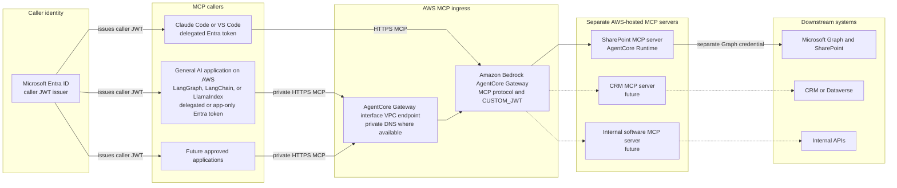
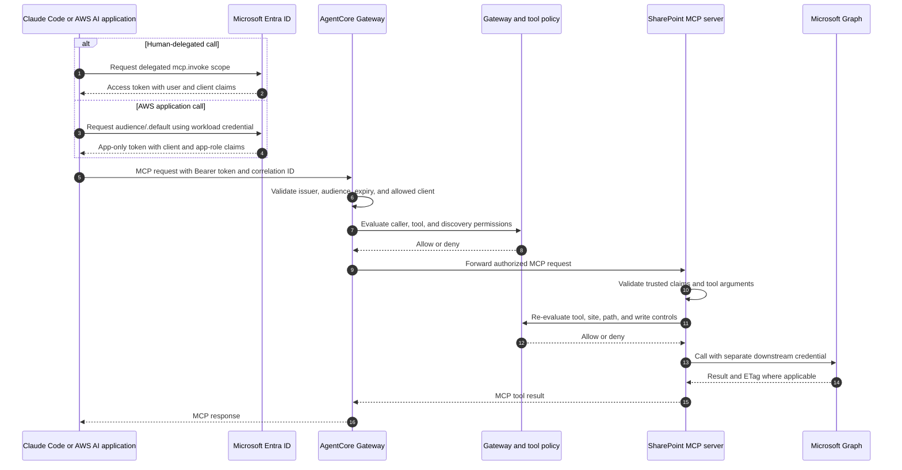

# MCP Agent Platform on AWS

This repository defines an enterprise MCP platform built around one shared
Amazon Bedrock AgentCore Gateway and a separate AWS-hosted MCP server for each
enabled downstream system. The current PoC runs each server on AgentCore
Runtime. SharePoint is enabled first; CRM, internal software, and future systems
remain separate server boundaries.

The examples in this README are intentionally inline. A developer can read the
architecture, copy the protocol examples, and understand the security controls
without access to the original source tree or machine-local file paths.

## Architecture



The fixed boundaries are:

- AgentCore Gateway is the only MCP front door. There is no custom gateway,
  CloudFront distribution, or CDN-backed MCP domain.
- Microsoft Entra ID identifies MCP callers.
- Gateway routes an authorized MCP request to the selected AWS-hosted server.
- Each server uses a separate downstream credential. An inbound caller JWT is
  never reused as a Microsoft Graph token.
- Every downstream system has its own MCP server, image, runtime, and policy
  entries.
- Tool authorization is default-deny and is evaluated again in the server,
  even after Gateway accepts the JWT.

AgentCore Runtime is the current PoC hosting service. The same high-level
Gateway-to-server model can also describe an MCP service hosted through an
approved Lambda adapter, ECS service, or EKS workload. The service-specific
integration mechanics are deployment details and are not part of the
developer-facing architecture diagram.

## Request Sequence

The same Gateway URL supports a human developer client and an approved general
AI application running on AWS. The token grant and policy checks differ.



For a user-facing AWS application, prefer a delegated or on-behalf-of token when
the tool action must be attributable to the signed-in user. Use app-only
identity only for a narrowly approved service workflow. An app-only Entra token
normally carries application roles rather than a delegated `scp` claim, so the
Gateway and policy configuration must support the selected grant type; do not
make a delegated scope the only authorization condition for service tokens.

## Identity and Authorization Contract

| Boundary | Credential | Required checks |
| --- | --- | --- |
| Caller to Gateway | Entra access token | Issuer, audience, expiry, allowed client, and grant-compatible scope or app role |
| MCP server to AWS services | Per-server AWS identity | Least-privilege logs, metrics, secret retrieval, and approved service calls |
| MCP server to Microsoft Graph | Separate Entra application credential | Selected Graph application permissions and site-level restrictions |

Trusted caller identity must come from validated request context, never from
ordinary MCP tool arguments. A caller must not be able to set
`x-mcp-subject`, `x-mcp-client-id`, `x-mcp-groups`, or `x-mcp-app-roles`
directly and have the server trust those values.

Recommended claim mapping:

| Server field | Delegated token | App-only token |
| --- | --- | --- |
| Subject | `oid` or `sub` | service principal subject |
| Client ID | `azp`, `appid`, or configured client claim | `azp` or `appid` |
| Delegated scopes | `scp` | usually absent |
| Application roles | optional `roles` | required `roles` |
| Groups | approved `groups` claim | optional; do not require unless emitted |

## Developer Client

### Acquire a delegated token on Windows PowerShell

The following device-code example requests the Enterprise MCP delegated scope.
Register the client as a public client and replace the placeholders.

```powershell
$TenantId = "<entra-tenant-id>"
$ClientId = "<public-client-application-id>"
$Audience = "api://enterprise-mcp-nonprod"
$Scopes = "$Audience/mcp.invoke openid profile offline_access"

$DeviceCode = Invoke-RestMethod `
    -Method Post `
    -Uri "https://login.microsoftonline.com/$TenantId/oauth2/v2.0/devicecode" `
    -ContentType "application/x-www-form-urlencoded" `
    -Body @{
        client_id = $ClientId
        scope     = $Scopes
    }

Write-Host $DeviceCode.message
$Deadline = [DateTimeOffset]::UtcNow.AddSeconds([int]$DeviceCode.expires_in)
$Interval = [int]$DeviceCode.interval
$Token = $null

:poll while ([DateTimeOffset]::UtcNow -lt $Deadline) {
    Start-Sleep -Seconds $Interval
    try {
        $Token = Invoke-RestMethod `
            -Method Post `
            -Uri "https://login.microsoftonline.com/$TenantId/oauth2/v2.0/token" `
            -ContentType "application/x-www-form-urlencoded" `
            -Body @{
                grant_type = "urn:ietf:params:oauth:grant-type:device_code"
                client_id  = $ClientId
                device_code = $DeviceCode.device_code
            }
        break poll
    }
    catch {
        $OAuthError = $_.ErrorDetails.Message | ConvertFrom-Json
        if ($OAuthError.error -eq "authorization_pending") {
            continue poll
        }
        if ($OAuthError.error -eq "slow_down") {
            $Interval += 5
            continue poll
        }
        throw
    }
}

if (-not $Token.access_token) {
    throw "The device-code flow expired before sign-in completed."
}

# Keep the token in process memory. Do not print or persist it.
$env:ENTERPRISE_MCP_ACCESS_TOKEN = $Token.access_token
```

### Initialize MCP, list tools, and call a tool

Install the Python MCP SDK, then run this client with a short-lived token in the
current process.

```powershell
py -m venv .venv
.\.venv\Scripts\Activate.ps1
python -m pip install "mcp==1.12.4"

$env:ENTERPRISE_MCP_GATEWAY_URL = `
    "https://<gateway-id>.gateway.bedrock-agentcore.<region>.amazonaws.com/mcp"
python .\mcp_client.py
```

Save the following as `mcp_client.py`:

```python
from __future__ import annotations

import asyncio
import os
import uuid

from mcp import ClientSession
from mcp.client.streamable_http import streamablehttp_client


async def main() -> None:
    gateway_url = os.environ["ENTERPRISE_MCP_GATEWAY_URL"]
    access_token = os.environ["ENTERPRISE_MCP_ACCESS_TOKEN"]
    correlation_id = str(uuid.uuid4())

    headers = {
        "Authorization": f"Bearer {access_token}",
        "X-Correlation-Id": correlation_id,
    }

    async with streamablehttp_client(
        gateway_url,
        headers=headers,
    ) as (read_stream, write_stream, _):
        async with ClientSession(read_stream, write_stream) as session:
            await session.initialize()

            tools = await session.list_tools()
            print("Available tools:", [tool.name for tool in tools.tools])

            result = await session.call_tool(
                "sharepoint_list_site_content",
                arguments={
                    "site_id": "engineering-site",
                    "path": "/Shared Documents/Engineering",
                    "recursive": False,
                    "max_items": 50,
                    "correlation_id": correlation_id,
                },
            )
            print(result.structuredContent or result.content)


if __name__ == "__main__":
    asyncio.run(main())
```

The Gateway may expose the built-in
`x_amz_bedrock_agentcore_search` tool for interactive discovery. Production
service flows should call predefined tools rather than use semantic search.

```python
search_result = await session.call_tool(
    "x_amz_bedrock_agentcore_search",
    arguments={"query": "approved tools that read SharePoint engineering files"},
)
```

## General AI Application on AWS

The AWS-hosted caller can be a Lambda function, container service, or
orchestrated agent built with LangGraph, LangChain, or LlamaIndex. Its framework
does not change the MCP security boundary: it still obtains an Entra token and
calls the AgentCore Gateway MCP endpoint.

This compact Lambda-compatible example uses client credentials for an approved
service workflow, caches the token in the warm execution environment, and calls
a predefined tool. Store the client secret in a managed secret service and
inject it at runtime; never log it or the returned token.

```python
from __future__ import annotations

import json
import os
import time
import urllib.parse
import urllib.request
import uuid


TENANT_ID = os.environ["ENTRA_TENANT_ID"]
CLIENT_ID = os.environ["ENTRA_CLIENT_ID"]
CLIENT_SECRET = os.environ["ENTRA_CLIENT_SECRET"]
MCP_AUDIENCE = os.environ["ENTRA_MCP_AUDIENCE"].rstrip("/")
GATEWAY_URL = os.environ["ENTERPRISE_MCP_GATEWAY_URL"]

_cached_token = ""
_expires_at = 0.0


def get_app_token() -> str:
    global _cached_token, _expires_at

    if _cached_token and time.time() < _expires_at - 60:
        return _cached_token

    form = urllib.parse.urlencode(
        {
            "grant_type": "client_credentials",
            "client_id": CLIENT_ID,
            "client_secret": CLIENT_SECRET,
            "scope": f"{MCP_AUDIENCE}/.default",
        }
    ).encode()
    request = urllib.request.Request(
        f"https://login.microsoftonline.com/{TENANT_ID}/oauth2/v2.0/token",
        data=form,
        headers={"Content-Type": "application/x-www-form-urlencoded"},
        method="POST",
    )

    with urllib.request.urlopen(request, timeout=10) as response:
        payload = json.load(response)

    _cached_token = payload["access_token"]
    _expires_at = time.time() + int(payload.get("expires_in", 3600))
    return _cached_token


def call_mcp_tool(tool_name: str, arguments: dict, correlation_id: str) -> dict:
    body = json.dumps(
        {
            "jsonrpc": "2.0",
            "id": correlation_id,
            "method": "tools/call",
            "params": {"name": tool_name, "arguments": arguments},
        }
    ).encode()
    request = urllib.request.Request(
        GATEWAY_URL,
        data=body,
        headers={
            "Authorization": f"Bearer {get_app_token()}",
            "Content-Type": "application/json",
            "Accept": "application/json, text/event-stream",
            "X-Correlation-Id": correlation_id,
        },
        method="POST",
    )

    with urllib.request.urlopen(request, timeout=30) as response:
        content_type = response.headers.get("Content-Type", "")
        raw_body = response.read().decode("utf-8")

    # A production adapter should parse text/event-stream responses rather
    # than assuming every Gateway response is a single JSON document.
    if "application/json" not in content_type:
        return {"content_type": content_type, "body": raw_body}
    return json.loads(raw_body)


def lambda_handler(event: dict, context: object) -> dict:
    correlation_id = getattr(context, "aws_request_id", str(uuid.uuid4()))
    result = call_mcp_tool(
        "sharepoint_list_site_content",
        {
            "site_id": "engineering-site",
            "path": "/Shared Documents/Engineering",
            "recursive": False,
            "max_items": 50,
            "correlation_id": correlation_id,
        },
        correlation_id,
    )
    return {"statusCode": 200, "body": json.dumps(result)}
```

For production, prefer workload identity or certificate-based credentials over
a long-lived client secret when the Entra application and AWS runtime support
that operating model.

## SharePoint MCP Server Pattern

An MCP server listens on `0.0.0.0:8000/mcp`, uses streamable HTTP, and remains
stateless so AgentCore Runtime can scale it horizontally.

```python
from __future__ import annotations

import re
from typing import Any

from mcp.server.fastmcp import FastMCP


mcp = FastMCP("sharepoint-mcp", host="0.0.0.0", stateless_http=True)
SAFE_ID = re.compile(r"^[A-Za-z0-9._:@/-]{1,220}$")


def require_safe_id(name: str, value: str) -> str:
    normalized = value.strip()
    if not SAFE_ID.fullmatch(normalized):
        raise ValueError(f"{name} has an invalid format")
    return normalized


def require_text(name: str, value: str, max_chars: int) -> str:
    normalized = value.strip()
    if not normalized or len(normalized) > max_chars:
        raise ValueError(f"{name} must contain 1 to {max_chars} characters")
    return normalized


def authorize_tool(
    *,
    trusted_caller: dict[str, Any],
    tool_name: str,
    site_id: str,
    resource_path: str,
) -> None:
    # The real implementation loads the versioned allowlist shown below.
    if trusted_caller["client_id"] not in {"claude-code-client", "aws-ai-app"}:
        raise PermissionError("client_not_allowed")
    if tool_name not in trusted_caller["allowed_tools"]:
        raise PermissionError("tool_not_allowed")
    if site_id not in trusted_caller["allowed_sites"]:
        raise PermissionError("site_not_allowed")
    if not resource_path.startswith("/Shared Documents/Engineering"):
        raise PermissionError("path_not_allowed")


@mcp.tool()
def sharepoint_list_site_content(
    site_id: str,
    path: str,
    correlation_id: str,
    recursive: bool = False,
    max_items: int = 50,
) -> dict[str, Any]:
    safe_site_id = require_safe_id("site_id", site_id)
    safe_path = require_text("path", path, 300)
    safe_correlation_id = require_safe_id("correlation_id", correlation_id)
    if not 1 <= max_items <= 200:
        raise ValueError("max_items must be between 1 and 200")

    # Resolve this from Gateway-validated, server-side request context.
    # Never accept trusted_caller as an MCP tool argument.
    trusted_caller = current_trusted_caller()
    authorize_tool(
        trusted_caller=trusted_caller,
        tool_name="sharepoint_list_site_content",
        site_id=safe_site_id,
        resource_path=safe_path,
    )

    result = graph_list_site_content(
        site_id=safe_site_id,
        path=safe_path,
        recursive=recursive,
        max_items=max_items,
    )
    audit(
        event_name="tool.sharepoint_list_site_content",
        correlation_id=safe_correlation_id,
        result="success",
        site_id=safe_site_id,
        path=safe_path,
        item_count=len(result),
    )
    return {"status": "ok", "site_id": safe_site_id, "result": result}


if __name__ == "__main__":
    mcp.run(transport="streamable-http")
```

`current_trusted_caller`, `graph_list_site_content`, and `audit` are boundary
adapters in this example:

- `current_trusted_caller` reads request-local claims created from
  Gateway-validated context. It must fail closed if required claims are absent.
- `graph_list_site_content` obtains its own Graph credential and enforces the
  approved site boundary.
- `audit` emits structured metadata but never tokens, credentials, full
  document content, or unrestricted tool arguments.

Write tools require additional controls:

| Field | Rule |
| --- | --- |
| `change_ticket_id` | Required and restricted to an approved pattern such as `CHG-12345`, `RFC-12345`, or `ADO-12345` |
| `idempotency_key` | Required and stored for replay protection |
| `audit_reason` | Required, bounded, and included in structured audit metadata |
| `expected_etag` | Required for updates when Microsoft Graph supports optimistic concurrency |
| target site/path | Must match both caller policy and the downstream application's selected permissions |

## Policy as Code

The human-maintained policy is the source of truth. Generated JSON can be
consumed by MCP server code and CI, but it must not be edited directly.

```yaml
version: "2026-07-24"

metadata:
  name: enterprise-mcp-tool-policy
  default_decision: deny

subjects:
  claude-code-sharepoint-readers:
    type: human_delegated
    entra:
      allowed_clients: [claude-code-client]
      required_scopes: [mcp.invoke]
      required_roles_any: [MCP.SharePoint.Read]
      required_groups_any: [mcp-sharepoint-readers]

  aws-ai-application:
    type: service_app
    entra:
      allowed_clients: [aws-ai-app]
      required_roles_any: [MCP.SharePoint.Read]

discovery:
  semantic_search:
    tool_name: x_amz_bedrock_agentcore_search
    allowed_subjects:
      - claude-code-sharepoint-readers
    denied_subjects:
      - aws-ai-application

approved_resources:
  sharepoint_sites:
    engineering:
      site_id: engineering-site
      allowed_paths:
        - /Shared Documents/Engineering
        - /SitePages

tools:
  sharepoint_list_site_content:
    server: sharepoint-mcp
    write: false
    authorization:
      allowed_subjects:
        - claude-code-sharepoint-readers
        - aws-ai-application
      allowed_sites:
        - engineering
    input_constraints:
      required: [site_id, path, correlation_id]
      path_must_be_under_allowed_paths: true

  sharepoint_update_file_content:
    server: sharepoint-mcp
    write: true
    authorization:
      allowed_subjects:
        - claude-code-sharepoint-publishers
      allowed_sites:
        - engineering
    write_controls:
      require_change_ticket: true
      require_idempotency_key: true
      require_expected_etag: true
      require_audit_reason: true
```

Authorization checks are conjunctive: when a subject defines an allowed client,
scope, group, and role, all configured categories must pass. Within
`required_groups_any` and `required_roles_any`, at least one configured value
must match.

The general AWS AI application is intentionally denied semantic discovery. It
uses predefined tool names and arguments, which makes its behavior easier to
review, test, and audit.

## Trusted Claim Propagation

If a Gateway interceptor is used, it sanitizes identity values from
Gateway-validated request context and adds only an allowlisted set of headers.
The incoming values with the same names must not be trusted.

```python
def lambda_handler(event: dict, context: object) -> dict:
    request_context = event.get("requestContext", {})
    identity = request_context.get("identity", {})
    request_id = request_context.get(
        "requestId",
        getattr(context, "aws_request_id", "unknown"),
    )

    headers = {
        "x-mcp-subject": safe_header(
            identity.get("subject") or identity.get("userId") or "unknown"
        ),
        "x-mcp-client-id": safe_header(identity.get("clientId") or "unknown"),
        "x-mcp-groups": safe_header(",".join(identity.get("groups", []))),
        "x-mcp-app-roles": safe_header(",".join(identity.get("roles", []))),
        "x-correlation-id": safe_header(request_id),
    }

    return {
        "interceptorOutputVersion": "1.0",
        "mcp": {
            "transformedGatewayRequest": {
                "headers": headers,
                "body": event["mcp"]["gatewayRequest"]["body"],
            }
        },
    }


def safe_header(value: object) -> str:
    text = str(value)
    return "".join(char for char in text if 32 <= ord(char) <= 126)[:1024]
```

The Gateway and receiving MCP server must allowlist exactly the trusted headers
that the server consumes. Interceptor-generated values override any
client-provided values with the same names.

## AWS Deployment Shape

The following condensed Terraform shows the shared Gateway and the current
AgentCore Runtime hosting pattern. It intentionally omits service-specific
routing plumbing so the developer model stays `Gateway → MCP server`. Pin the
AWS provider version in the real deployment and verify the current provider
schema before applying.

```hcl
resource "aws_bedrockagentcore_gateway" "enterprise_mcp" {
  name     = "${var.environment}-enterprise-mcp"
  role_arn = aws_iam_role.gateway.arn

  authorizer_type = "CUSTOM_JWT"
  authorizer_configuration {
    custom_jwt_authorizer {
      discovery_url    = var.entra_discovery_url
      allowed_audience = [var.entra_audience]
      allowed_clients  = var.entra_allowed_clients
    }
  }

  protocol_type = "MCP"
  protocol_configuration {
    mcp {
      instructions       = "Enterprise MCP Gateway"
      search_type        = "SEMANTIC"
      supported_versions = ["2025-03-26", "2025-06-18"]
    }
  }
}

resource "aws_bedrockagentcore_agent_runtime" "sharepoint" {
  agent_runtime_name = "${var.environment}_sharepoint_mcp"
  role_arn           = aws_iam_role.sharepoint_runtime.arn

  agent_runtime_artifact {
    container_configuration {
      container_uri = var.sharepoint_image_uri
    }
  }

  network_configuration {
    network_mode = "VPC"
    network_mode_config {
      subnets         = var.private_subnet_ids
      security_groups = var.runtime_security_group_ids
    }
  }

  protocol_configuration {
    server_protocol = "MCP"
  }

  request_header_configuration {
    request_header_allowlist = [
      "x-mcp-subject",
      "x-mcp-client-id",
      "x-mcp-groups",
      "x-mcp-app-roles",
      "x-correlation-id",
    ]
  }
}
```

Private access uses the regional AgentCore Gateway interface VPC endpoint with
private DNS. The selected AWS hosting service also needs approved egress or VPC
endpoints for image pulls, logs, metrics, secrets, and downstream network paths.

## Container Contract

Each server image must:

- listen on `0.0.0.0:8000`;
- expose streamable HTTP MCP at `/mcp`;
- run as a non-root user;
- emit structured logs to stdout;
- avoid baking secrets or environment-specific policy into the image;
- support graceful termination;
- pin and scan dependencies; and
- keep downstream-specific code inside that server boundary.

An optional centrally maintained base image can standardize the Python runtime,
certificate bundle, non-root user, health check, telemetry defaults, and
approved dependency set. Service teams still own their MCP tools and downstream
adapters.

```dockerfile
FROM public.ecr.aws/docker/library/python:3.12-slim

ENV PYTHONDONTWRITEBYTECODE=1 \
    PYTHONUNBUFFERED=1

RUN groupadd --system mcp \
    && useradd --system --gid mcp --create-home mcp

WORKDIR /app
COPY requirements.txt .
RUN pip install --no-cache-dir --require-hashes -r requirements.txt

COPY src ./src
USER mcp
EXPOSE 8000
CMD ["python", "-m", "src.server"]
```

## CI/CD Checks

Policy changes and server changes should be validated independently. A minimal
Azure DevOps policy job is:

```yaml
trigger:
  paths:
    include:
      - policy/**

pool:
  vmImage: ubuntu-latest

steps:
  - task: UsePythonVersion@0
    inputs:
      versionSpec: "3.12"

  - script: |
      python -m pip install --upgrade pip
      python -m pip install jsonschema pyyaml
      python policy/validate_policy.py --check
    displayName: Validate policy schema and generated JSON
```

Server CI should add unit tests for input validation and authorization, build
the service image, scan dependencies and the image, and run an MCP
`initialize`/`tools/list` smoke test before publishing.

## Verification Checklist

Before a non-production deployment:

1. Validate the Entra issuer, audience, allowed client IDs, delegated scope, and
   application-role assignments.
2. Confirm a delegated client can initialize MCP and list only its authorized
   tools.
3. Confirm the general AWS AI application can call only its predefined tools
   and cannot use semantic search.
4. Confirm an unknown client, wrong audience, expired token, and missing
   required claim are denied.
5. Confirm a valid caller is denied for an unapproved site, path, or tool.
6. Confirm write tools reject a missing ticket, duplicate idempotency key, and
   stale ETag.
7. Confirm Gateway routes requests only to the approved MCP server and rejects
   an unknown server.
8. Confirm the MCP server uses a separate Graph credential and cannot access
   unapproved SharePoint sites.
9. Search logs for token-shaped values and full document content; none should
   be present.
10. Render every Mermaid block and validate every fenced code block.

Expected failure mapping:

| Symptom | First checks |
| --- | --- |
| Gateway returns `401` | Entra issuer, audience, expiry, discovery URL, and token grant |
| Gateway returns `403` | allowed client, Gateway policy, delegated scope, app role, and group mapping |
| Tool is missing | discovery permission, semantic-search policy, and server routing configuration |
| MCP server is unavailable | selected AWS service health, Gateway route, network path, and region |
| MCP server denies a valid caller | trusted header propagation and subject-policy matching |
| Graph returns `403` | downstream app permission, admin consent, selected-site grant, and target site |
| Graph update returns `412` | stale ETag; reread and retry through the approved workflow |

## Current Validation State

The repository provides the architecture, Terraform shape, policy model,
container contract, and dry-run client/server patterns. Structural validation
can prove configuration consistency, but it cannot prove live Entra claims,
PrivateLink routing, live Gateway-to-server routing, or Microsoft Graph
permissions.

Production readiness still requires deployment in a non-production AWS account
and Entra tenant, live token tests for both caller types, negative authorization
tests, real Graph read/write validation with selected-site permissions, and
operational evidence for logging, alerts, rollback, credential rotation, and
disaster recovery.

## External References

- [AgentCore Gateway custom JWT authorization](https://docs.aws.amazon.com/bedrock-agentcore/latest/devguide/inbound-jwt-authorizer.html)
- [AgentCore Gateway request-header propagation](https://docs.aws.amazon.com/bedrock-agentcore/latest/devguide/gateway-headers.html)
- [Terraform AgentCore Gateway resource](https://registry.terraform.io/providers/hashicorp/aws/latest/docs/resources/bedrockagentcore_gateway)
- [Microsoft identity platform scopes and `.default`](https://learn.microsoft.com/en-us/entra/identity-platform/scopes-oidc)
- [Microsoft identity platform client-credentials flow](https://learn.microsoft.com/en-us/entra/identity-platform/scenario-daemon-acquire-token)
- [Model Context Protocol Python SDK](https://github.com/modelcontextprotocol/python-sdk)
