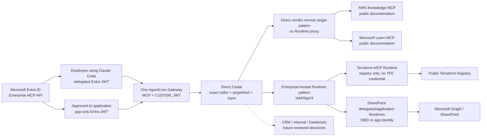
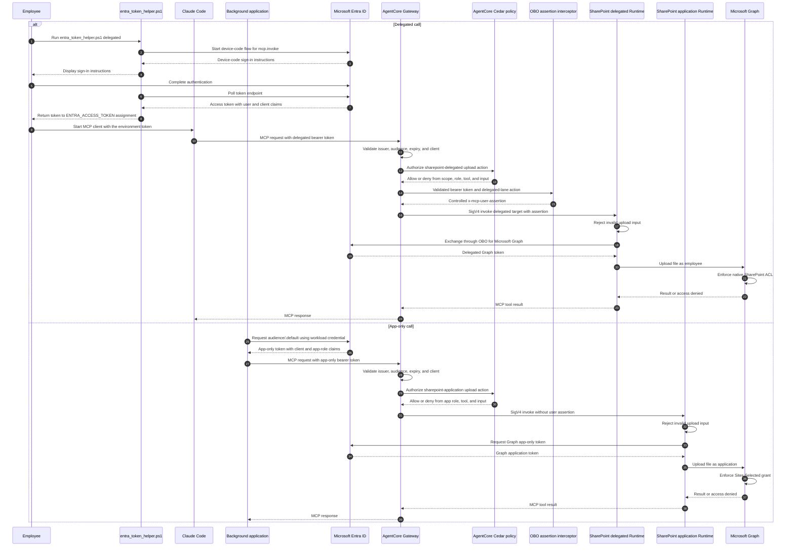
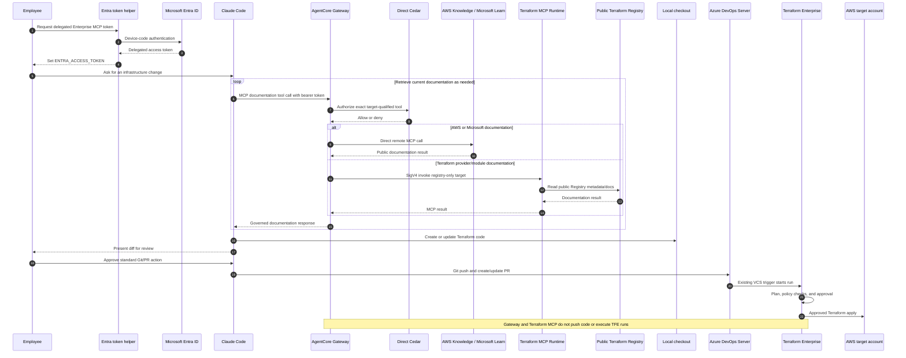

# MCP Agent Platform on AWS

This repository defines an enterprise MCP platform built around one shared
Amazon Bedrock AgentCore Gateway. Platform-owned and enterprise-hosted MCP
servers run on AgentCore Runtime, while approved vendor-operated remote MCP
endpoints can connect directly as Gateway targets. SharePoint remains the first
enabled business-system integration; AWS Knowledge, Microsoft Learn, and a
Registry-only Terraform MCP server are the first documentation-target PoC.

The examples in this README are intentionally inline. A developer can read the
architecture, copy the protocol examples, and understand the security controls
without access to the original source tree or machine-local file paths.

## Architecture



The fixed boundaries are:

- AgentCore Gateway is the only MCP front door. There is no custom gateway,
  CloudFront distribution, or CDN-backed MCP domain.
- Microsoft Entra ID identifies MCP callers.
- Direct Cedar at Gateway is the only caller/tool authorization policy.
- Approved vendor-operated remote MCP endpoints can be direct Gateway targets;
  an AgentCore Runtime proxy is not mandatory.
- AWS Knowledge and Microsoft Learn are public documentation-only targets.
  Queries must not contain secrets, private source code, customer records, or
  other sensitive content.
- The Terraform MCP server is enterprise-hosted on Runtime with only
  `--toolsets=registry`, `ENABLE_TF_OPERATIONS=false`, and no TFE credential.
  It retrieves documentation but cannot create a run or apply infrastructure.
- Delegated requests use the `sharepoint-delegated` Runtime lane and a Graph
  OBO token. SharePoint's native ACL decides which sites and items the employee
  may use.
- A Gateway request interceptor propagates the already validated caller token
  only to the delegated lane. Gateway still invokes both Runtimes with
  IAM/SigV4.
- App-only requests use the `sharepoint-application` Runtime lane and a
  separate Graph app token. `Sites.Selected` decides which sites the
  application may use.
- Platform-owned downstream integrations keep separate MCP server source/image
  and policy boundaries; materially different identity lanes may use separate
  targets and Runtimes.
- Runtime rejects invalid upload input without trimming, normalizing, or
  repairing it. It does not load or re-evaluate a second authorization policy.
- The workload Terraform root deploys AgentCore Gateway/Runtime in Sydney
  (`ap-southeast-2`). Melbourne (`ap-southeast-4`) remains a future candidate
  until AWS publishes the required AgentCore endpoints and VPC support. The
  target account ID, Runtime subnets, and security groups come from central
  platform/TFE configuration.
- Gateway PrivateLink, private DNS, endpoint policy, and corporate routing are
  pre-existing network-platform dependencies; this workload root does not
  create or own them.

AgentCore Runtime is the current PoC hosting service for platform-owned code and
the restricted Terraform MCP process. Gateway can instead connect directly to
an approved vendor-operated remote MCP endpoint. ADR 0009 defines the target
selection and documentation-only controls; Databricks data access and Azure
DevOps work-management operations remain separate future decisions. ADR 0010
defines the single SharePoint upload tool, fail-fast input behavior, and
delegated/application lane names.

## Request Sequence

The same Gateway URL supports a human developer client and an approved general
AI application running on AWS. The token grant and policy checks differ. This
sequence uses the upload tool to show both credential lanes; list/read tools
use the same lane selection.



For a user-facing AWS application, prefer a delegated or on-behalf-of token when
the tool action must be attributable to the signed-in user. Use app-only
identity only for a narrowly approved service workflow. An app-only Entra token
normally carries application roles rather than a delegated `scp` claim, so the
Gateway and policy configuration must support the selected grant type; do not
make a delegated scope the only authorization condition for service tokens.

## Documentation-Assisted Terraform Delivery

Claude Code—not a generic coding agent—uses the governed documentation targets
to research current AWS, Microsoft, and Terraform behavior. It writes the code
in the employee's local checkout and uses normal Git/PR mechanics. Azure DevOps
Server and central TFE remain the only code-review and Terraform execution path.



The editable sequence sources are
`docs/architecture/claude-code-terraform-docs-sequence.mmd` and
`docs/architecture/claude-code-terraform-docs-sequence.drawio`.

## Identity and Authorization Contract

| Boundary | Credential | Required checks |
| --- | --- | --- |
| Caller to Gateway | Entra access token | Issuer, audience, expiry, allowed client, and grant-compatible scope or app role |
| Gateway to either Runtime | Gateway IAM role with SigV4 | Runtime resource policy allows only the Gateway role |
| Gateway to AWS Knowledge or Microsoft Learn | No outbound credential; approved public-docs exception | TLS/hostname, reviewed target/tool, data-classification, rate/size limits, and target kill switch |
| MCP server to AWS services | Per-server AWS identity | Least-privilege logs, metrics, secret retrieval, and approved service calls |
| Terraform MCP Runtime to public Registry | No TFE credential | Public `registry` toolset only; Terraform operations disabled |
| Delegated Runtime to Microsoft Graph | OBO delegated Graph token | Native SharePoint user/site/item permissions |
| Application Runtime to Microsoft Graph | Separate Entra application credential | Selected Graph application permissions and `Sites.Selected` grants |

Trusted caller identity must come from validated request context, never from
ordinary MCP tool arguments. The OBO assertion header is a credential copied
and overwritten by the trusted Gateway interceptor, not a caller-controlled
identity claim. Only the delegated target and Runtime allowlist it; the
application lane does not.

CRM does not automatically require two Runtimes. Start with one
`crm-application` lane when every approved CRM tool uses the same service
identity. Add a `crm-delegated` lane from the same CRM image only when the CRM
API supports and requires delegated access. CRM and SharePoint still remain
separate server images and ownership boundaries.

Recommended claim mapping:

| Server field | Delegated token | App-only token |
| --- | --- | --- |
| Subject | `oid` or `sub` | service principal subject |
| Client ID | `azp`, `appid`, or configured client claim | `azp` or `appid` |
| Delegated scopes | `scp` | usually absent |
| Application roles | optional `roles` | required `roles` |
| Groups | approved `groups` claim | optional; do not require unless emitted |

## Developer Client

### Acquire a delegated token on Windows PowerShell

The employee runs the repository token helper. The helper performs the Entra
device-code flow and returns the delegated Enterprise MCP token to the
PowerShell assignment below. Claude Code does not authenticate the employee or
request the token; it only reads `ENTRA_ACCESS_TOKEN` when sending MCP requests.

```powershell
Set-Location examples/enterprise_mcp_platform
$env:ENTRA_TENANT_ID = "<tenant-id>"
$env:ENTRA_CLIENT_ID = "<interactive-mcp-public-client-id>"
$env:ENTRA_MCP_AUDIENCE = "api://enterprise-mcp-nonprod"
$env:ENTRA_ACCESS_TOKEN = & .\clients\entra_token_helper.ps1 delegated
```

### Connect to MCP, list tools, and call a tool

Install the Python MCP SDK, then run this client with a short-lived token in the
current process. The server code uses Python MCP SDK 2.0, while the managed
AgentCore Gateway currently supports handshake-era MCP protocol versions rather
than `2026-07-28`. Gateway clients therefore use SDK 2 with `mode="legacy"`
until AWS documents and validates support for the newer protocol.

```powershell
py -m venv .venv
.\.venv\Scripts\Activate.ps1
python -m pip install "mcp==2.0.0"

$env:ENTERPRISE_MCP_GATEWAY_URL = `
    "https://<gateway-id>.gateway.bedrock-agentcore.<region>.amazonaws.com/mcp"
python .\mcp_client.py
```

Save the following as `mcp_client.py`:

```python
from __future__ import annotations

import asyncio
import os
import uuid

import httpx2
from mcp.client import Client
from mcp.client.streamable_http import streamable_http_client


async def main() -> None:
    gateway_url = os.environ["ENTERPRISE_MCP_GATEWAY_URL"]
    access_token = os.environ["ENTRA_ACCESS_TOKEN"]
    correlation_id = str(uuid.uuid4())

    headers = {
        "Authorization": f"Bearer {access_token}",
        "X-Correlation-Id": correlation_id,
    }

    async with httpx2.AsyncClient(
        headers=headers,
        timeout=httpx2.Timeout(120.0),
        follow_redirects=True,
    ) as http_client:
        transport = streamable_http_client(
            gateway_url,
            http_client=http_client,
            terminate_on_close=False,
        )
        async with Client(transport, mode="legacy") as client:
            tools = await client.list_tools()
            print("Available tools:", [tool.name for tool in tools.tools])

            result = await client.call_tool(
                "sharepoint_upload_file",
                arguments={
                    "site_id": "engineering-site",
                    "file_path": "Shared Documents/Engineering/example.txt",
                    "content": "Uploaded by the delegated example.",
                },
            )
            print(result.structured_content or result.content)


if __name__ == "__main__":
    asyncio.run(main())
```

The Gateway may expose the built-in
`x_amz_bedrock_agentcore_search` tool for interactive discovery. Production
service flows should call predefined tools rather than use semantic search.

```python
search_result = await client.call_tool(
    "x_amz_bedrock_agentcore_search",
    arguments={"query": "approved tools that read SharePoint engineering files"},
)
```

## General AI Application on AWS

The AWS-hosted caller can be a Lambda function, container service, or
orchestrated agent built with LangGraph, LangChain, or LlamaIndex. Its framework
does not change the MCP security boundary: it still obtains an Entra token and
calls the AgentCore Gateway MCP endpoint.

This compact Lambda-compatible example uses client credentials for an approved
service workflow, caches the token in the warm execution environment, and calls
a predefined tool. Store the client secret in a managed secret service and
inject it at runtime; never log it or the returned token.

```python
from __future__ import annotations

import json
import os
import time
import urllib.parse
import urllib.request
import uuid


TENANT_ID = os.environ["ENTRA_TENANT_ID"]
CLIENT_ID = os.environ["ENTRA_CLIENT_ID"]
CLIENT_SECRET = os.environ["ENTRA_CLIENT_SECRET"]
MCP_AUDIENCE = os.environ["ENTRA_MCP_AUDIENCE"].rstrip("/")
GATEWAY_URL = os.environ["ENTERPRISE_MCP_GATEWAY_URL"]

_cached_token = ""
_expires_at = 0.0


def get_app_token() -> str:
    global _cached_token, _expires_at

    if _cached_token and time.time() < _expires_at - 60:
        return _cached_token

    form = urllib.parse.urlencode(
        {
            "grant_type": "client_credentials",
            "client_id": CLIENT_ID,
            "client_secret": CLIENT_SECRET,
            "scope": f"{MCP_AUDIENCE}/.default",
        }
    ).encode()
    request = urllib.request.Request(
        f"https://login.microsoftonline.com/{TENANT_ID}/oauth2/v2.0/token",
        data=form,
        headers={"Content-Type": "application/x-www-form-urlencoded"},
        method="POST",
    )

    with urllib.request.urlopen(request, timeout=10) as response:
        payload = json.load(response)

    _cached_token = payload["access_token"]
    _expires_at = time.time() + int(payload.get("expires_in", 3600))
    return _cached_token


def call_mcp_tool(tool_name: str, arguments: dict, correlation_id: str) -> dict:
    body = json.dumps(
        {
            "jsonrpc": "2.0",
            "id": correlation_id,
            "method": "tools/call",
            "params": {"name": tool_name, "arguments": arguments},
        }
    ).encode()
    request = urllib.request.Request(
        GATEWAY_URL,
        data=body,
        headers={
            "Authorization": f"Bearer {get_app_token()}",
            "Content-Type": "application/json",
            "Accept": "application/json, text/event-stream",
            "X-Correlation-Id": correlation_id,
        },
        method="POST",
    )

    with urllib.request.urlopen(request, timeout=30) as response:
        content_type = response.headers.get("Content-Type", "")
        raw_body = response.read().decode("utf-8")

    # A production adapter should parse text/event-stream responses rather
    # than assuming every Gateway response is a single JSON document.
    if "application/json" not in content_type:
        return {"content_type": content_type, "body": raw_body}
    return json.loads(raw_body)


def lambda_handler(event: dict, context: object) -> dict:
    correlation_id = getattr(context, "aws_request_id", str(uuid.uuid4()))
    result = call_mcp_tool(
        "sharepoint_upload_file",
        {
            "site_id": "engineering-site",
            "file_path": "Shared Documents/Engineering/example.txt",
            "content": "Uploaded by the app-only example.",
        },
        correlation_id,
    )
    return {"statusCode": 200, "body": json.dumps(result)}
```

For production, prefer workload identity or certificate-based credentials over
a long-lived client secret when the Entra application and AWS runtime support
that operating model.

## SharePoint MCP Server Pattern

An MCP server listens on `0.0.0.0:8000/mcp`, uses streamable HTTP, and remains
stateless so AgentCore Runtime can scale it horizontally. The PoC exposes one
SharePoint write operation: upload UTF-8 text to a path in the site's default
document library.

```python
from __future__ import annotations

from typing import Any

from mcp.server.mcpserver import Context, MCPServer


mcp = MCPServer("sharepoint-mcp")


@mcp.tool()
def sharepoint_upload_file(
    site_id: str,
    file_path: str,
    content: str,
    ctx: Context,
) -> dict[str, Any]:
    validate_upload_input(site_id, file_path, content)
    return graph_upload_file(
        site_id=site_id,
        file_path=file_path,
        content=content,
        user_assertion=user_assertion_from_context(ctx),
    )


if __name__ == "__main__":
    mcp.run(
        transport="streamable-http",
        host="0.0.0.0",
        port=8000,
        stateless_http=True,
    )
```

`validate_upload_input` either accepts each value unchanged or raises an error.
It does not trim, normalize, repair, or substitute values. `Context` is injected
by the MCP SDK and is not a fourth client-visible input. The Graph adapter uses
OBO in the delegated lane or the dedicated Graph application in the
application lane; SharePoint ACLs or `Sites.Selected` enforce site access.

## Policy as Code

The reviewed `.cedar` files are the only MCP tool-authorization source. There
is no policy YAML, generated Runtime JSON, or server-side authorization copy.

```cedar
permit (
    principal is AgentCore::OAuthUser,
    action == AgentCore::Action::"sharepoint-delegated___sharepoint_upload_file",
    resource == AgentCore::Gateway::"__GATEWAY_ARN__"
)
when {
    principal.hasTag("scp") &&
    (
        principal.getTag("scp") == "mcp.invoke" ||
        principal.getTag("scp") like "mcp.invoke *" ||
        principal.getTag("scp") like "* mcp.invoke" ||
        principal.getTag("scp") like "* mcp.invoke *"
    ) &&
    principal.hasTag("roles") &&
    principal.getTag("roles") like "*\"MCP.SharePoint.Delegated.Upload\"*"
};
```

This policy grants a delegated employee the upload tool. It does not grant Site
A, B, C, or D: Graph OBO and native SharePoint permissions decide that. The
application policy targets
`sharepoint-application___sharepoint_upload_file`, while Graph application
permissions and `Sites.Selected` define its site access.

The three underscores are required by AgentCore Gateway. AWS constructs every
aggregated MCP tool name as `<TargetName>___<ToolName>`; this repository did not
invent a SharePoint-specific separator. Terraform replaces
`__GATEWAY_ARN__` with the concrete Gateway ARN because AgentCore requires a
specific Gateway resource when Cedar names a specific action.

Terraform passes the substituted statements to `aws_bedrockagentcore_policy`
with `FAIL_ON_ANY_FINDINGS`. Validate in
non-production against the live Gateway schema, then move the policy engine
from `LOG_ONLY` to `ENFORCE`. The Gateway keeps the delegated-only
`mcp.invoke` scope gate until the same approved `ENFORCE` cutover enables
app-only access.

## Request Metadata Propagation

The Gateway request interceptor forwards the Gateway-validated bearer token as
`x-mcp-user-assertion` only for `sharepoint-delegated___*` calls. It does not
make a second authorization decision: Cedar remains the tool-policy authority,
while the delegated Runtime consumes the assertion only for the Graph OBO
exchange. Application targets never receive this header.

```python
def lambda_handler(event: dict, context: object) -> dict:
    request = event["mcp"]["gatewayRequest"]
    tool_name = request["body"]["params"]["name"]
    headers = {}

    if tool_name.startswith("sharepoint-delegated___"):
        bearer = extract_bearer(request["headers"])
        headers["x-mcp-user-assertion"] = bearer

    return {
        "interceptorOutputVersion": "1.0",
        "mcp": {
            "transformedGatewayRequest": {
                "headers": headers,
                "body": request["body"],
            }
        },
    }
```

The actual implementation rejects a missing or malformed bearer token, caps
the assertion length, and never logs it. Only the delegated target and Runtime
allowlist the assertion header. Interceptor-generated values override any
client-provided values with the same names.

## AWS Deployment Shape

The current Terraform creates one shared Gateway and flattens each enabled
service lane into its own Runtime, target, IAM role, configuration, and Cedar
resource policy. Lanes for the same service reuse one immutable image. The AWS
and archive providers are pinned in the example and the lock file is committed.

```hcl
resource "aws_bedrockagentcore_gateway" "enterprise_mcp" {
  name     = "${var.environment}-enterprise-mcp"
  role_arn = aws_iam_role.gateway.arn

  authorizer_type = "CUSTOM_JWT"
  authorizer_configuration {
    custom_jwt_authorizer {
      discovery_url    = var.entra_discovery_url
      allowed_audience = [var.entra_audience]
      allowed_clients  = var.entra_allowed_clients
    }
  }

  protocol_type = "MCP"
  protocol_configuration {
    mcp {
      instructions       = "Enterprise MCP Gateway"
      search_type        = "SEMANTIC"
      supported_versions = ["2025-03-26", "2025-06-18"]
    }
  }
}

resource "aws_bedrockagentcore_agent_runtime" "mcp_server" {
  for_each = local.enabled_mcp_runtime_lanes

  agent_runtime_name = "${var.environment}_${replace(each.key, "-", "_")}_mcp"
  role_arn           = aws_iam_role.runtime[each.key].arn

  agent_runtime_artifact {
    container_configuration {
      container_uri = each.value.image_uri
    }
  }

  network_configuration {
    network_mode = "VPC"
    network_mode_config {
      subnets         = var.private_subnet_ids
      security_groups = var.runtime_security_group_ids
    }
  }

  protocol_configuration {
    server_protocol = "MCP"
  }

  request_header_configuration {
    request_header_allowlist = each.value.obo_assertion_required ? [
      "x-correlation-id",
      "x-mcp-user-assertion",
    ] : ["x-correlation-id"]
  }
}
```

Private access uses the regional AgentCore Gateway interface VPC endpoint with
private DNS. The selected AWS hosting service also needs approved egress or VPC
endpoints for image pulls, logs, metrics, secrets, and downstream network paths.

## Container Contract

Each server image must:

- listen on `0.0.0.0:8000`;
- expose streamable HTTP MCP at `/mcp`;
- run as a non-root user;
- emit structured logs to stdout;
- avoid baking secrets or environment-specific policy into the image;
- support graceful termination;
- pin and scan dependencies; and
- keep downstream-specific code inside that server boundary.

An optional centrally maintained base image can standardize the Python runtime,
certificate bundle, non-root user, health check, telemetry defaults, and
approved dependency set. Service teams still own their MCP tools and downstream
adapters.

```dockerfile
FROM public.ecr.aws/docker/library/python:3.13-slim

ENV PYTHONDONTWRITEBYTECODE=1 \
    PYTHONUNBUFFERED=1

RUN groupadd --system mcp \
    && useradd --system --gid mcp --create-home mcp

WORKDIR /app
COPY requirements.txt .
RUN pip install --no-cache-dir --require-hashes -r requirements.txt

COPY src ./src
USER mcp
EXPOSE 8000
CMD ["python", "-m", "src.server"]
```

## CI/CD Checks

Policy changes and server changes should be validated independently. A minimal
Azure DevOps policy job is:

```yaml
trigger:
  paths:
    include:
      - policy/**

pool:
  vmImage: ubuntu-latest

steps:
  - script: |
      set -euo pipefail
      cedar_files="$(find policy/cedar -type f -name '*.cedar' -print)"
      test -n "$cedar_files"
      while IFS= read -r cedar_file; do
        test -s "$cedar_file"
        grep -q 'resource is AgentCore::Gateway' "$cedar_file"
      done <<EOF
      $cedar_files
      EOF
    displayName: Check direct Cedar source
```

AgentCore policy create/update with `FAIL_ON_ANY_FINDINGS` is the authoritative
live-schema validation. Server CI should add unit tests for input validation,
build the service image, scan dependencies and the image, and run an MCP
`initialize`/`tools/list` smoke test before publishing.

## Verification Checklist

Before a non-production deployment:

1. Validate the Entra issuer, audience, allowed client IDs, delegated scope, and
   application-role assignments.
2. Confirm a delegated client can initialize MCP and list only its authorized
   tools.
3. Confirm the general AWS AI application can call only its predefined tools
   and cannot use semantic search.
4. Confirm an unknown client, wrong audience, expired token, and missing
   required claim are denied.
5. Confirm Cedar denies an unapproved tool, SharePoint ACL denies a delegated
   cross-site request, and `Sites.Selected` denies an application cross-site
   request.
6. Confirm a valid upload preserves the supplied path and content, including
   empty content, while missing or invalid inputs raise an error without
   cleanup or repair.
7. Confirm Gateway routes requests only to the approved MCP server and rejects
   an unknown server.
8. Confirm the MCP server uses a separate Graph credential and cannot access
   unapproved SharePoint sites.
9. Confirm the public documentation targets expose only reviewed read-only
   tools and reject any AWS-operation or TFE-operation attempt.
10. Confirm the Terraform MCP Runtime has only the `registry` toolset,
    `ENABLE_TF_OPERATIONS=false`, and no TFE credential.
11. Synchronize a changed test target and confirm a newly discovered tool is
    denied until Cedar is explicitly reviewed and updated.
12. Search logs for token-shaped values, documentation queries, private source
    code, and full document content; none should be present.
13. Render every Mermaid block and validate every fenced code block.

Expected failure mapping:

| Symptom | First checks |
| --- | --- |
| Gateway returns `401` | Entra issuer, audience, expiry, discovery URL, and token grant |
| Gateway returns `403` | allowed client, Gateway policy, delegated scope, app role, and group mapping |
| Tool is missing | discovery permission, semantic-search policy, and server routing configuration |
| MCP server is unavailable | selected AWS service health, Gateway route, network path, and region |
| Public documentation target fails | vendor endpoint status, MCP version/schema drift, rate limit, egress policy, and target synchronization |
| Terraform documentation tool is missing | Runtime health, `registry` toolset, Gateway target synchronization, and Cedar action |
| SharePoint denies a delegated caller | OBO exchange and the employee's native site/item permissions |
| Graph returns `403` | downstream app permission, admin consent, selected-site grant, and target site |
| Upload input is rejected | inspect the exact `site_id`, `file_path`, or `content`; the server does not clean or replace it |

## Current Validation State

The repository provides the architecture, Terraform shape, direct Cedar source,
container contract, and dry-run client/server patterns. Structural validation
can prove configuration consistency, but it cannot prove live Entra claims,
the externally managed PrivateLink route, live Gateway-to-server routing, or
Microsoft Graph permissions.

Production readiness still requires deployment in a non-production AWS account
and Entra tenant, live token tests for both caller types, negative authorization
tests, real Graph upload validation with selected-site permissions, and
operational evidence for logging, alerts, rollback, credential rotation, and
disaster recovery.

## External References

- [AgentCore Gateway custom JWT authorization](https://docs.aws.amazon.com/bedrock-agentcore/latest/devguide/inbound-jwt-authorizer.html)
- [AgentCore Gateway request-header propagation](https://docs.aws.amazon.com/bedrock-agentcore/latest/devguide/gateway-headers.html)
- [AgentCore Gateway MCP server targets](https://docs.aws.amazon.com/bedrock-agentcore/latest/devguide/gateway-target-MCPservers.html)
- [AgentCore Gateway tool naming](https://docs.aws.amazon.com/bedrock-agentcore/latest/devguide/gateway-tool-naming.html)
- [AgentCore policy action scope](https://docs.aws.amazon.com/bedrock-agentcore/latest/devguide/policy-scope.html)
- [AWS Knowledge MCP server](https://awslabs.github.io/mcp/servers/aws-knowledge-mcp-server)
- [Microsoft Learn MCP server](https://learn.microsoft.com/en-us/training/support/mcp-get-started-foundry)
- [Terraform MCP server reference](https://developer.hashicorp.com/terraform/mcp-server/reference)
- [Terraform AgentCore Gateway resource](https://registry.terraform.io/providers/hashicorp/aws/latest/docs/resources/bedrockagentcore_gateway)
- [Microsoft identity platform scopes and `.default`](https://learn.microsoft.com/en-us/entra/identity-platform/scopes-oidc)
- [Microsoft identity platform client-credentials flow](https://learn.microsoft.com/en-us/entra/identity-platform/scenario-daemon-acquire-token)
- [Microsoft Graph delegated and app-only permissions](https://learn.microsoft.com/en-us/graph/permissions-overview)
- [Model Context Protocol Python SDK](https://github.com/modelcontextprotocol/python-sdk)
