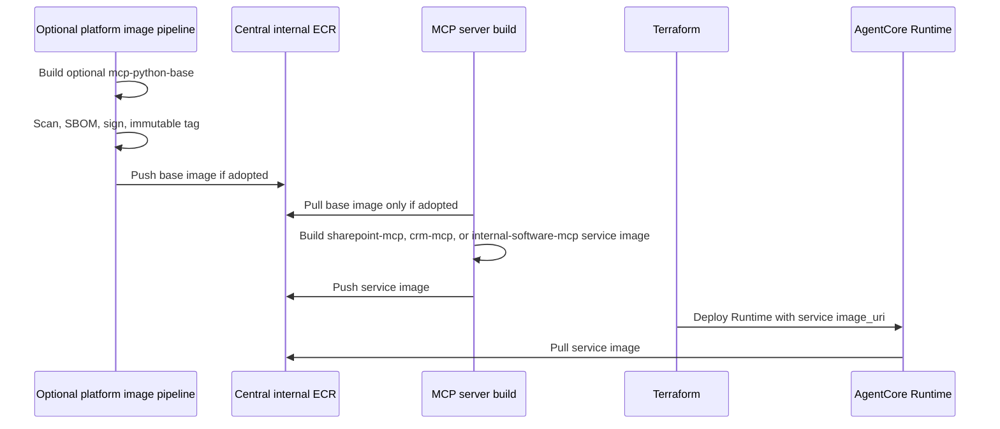
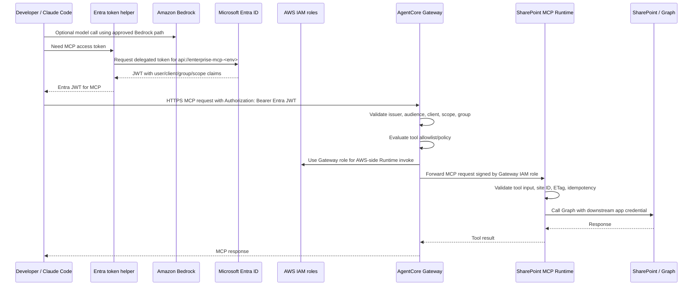
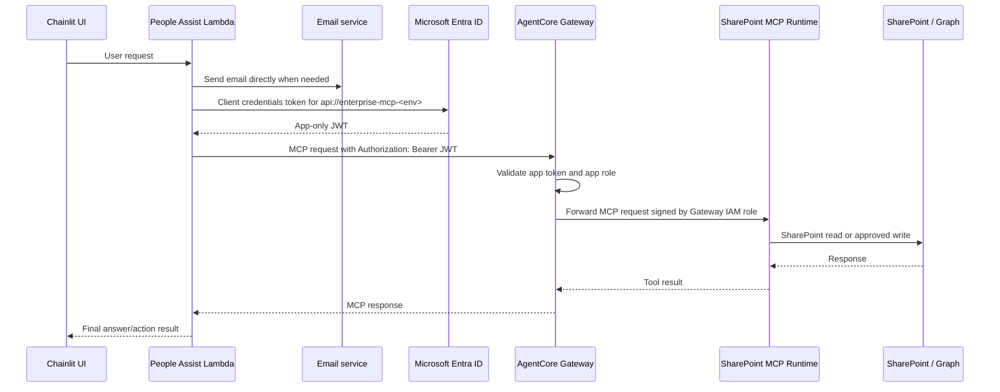

# ADR 0001: Enterprise AgentCore Gateway for MCP With Separate Runtime-Hosted MCP Servers

Date: 2026-07-04

Status: Accepted for PoC validation

The original authorization model and request sequences below are superseded by
ADR 0006. The shared Gateway, downstream-system server boundaries, Runtime
hosting, and AWS IAM separation decisions remain in force.

ADR 0009 supersedes the universal Runtime-hosting requirement below. Approved
vendor-operated remote MCP endpoints may connect directly as Gateway targets;
platform-owned and enterprise-hosted MCP servers continue to use the approved
Runtime pattern.

## Context

The clarified requirement is to start with one central enterprise MCP endpoint
implemented by Amazon Bedrock AgentCore Gateway, while still keeping each
downstream system in a separate MCP server boundary. SharePoint is the first
implemented MCP server, but CRM, internal software, and future systems should
not be forced into the SharePoint folder or a separate repo before the platform
pattern is proven.

SharePoint tools should be narrow API-like operations:

- list content metadata for an approved site/path
- read text from one approved file
- insert page content into an approved site
- update one approved file with optimistic concurrency

People Assist may call this MCP endpoint when it needs governed SharePoint
access. It does not need MCP for email sending because Lambda can send email
through the approved mail path.

Claude Code developers use MCP through an Entra-issued JWT. AWS IAM roles are
used on the AWS side of the boundary, including Gateway-to-Runtime invocation,
Runtime AWS permissions, and any AWS-hosted Bedrock path. If a future approved
direct-Bedrock mode uses workstation AWS credentials, that credential still
remains separate from the MCP bearer token. ADR 0004 records this clarified
Claude Code credential boundary.

MCP servers are deployed as Docker images. Repeating security setup,
healthchecks, logging defaults, and common runtime dependencies in every server
Dockerfile would create drift across SharePoint, CRM, internal software, and
future servers.

## Decision

Build one shared AgentCore Gateway endpoint configured for MCP using the
AWS-managed AgentCore Gateway URL:

```text
https://{gateway-id}.gateway.bedrock-agentcore.{region}.amazonaws.com/mcp
```

Do not use CloudFront for this MCP endpoint. The public-sector posture should
avoid CDN/global edge caching layers for this path, even when caching is
disabled.

Use this target architecture:

```mermaid
flowchart LR
    Claude["Claude Code\ngets Entra JWT\nMCP bearer token"]
    PA["People Assist Lambda\noptional MCP caller"]
    Entra["Microsoft Entra ID\nenterprise-mcp-api"]
    IAM["AWS IAM\nserver-side roles"]
    VPCE["AgentCore Gateway PrivateLink\ncom.amazonaws.region.bedrock-agentcore.gateway"]
    URL["AWS-managed Gateway URL\n/gateway-id.../mcp"]
    GW["AgentCore Gateway\nMCP + CUSTOM_JWT\npolicy engine + semantic search"]
    SPTarget["Gateway MCP target\nsharepoint-mcp"]
    CRMTarget["Gateway MCP target\ncrm-mcp future"]
    InternalTarget["Gateway MCP target\ninternal-software-mcp future"]
    SPRT["AgentCore Runtime\nsharepoint-mcp\n/mcp"]
    CRMRT["AgentCore Runtime\ncrm-mcp disabled"]
    InternalRT["AgentCore Runtime\ninternal-software-mcp disabled"]
    SP["SharePoint / Graph\nselected permissions"]
    CRM["CRM / Dataverse\nfuture"]
    Internal["Internal software APIs\nfuture"]

    Claude -->|HTTPS MCP bearer Entra JWT| URL
    PA -->|App JWT through VPC endpoint| VPCE
    Entra -->|issues tokens| Claude
    Entra -->|issues tokens| PA
    IAM -->|Gateway role invokes Runtime| SPTarget
    VPCE --> URL
    URL --> GW
    GW --> SPTarget
    GW -.future.-> CRMTarget
    GW -.future.-> InternalTarget
    SPTarget --> SPRT
    CRMTarget -.future.-> CRMRT
    InternalTarget -.future.-> InternalRT
    SPRT --> SP
    CRMRT -.future.-> CRM
    InternalRT -.future.-> Internal
```



Specific decisions:

- Host every MCP server in its own AgentCore Runtime.
- Expose MCP from each container at `0.0.0.0:8000/mcp`.
- Put AgentCore Gateway in front with `protocol_type = "MCP"`, not as a custom
  gateway we operate ourselves.
- Attach every enabled Runtime-hosted MCP server to Gateway using a Gateway
  `mcp_server` target pointed at that Runtime invocation endpoint.
- Use `gateway_iam_role { service = "bedrock-agentcore" }` so Gateway signs the
  upstream Runtime request.
- Restrict Runtime invocation to the Gateway role with a resource policy.
- Use Entra `CUSTOM_JWT` authorization at Gateway.
- Validate Entra audience, client IDs, and scopes at Gateway.
- Require Claude Code to call MCP with an Entra bearer token, not with AWS IAM.
- Keep AWS IAM roles server-side for Gateway, Runtime, AWS observability, secrets,
  downstream credential access, and any approved Bedrock model path.
- Do not use Cognito or a separately managed AgentCore Identity credential
  provider for inbound MCP authentication. Entra remains the token issuer;
  Gateway `CUSTOM_JWT` uses the managed AgentCore Identity inbound authorizer.
- Do not configure Runtime `custom_jwt_authorizer` for the normal
  Gateway-to-Runtime path; Runtime invocation is IAM-signed by Gateway.
- Use Terraform for infrastructure.
- Use one Terraform root for both nonprod and prod environment runs. Environment
  differences are selected with `nonprod.tfvars` and `prod.tfvars`, not
  separate copied code.
- Use existing central ECR image URIs as input to Runtime resources.
- Keep MCP server images self-contained for the PoC. Treat a centrally owned MCP
  base image as an optional future hardening pattern.
- Use AgentCore Gateway PrivateLink for private clients that run in VPCs or
  connected private networks. Per ADR 0008, the external network/platform
  account owns the endpoint, private DNS, endpoint policy, and routing.
- Use the AWS-managed Gateway URL as the MCP server URL.
- Do not use CloudFront, Lambda@Edge, or CDN-backed custom-domain routing for
  this public-sector MCP path.
- Keep SharePoint, CRM, internal software, and future servers in separate code
  folders and separate Runtime images.
- Enable SharePoint first. Keep CRM and internal software disabled until their
  tool contracts and allowlists are approved.
- Keep email sending outside MCP unless a future governance decision requires
  email to become a governed MCP tool.
- Enable Gateway semantic search so clients can discover relevant tools through
  `x_amz_bedrock_agentcore_search`.
- Add Runtime observability permissions for CloudWatch Logs, CloudWatch metrics,
  and X-Ray, but do not grant broad AgentCore permissions by default.

## AWS Sample Alignment

The AWS Claude Code Gateway sample supports the central Gateway direction:
Gateway reduces MCP configuration sprawl and tool-context overhead by giving
Claude Code one endpoint in front of backend MCP servers.

Adopt these sample patterns:

- Gateway as the single Claude Code MCP server.
- Gateway semantic search for tool discovery.
- Runtime MCP server containers listening on `0.0.0.0:8000/mcp`.
- Python SDK 2 `MCPServer` with `streamable-http` and
  `stateless_http=True`.
- Terraform-managed Runtime with `server_protocol = "MCP"`.
- MCP smoke tests that initialize, list tools, and call a selected tool.
- IAM trust policies constrained by source account and source ARN.
- Runtime CloudWatch/X-Ray/metrics permissions.

Do not adopt these sample choices for this environment:

- Cognito for inbound auth.
- A separately managed AgentCore Identity credential provider or token vault for
  the inbound MCP caller flow.
- Per-sample ECR/CodeBuild image pipeline resources.
- Broad `BedrockAgentCoreFullAccess`.
- Workload identity token permissions until a concrete outbound-token brokering
  use case is approved.

The Gateway `CUSTOM_JWT` authorizer is documented as an AgentCore Identity
inbound authorization capability, while Entra remains the issuer and source of
caller identity. Separately configured AgentCore Identity credential providers,
token-vault features and workload-token permissions remain future options only
if the platform needs a managed workload identity or outbound OAuth token
broker.

## Optional Base Image Standard

The current PoC does not require a platform-owned base image. Each MCP server
image can build directly from an approved Python base image and be deployed as a
final service image.

Keep the optional base-image pattern documented for later adoption. A future
platform-owned base image might use a URI like:

```text
111122223333.dkr.ecr.ap-southeast-2.amazonaws.com/internal/mcp-python-base:2026-07-04
```

If the pattern is adopted later, service Dockerfiles can extend the base:

```dockerfile
ARG MCP_BASE_IMAGE=111122223333.dkr.ecr.ap-southeast-2.amazonaws.com/internal/mcp-python-base:2026-07-04
FROM ${MCP_BASE_IMAGE}
```

The optional base image would own common platform controls:

- approved Python runtime baseline
- non-root user
- stdout/stderr logging defaults
- common MCP runtime dependencies
- healthcheck helper
- signal handling
- image labels for inventory
- vulnerability scan, SBOM, and image signing in the central image pipeline

The optional base image must not own business tools, downstream secrets, or
caller-specific authorization. Those remain in each MCP server folder and in
Gateway/Runtime policy.



## Claude Code Sequence



## People Assist Sequence



## Authorization Model

Use layered authorization:

1. Entra issues caller tokens for the environment-specific Enterprise MCP API
   audience, such as `api://enterprise-mcp-nonprod` or
   `api://enterprise-mcp-prod`.
2. Gateway validates the JWT issuer, audience, allowed client ID, and scope.
3. Gateway policy engine enforces which caller class can use which MCP tool.
4. Runtime validates tool input, site ID, idempotency key, ETag, and write
   constraints.
5. SharePoint Graph access uses separate downstream credentials and selected
   permissions.

AWS IAM is deliberately outside the inbound MCP caller identity. IAM is used only
after the request reaches AWS infrastructure, or for a separate direct Bedrock
model call if that path is approved for Claude Code.

Token acquisition is caller responsibility:

- Claude Code/developer tooling obtains a delegated Entra access token, for
  example with device code or an approved OAuth helper, requesting
  `api://enterprise-mcp-<env>/mcp.invoke`.
- People Assist Lambda obtains an app-only Entra access token with client
  credentials, requesting `api://enterprise-mcp-<env>/.default`.
- Terraform does not obtain or store Entra access tokens.

Terraform configures what AgentCore Gateway trusts: Entra discovery URL,
allowed audience, allowed client IDs, and scopes. Entra app registrations may be
managed by the cloud-owned `identity/entra` Terraform root, while the AWS
`infra` root consumes those IDs as input variables. ADR 0003 defines the current
Azure DevOps pipeline model for those roots.

Do not reuse the inbound caller JWT as the downstream SharePoint token.

Do not trust caller identity supplied as MCP tool arguments. If Runtime needs
caller context, pass sanitized claims through a trusted Gateway interceptor or
enforce identity-specific authorization entirely at Gateway policy level.

## Tool Allowlist

Current policy classes:

| Principal class | Match source | Allowed tools | Sites | Writes |
| --- | --- | --- | --- | --- |
| People Assist Lambda | Entra client ID + app role | list/get | HR policy site | No |
| Claude Code reader | Entra client ID + reader group | list/get | approved engineering/HR sites | No |
| SharePoint publisher | Entra client ID + publisher group/app role | list/get/insert/update | approved publishing sites | Yes, with change ticket |

The allowlist should live as code and require review from platform owners and
SharePoint data owners.

## Consequences

This gives developers and agents one stable MCP address while preserving
separate operational ownership for each downstream-system MCP server.

The shared Gateway must be conservative. A mistake in tool design or allowlist
policy can affect multiple server targets, so tool schemas, policy tests, and
server ownership boundaries are mandatory.

If adopted later, a shared base image can reduce drift, but it also becomes a
platform dependency. Base image changes need semantic versioning, vulnerability
response ownership, rollback capability, and compatibility testing against
every enabled MCP server. Do not use a mutable `latest` base tag in production
builds.

Gateway becomes the primary external policy boundary. Runtime still enforces
resource-level validation because Gateway policy is not a substitute for input
validation and downstream safety checks.

Gateway semantic search helps clients discover tools, but it does not authorize
tool use. Search results must still pass Gateway policy and Runtime validation.

Claude Code uses both AWS IAM and Entra JWT:

- IAM authorizes Bedrock model access.
- Entra JWT authorizes MCP tool access.

Those identities are correlated in audit logs by `correlation_id`, but they are
not collapsed into one credential.

## Implementation Artifacts

- [Enterprise MCP platform example](/Users/ronruan/Desktop/mcp_poc/examples/enterprise_mcp_platform)
- [SharePoint MCP server](/Users/ronruan/Desktop/mcp_poc/examples/enterprise_mcp_platform/servers/sharepoint_mcp)
- [Optional MCP Python base image](/Users/ronruan/Desktop/mcp_poc/examples/enterprise_mcp_platform/images/mcp_python_base)
- [Direct Cedar policy](/Users/ronruan/Desktop/mcp_poc/examples/enterprise_mcp_platform/policy)
- [ADR 0006: Direct Cedar and dual SharePoint identity lanes](/Users/ronruan/Desktop/mcp_poc/docs/adr/0006-direct-cedar-and-dual-sharepoint-identity-lanes.md)
- [Windows PowerShell Entra token helper](/Users/ronruan/Desktop/mcp_poc/examples/enterprise_mcp_platform/clients/entra_token_helper.ps1)
- [Shared Terraform root](/Users/ronruan/Desktop/mcp_poc/examples/enterprise_mcp_platform/infra/main.tf)
- [Terraform IAM resources](/Users/ronruan/Desktop/mcp_poc/examples/enterprise_mcp_platform/infra/iam.tf)
- [Terraform AgentCore Gateway resources](/Users/ronruan/Desktop/mcp_poc/examples/enterprise_mcp_platform/infra/agentcore_gateway.tf)
- [Terraform AgentCore Runtime resources](/Users/ronruan/Desktop/mcp_poc/examples/enterprise_mcp_platform/infra/agentcore_runtime.tf)

## Open Validation

- Confirm Claude Code can pass an Entra bearer token to the streamable HTTP MCP
  endpoint or use a secure token helper/proxy.
- Confirm the approved Entra delegated-token flow for Claude Code users.
- Confirm the approved Lambda secret-injection path for People Assist
  client-credentials auth.
- Confirm the Gateway `mcp_server` target can call the Runtime invocation
  endpoint with Gateway IAM signing in the target account.
- Validate Gateway semantic search and document how Claude Code should call
  `x_amz_bedrock_agentcore_search`.
- Confirm the external network/platform account's PrivateLink/private DNS path
  for Lambda and private developer networks.
- Confirm whether any future vanity domain can be supported without a CDN and
  without breaking TLS or OAuth discovery.
- Replace dry-run Graph operations with real Microsoft Graph calls and selected
  permissions.
- Decide whether caller claim headers are needed by Runtime or whether Gateway
  policy is sufficient.

## References

- AWS: Deploy MCP servers in AgentCore Runtime
  <https://docs.aws.amazon.com/bedrock-agentcore/latest/devguide/runtime-mcp.html>
- AWS: Supported Gateway targets
  <https://docs.aws.amazon.com/bedrock-agentcore/latest/devguide/gateway-supported-targets.html>
- AWS: AgentCore Runtime targets
  <https://docs.aws.amazon.com/bedrock-agentcore/latest/devguide/gateway-target-http-runtime.html>
- AWS: AgentCore PrivateLink interface endpoints
  <https://docs.aws.amazon.com/bedrock-agentcore/latest/devguide/vpc-interface-endpoints.html>
- AWS: Gateway header propagation
  <https://docs.aws.amazon.com/bedrock-agentcore/latest/devguide/gateway-headers.html>
- Terraform AWS provider: AgentCore Runtime
  <https://registry.terraform.io/providers/hashicorp/aws/latest/docs/resources/bedrockagentcore_agent_runtime>
- Terraform AWS provider: AgentCore Gateway
  <https://registry.terraform.io/providers/hashicorp/aws/latest/docs/resources/bedrockagentcore_gateway>
- Microsoft: Device authorization grant flow
  <https://learn.microsoft.com/en-us/entra/identity-platform/v2-oauth2-device-code>
- Microsoft: Client credentials flow
  <https://learn.microsoft.com/en-us/entra/identity-platform/v2-oauth2-client-creds-grant-flow>
- HashiCorp: HCP Terraform workspaces
  <https://developer.hashicorp.com/terraform/cloud-docs/workspaces>
- HashiCorp: HCP Terraform variables and variable sets
  <https://developer.hashicorp.com/terraform/cloud-docs/variables>
- AWS sample: Claude Code with AgentCore Gateway
  <https://github.com/awslabs/agentcore-samples/tree/main/02-use-cases/03-coding-assistants/claude-code-gateway-mcp-server>
- AWS sample: MCP server on AgentCore Runtime with Terraform
  <https://github.com/awslabs/agentcore-samples/tree/main/04-infrastructure-as-code/terraform/mcp-server-agentcore-runtime>
- AWS: Gateway semantic tool search
  <https://docs.aws.amazon.com/bedrock-agentcore/latest/devguide/gateway-using-mcp-semantic-search.html>
