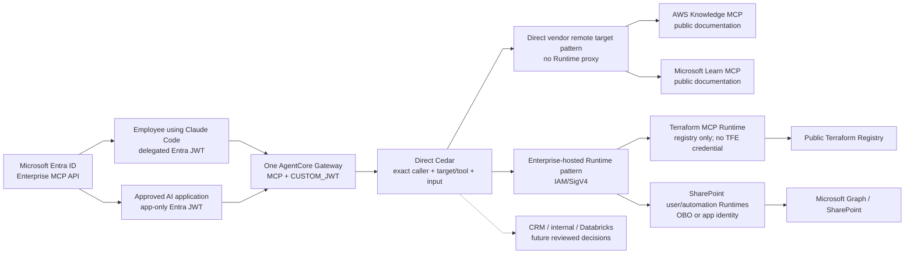
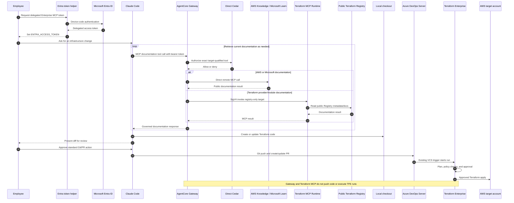

# ADR 0009: Vendor-Native and Documentation MCP Targets

Date: 2026-07-29

Status: Accepted for PoC validation

ADR 0010 replaces the SharePoint target names in this ADR with
`sharepoint-delegated` and `sharepoint-application`. The vendor-native and
documentation-target decision is unchanged.

## Context

ADR 0001 established one shared AgentCore Gateway and initially assumed that
every MCP server would be hosted on AgentCore Runtime. That assumption is
appropriate for platform-owned MCP code such as the SharePoint server, but it
adds an unnecessary proxy when a vendor already operates a compatible remote
MCP endpoint.

The first documentation use cases are:

- current AWS documentation and technical guidance;
- current Microsoft Learn documentation and code samples; and
- current public Terraform Registry provider/module documentation.

Terraform code is authored in the employee's local checkout by Claude Code.
Code delivery remains standard Git to the self-managed Azure DevOps Server
repository, followed by the existing Terraform Enterprise workflow. The
Terraform MCP server is not a deployment path.

Databricks data access and Azure DevOps Wiki/work-item/sprint operations require
separate downstream identity and authorization decisions. They are outside this
ADR.

## Decision

Keep the shared AgentCore Gateway as the only enterprise MCP front door. Attach
targets according to who operates the MCP service:

1. Connect an approved vendor-operated remote MCP endpoint directly as an
   AgentCore Gateway MCP server target when the endpoint, protocol version,
   outbound authentication method, data handling, and availability model pass
   review. Do not add an AgentCore Runtime proxy only to preserve the original
   Runtime-only diagram.
2. Run vendor-provided MCP software on AgentCore Runtime when the enterprise
   must host or configure the process, restrict its enabled toolsets, attach
   private connectivity, or apply service-side controls.
3. Continue to run platform-owned MCP servers such as SharePoint in their
   approved Runtime identity lanes.

The first PoC target set is:

| Target | Gateway-to-target path | Enabled capability |
| --- | --- | --- |
| `aws-knowledge` | Direct remote MCP target to `https://knowledge-mcp.global.api.aws` | Public AWS documentation, architectural guidance, and code examples |
| `microsoft-learn` | Direct remote MCP target to `https://learn.microsoft.com/api/mcp` | Public Microsoft Learn documentation and code samples |
| `terraform-registry` | Gateway target to an enterprise-hosted HashiCorp Terraform MCP server on AgentCore Runtime | Public Terraform Registry provider/module documentation only |
| `sharepoint-user` / `sharepoint-automation` | Existing AgentCore Runtime identity lanes | Governed SharePoint operations defined by ADRs 0006 and 0007 |

Configure the Terraform MCP Runtime with only the public Registry toolset:

- start with `--toolsets=registry`;
- keep `ENABLE_TF_OPERATIONS=false`;
- do not enable `registry-private` or `terraform`;
- do not provide `TFE_TOKEN` or another HCP Terraform/Terraform Enterprise
  credential; and
- use streamable HTTP at `/mcp` with the approved Runtime contract.

The documentation targets are read-only knowledge sources. They must not expose
AWS resource-operation tools, Terraform Enterprise workspace/run tools, shell
execution, or generic HTTP-fetch tools.

Direct Cedar remains default-deny and authorizes exact target-qualified tool
actions. A newly discovered vendor tool is not usable until its Cedar action,
caller population, data classification, and operational owner are reviewed.
Use Gateway target synchronization deliberately after a vendor capability
change; do not treat synchronization as authorization.

Because the AWS Knowledge and Microsoft Learn endpoints are public and do not
require outbound credentials, their no-auth outbound path is a narrow
documentation exception. The exception requires:

- TLS endpoint and hostname validation;
- outbound domain restrictions where supported;
- no secrets, tokens, customer records, private source code, or sensitive
  document content in queries;
- input/output size limits, timeouts, rate limits, and safe error handling;
- audit metadata that identifies caller, target, tool, decision, and result
  without logging query or document bodies; and
- a target-level kill switch.

Claude Code uses the documentation results to edit the local repository. It
then uses normal Git/PR mechanics against Azure DevOps Server. Azure DevOps and
central TFE controls remain authoritative for review, plan, approval, and apply.
Neither AgentCore Gateway nor the Terraform MCP Runtime receives permission to
push code, create TFE runs, or apply infrastructure.

## Target Flow

Editable sources:

- `docs/architecture/enterprise-mcp-platform.mmd`
- `docs/architecture/enterprise-mcp-platform.drawio`

## Claude Code and Terraform Delivery Sequence

Editable sources:

- `docs/architecture/claude-code-terraform-docs-sequence.mmd`
- `docs/architecture/claude-code-terraform-docs-sequence.drawio`

## Consequences

Positive:

- Employees and applications retain one governed MCP endpoint.
- Public vendor documentation can be used without operating an unnecessary
  Runtime proxy.
- The Terraform server is constrained to documentation while Claude Code,
  Azure DevOps, and TFE retain their existing responsibilities.
- Direct Cedar, audit, kill-switch, and target ownership controls apply
  consistently across direct and Runtime-hosted targets.

Tradeoffs:

- Public remote MCP availability, rate limits, schemas, and terms are outside
  enterprise control.
- Vendor capability changes require target synchronization and policy review.
- Public documentation queries create an external data-egress path and require
  strict data-classification controls.
- The enterprise still operates the restricted Terraform MCP Runtime.

## PoC Validation

Before enabling these targets beyond non-production:

1. Confirm AgentCore Gateway can initialize, list, and call each endpoint using
   a supported MCP protocol version.
2. Confirm Cedar exposes only the reviewed documentation tools to each caller
   role and denies every other target-qualified action.
3. Confirm the AWS target cannot execute AWS APIs.
4. Confirm the Terraform target starts with only `registry`, has
   `ENABLE_TF_OPERATIONS=false`, and has no TFE credential.
5. Confirm Gateway target synchronization does not make a newly discovered
   tool callable without an explicit Cedar change.
6. Test timeouts, vendor throttling, oversized responses, schema drift, and the
   per-target kill switch.
7. Verify logs contain no bearer tokens, query bodies, private source code, or
   full retrieved documents.
8. Demonstrate that deployment still occurs only after Git/PR and TFE controls.

## Relationship to Earlier Decisions

This ADR supersedes only ADR 0001's universal requirement to host every MCP
server on AgentCore Runtime. ADR 0001's shared Gateway, separate downstream
boundaries, Entra caller identity, AWS IAM separation, and no-CloudFront
decisions remain in force.

ADRs 0006 and 0007 continue to govern SharePoint Runtime identity lanes. This
ADR does not approve Databricks data access or Azure DevOps work-management
operations.

## References

- [AgentCore Gateway MCP server targets](https://docs.aws.amazon.com/bedrock-agentcore/latest/devguide/gateway-target-MCPservers.html)
- [AWS Knowledge MCP server](https://awslabs.github.io/mcp/servers/aws-knowledge-mcp-server)
- [Microsoft Learn MCP server](https://learn.microsoft.com/en-us/training/support/mcp-get-started-foundry)
- [Terraform MCP server reference](https://developer.hashicorp.com/terraform/mcp-server/reference)
