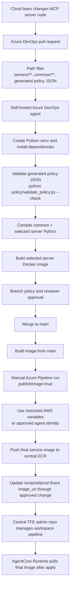
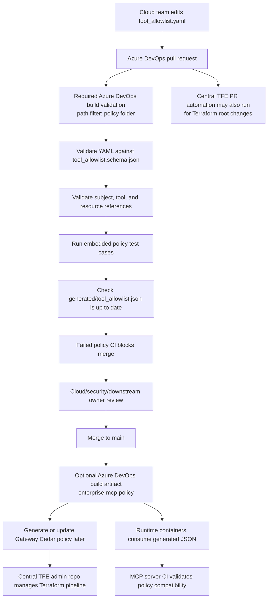
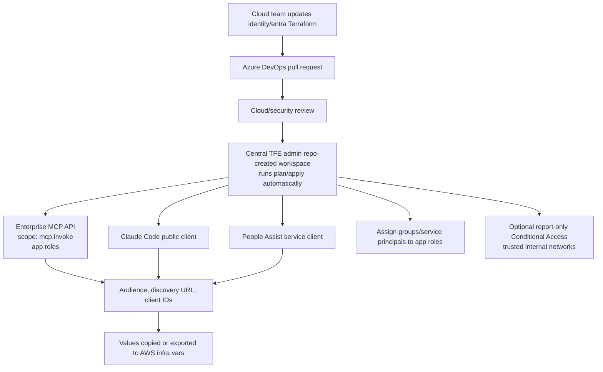
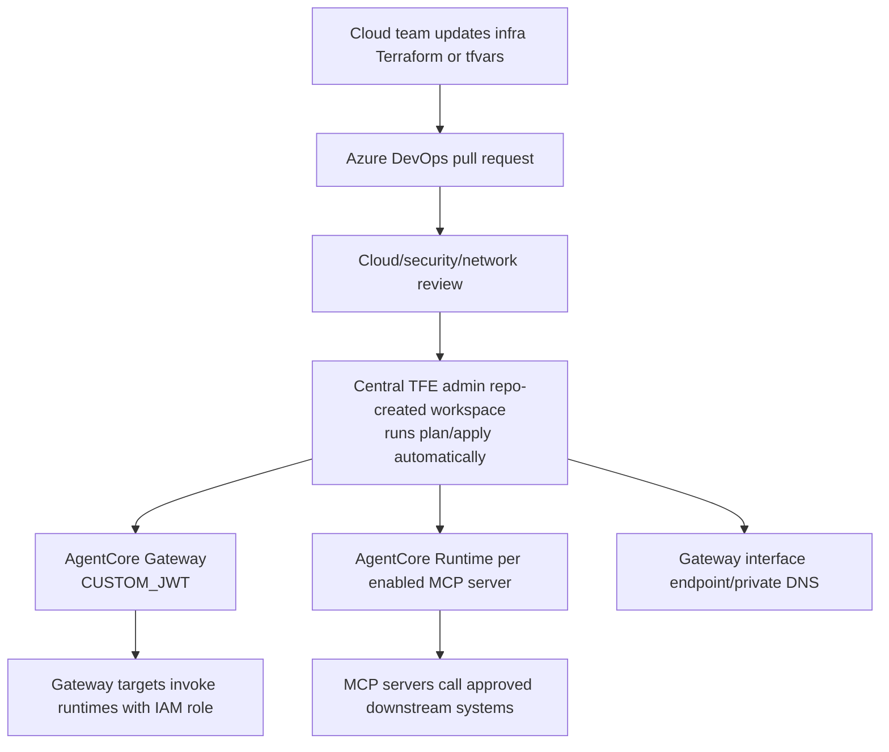
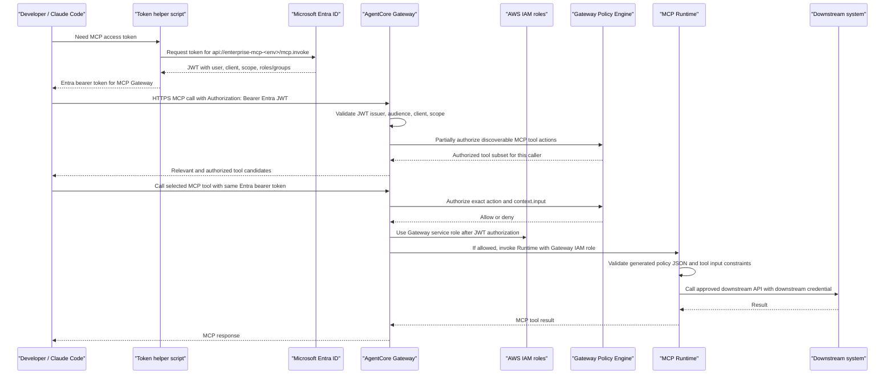
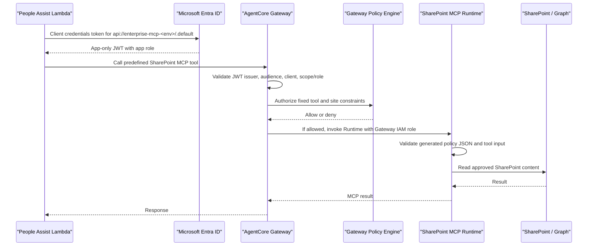
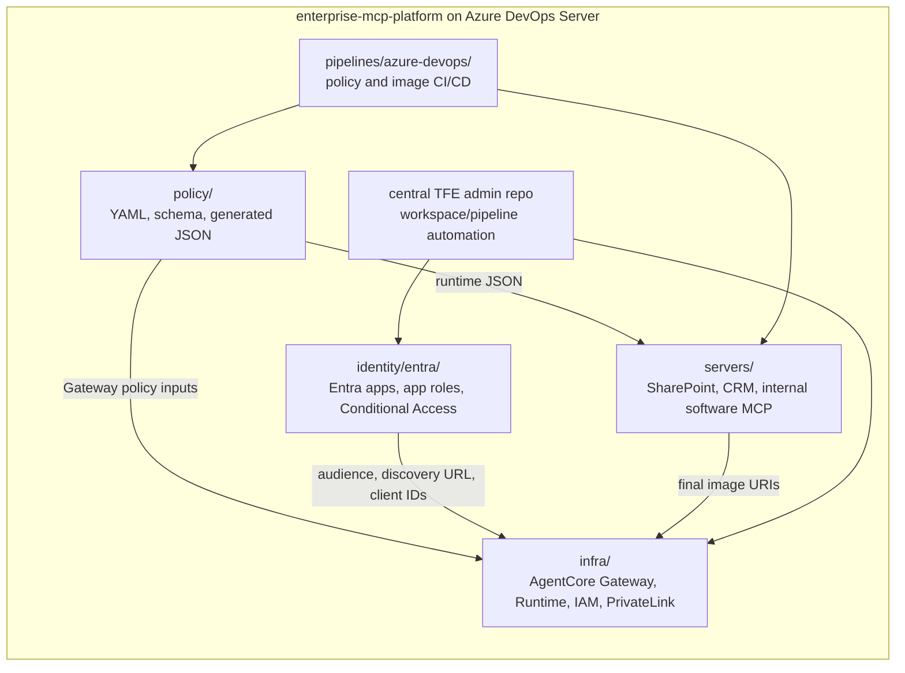

# Azure DevOps Workflows

These diagrams describe the cloud-team-owned operating model for the on-prem
Azure DevOps repository. The repo keeps identity, AWS infrastructure, policy,
shared runtime helpers, and MCP server code together, while still keeping clear
folder boundaries and separate Terraform state per root/environment.

## MCP Server CI/CD



## Policy CI/CD



For Azure Repos, the merge-blocking check is the branch policy build
validation, not the YAML `pr` trigger. Configure `policy-ci.yml` as a required
build validation policy on `main` with a path filter matching:

```text
/examples/enterprise_mcp_platform/policy/*;
/examples/enterprise_mcp_platform/policy/generated/*;
/examples/enterprise_mcp_platform/requirements.txt;
/examples/enterprise_mcp_platform/pipelines/azure-devops/policy-ci.yml
```

If the example becomes its own repo root, remove the
`/examples/enterprise_mcp_platform` prefix. The central TFE admin repo can keep
running Terraform PR automation independently; policy CI failure must still
block PR completion for matching policy changes.

## Entra Identity Terraform Flow



## AWS AgentCore Terraform Flow



## Claude Code Tool Discovery And Authorization



## Fixed Production Agent Authorization



## Cloud-Owned Repo Boundaries



DevOps ownership should be explicit:

| Area | Primary owner | Required reviewer |
| --- | --- | --- |
| `policy/tool_allowlist.yaml` | cloud platform team | security/downstream owner for expanded access |
| MCP server source | cloud platform team | downstream system owner for domain behavior |
| MCP Dockerfiles | cloud platform team | DevOps/security for publish controls |
| `pipelines/azure-devops/*.yml` | cloud platform team | DevOps/security |
| `infra/*.tf` | cloud platform team | security/networking as applicable |
| `identity/entra/*.tf` | cloud platform team | identity/security governance |
| `envs/prod.tfvars` | cloud platform team | production change approver |
