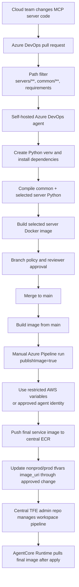
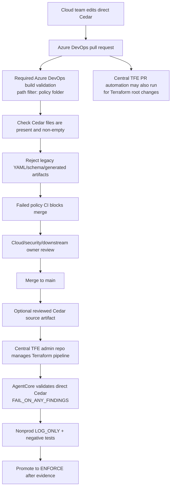
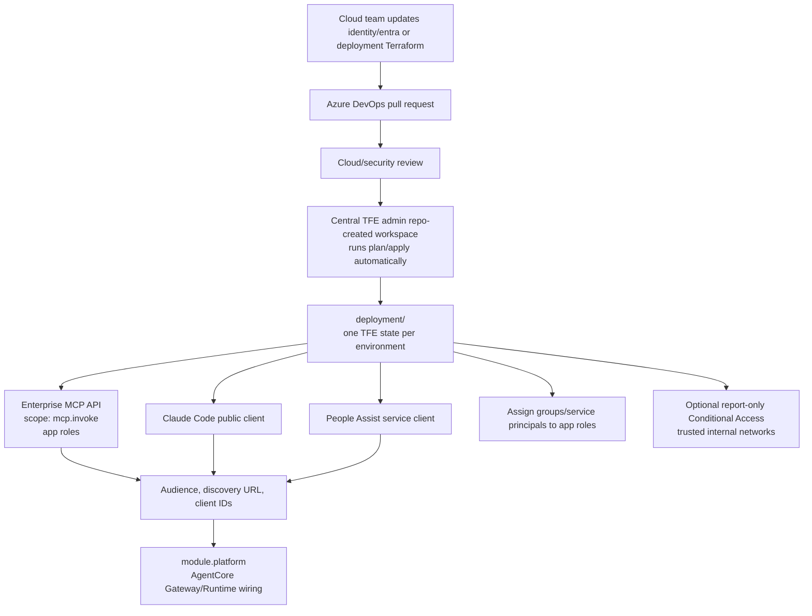
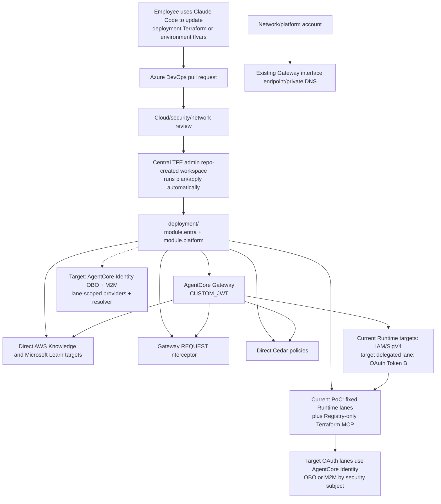
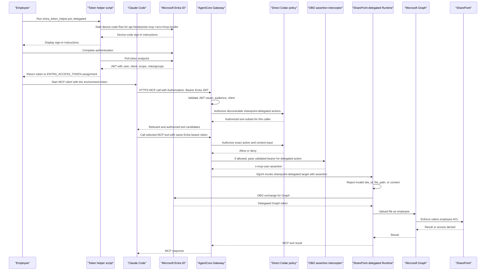
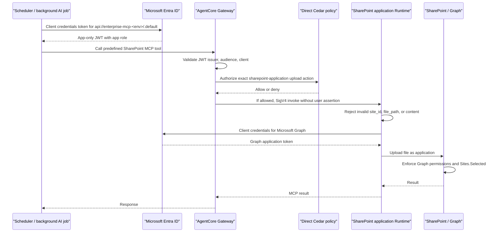
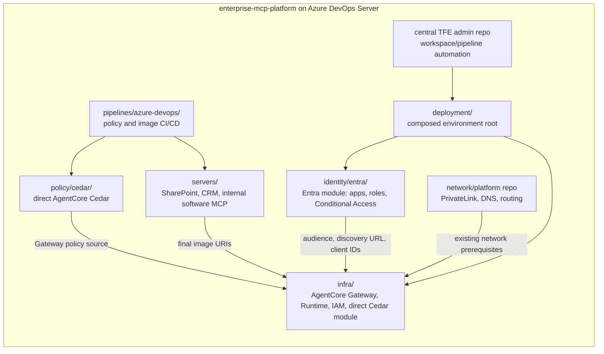

# Azure DevOps Workflows

These diagrams describe the cloud-team-owned operating model for the
self-managed Azure DevOps Server repository hosted on AWS. The repo keeps
identity, AWS infrastructure, policy, shared runtime helpers, and MCP server
code together, while still keeping clear module boundaries. The composed
`deployment/` root is the TFE execution path, with one state per environment;
`identity/entra` and `infra` are modules inside that state.

## MCP Server CI/CD



## Policy CI/CD



For Azure Repos, the merge-blocking check is the branch policy build
validation, not the YAML `pr` trigger. Configure `policy-ci.yml` as a required
build validation policy on `main` with a path filter matching:

```text
/examples/enterprise_mcp_platform/policy/*;
/examples/enterprise_mcp_platform/policy/cedar/*;
/examples/enterprise_mcp_platform/pipelines/azure-devops/policy-ci.yml
```

If the example becomes its own repo root, remove the
`/examples/enterprise_mcp_platform` prefix. The central TFE admin repo can keep
running Terraform PR automation independently; policy CI failure must still
block PR completion for matching policy changes.

## Entra Identity Terraform Flow



## AWS AgentCore Terraform Flow



The AWS flow above is the current repository implementation reference. The
target trust-domain Runtime, AgentCore Identity OBO/M2M providers, and live
provider registration are **Accepted for PoC validation**, not deployed. The
staged app-only resolver/adapter and bounded mapping are present behind the
ingress gate. The current two fixed SharePoint lanes remain in place while
delegated two-hop OBO, application M2M, provider-ARN IAM, and app-only
caller-context gates are tested. See
[`sharepoint-identity-routing.md`](sharepoint-identity-routing.md) and
[`ADR 0012`](../adr/0012-agentcore-identity-for-delegated-and-m2m-lanes.md).

The documentation targets can inform Claude Code, but they are not part of the
Git or deployment path. Claude Code writes the local checkout, Azure DevOps
Server owns Git/PR controls, and central TFE owns plan/apply. See
`claude-code-terraform-docs-sequence.mmd`.

## Current PoC Claude Code Tool Discovery And Authorization



## Current PoC Application Credential Authorization



The application sequence is a current PoC shape, not enabled app-only ingress.
The target keeps `client_credentials` semantics but retrieves the downstream
token through a lane-scoped AgentCore Identity M2M provider. A Gateway request-
interceptor PoC gate copies the signed caller JWT to
`x-mcp-caller-assertion`, then revalidates the Gateway audience, tenant, client,
and roles in the trust-domain Runtime. A thin resolver uses caller client ID,
exact target-qualified action, server-owned resource key (`site_id` for
SharePoint), and environment; callers cannot select auth mode or provider
details. Misses and unavailable configuration/providers fail closed. The
official AWS documentation does not provide the complete native no-code caller-
context composition, so it remains unverified. `JWT_PASSTHROUGH` is not the
default.

## Cloud-Owned Repo Boundaries



DevOps ownership should be explicit:

| Area | Primary owner | Required reviewer |
| --- | --- | --- |
| `policy/cedar/*.cedar` | cloud platform team | security/downstream owner for expanded access |
| MCP server source | cloud platform team | downstream system owner for domain behavior |
| MCP Dockerfiles | cloud platform team | DevOps/security for publish controls |
| `pipelines/azure-devops/*.yml` | cloud platform team | DevOps/security |
| `infra/*.tf` | cloud platform team | security/networking as applicable |
| `identity/entra/*.tf` | cloud platform team | identity/security governance |
| `envs/prod.tfvars` | cloud platform team | production change approver |
