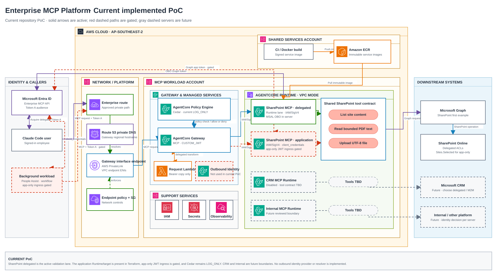
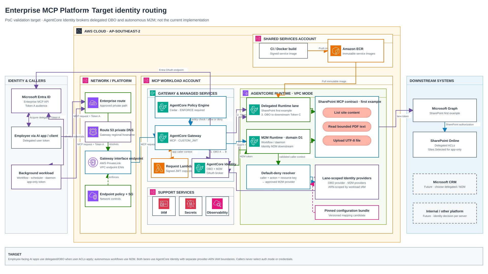
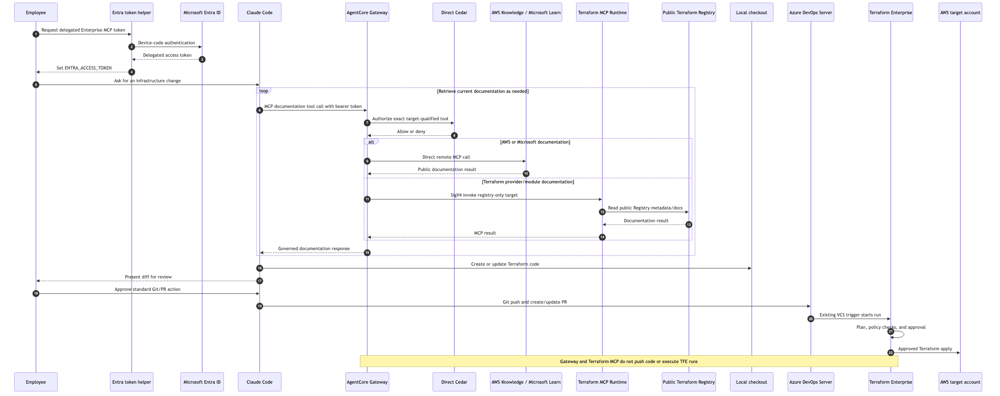

# Enterprise MCP Platform on AWS

## Developer Architecture Guide

**Status:** Living technical guide; current PoC and target validation are
explicitly separated below

**Last updated:** 10 September 2026

**Maintainer:** Cloud Platform Team

**Implementation root:** `examples/enterprise_mcp_platform`

---

## 1. Platform overview

The platform provides one governed internal Model Context Protocol (MCP) entry
point on AWS. Amazon Bedrock AgentCore Gateway is the shared MCP front door.
Platform-owned and enterprise-hosted servers use AgentCore Runtime, while an
approved vendor-operated remote MCP endpoint may connect directly as a Gateway
target. SharePoint is the first enabled business-system integration. AWS
Knowledge, Microsoft Learn and a Registry-only Terraform MCP Runtime are the
first documentation-target PoC. CRM, internal-software and Databricks targets
remain disabled until their tool contracts, identity model and owners are
implemented and validated.

The current repository implementation uses Gateway `CUSTOM_JWT`, direct Cedar,
two fixed SharePoint Runtime lanes invoked with IAM/SigV4, a delegated-only
assertion-copy interceptor plus Runtime MSAL OBO, and application Runtime
Graph `client_credentials`. App-only Gateway ingress is gated off. The target
identity-routing design is **Accepted for PoC validation**, not implemented:
AgentCore Identity brokers two audience-specific OBO hops for delegated access
and M2M client credentials for autonomous workflows. The lanes use separate
workload identities/provider IAM; app-only uses one Runtime per approved trust
domain with a thin default-deny resolver. See [downstream identity routing
(SharePoint example)](sharepoint-identity-routing.md) and
[ADR 0012](../adr/0012-agentcore-identity-for-delegated-and-m2m-lanes.md).

The repository contains representative Terraform, direct Cedar and MCP server
code. Treat it as an implementation reference: dual Runtime/target expansion,
the OBO assertion interceptor, Graph token acquisition, direct Cedar Terraform
resources, and the opt-in app-only resolver/adapter are implemented examples,
not live deployment evidence. ADR 0009 adds the target model, while ADR 0010
narrows the SharePoint write surface to one fail-fast upload tool and names the
lanes by Graph credential mode. Direct vendor-target resources and the
restricted Terraform MCP Runtime are not yet implemented. The workload root
currently targets Sydney
(`ap-southeast-2`) and consumes a platform-supplied target account ID and
existing Runtime network IDs. Melbourne (`ap-southeast-4`) remains gated on
official service availability and non-production validation. Real
Gateway-to-target invocation, live Entra exchange, Microsoft Graph upload,
documentation-target controls, the externally managed PrivateLink route and
production CI/CD controls still require target-environment validation.

## 2. Repository map

| Path | Developer use |
| --- | --- |
| `examples/enterprise_mcp_platform/clients` | Local, Claude Code and Gateway validation clients, including the Windows Entra token helper. |
| `examples/enterprise_mcp_platform/servers/sharepoint_mcp` | SharePoint MCP server, tool contracts and Graph client boundary. |
| `examples/enterprise_mcp_platform/common/mcp_runtime` | Shared validation and audit helpers used by Runtime-hosted servers. |
| `examples/enterprise_mcp_platform/policy` | Direct AgentCore Cedar source and its deployment contract. |
| `examples/enterprise_mcp_platform/deployment` | Composed environment Terraform root; one TFE workspace/state per environment, wiring the Entra and platform modules. |
| `examples/enterprise_mcp_platform/identity/entra` | Entra module for environment-specific API, client, role and assignment configuration. |
| `examples/enterprise_mcp_platform/infra` | AgentCore Gateway, Runtime targets, IAM and direct Cedar module; consumes central platform account and Runtime network inputs. |
| `examples/enterprise_mcp_platform/pipelines/azure-devops` | MCP server and policy validation pipeline examples. |
| `docs/architecture` | Architecture diagrams, sequences and this generated developer guide. |
| `docs/adr` | Durable architecture decisions and their history. |

Start with `examples/enterprise_mcp_platform/README.md` for local commands. Use the ADRs for decision history and `IN_PROGRESS.md` for work that is not yet complete.

## 3. Developer workflow

### 3.1 Run the SharePoint server locally

Use dry-run mode while developing tool contracts and authorization behaviour. From the repository root:

```bash
cd examples/enterprise_mcp_platform
python -m venv .venv
. .venv/bin/activate
pip install -r requirements.txt
export GRAPH_DRY_RUN=true
python -m servers.sharepoint_mcp.src.server
```

In another terminal, activate the same environment and run `python clients/local_client.py`.

### 3.2 Review and validate policy changes

Edit the Cedar statements directly:

```text
examples/enterprise_mcp_platform/policy/cedar/sharepoint-delegated.cedar
examples/enterprise_mcp_platform/policy/cedar/sharepoint-application.cedar
```

There is no generated Runtime policy. AgentCore policy create/update with
`FAIL_ON_ANY_FINDINGS` validates Cedar against the live Gateway schema. Test
positive and negative calls in non-production before moving from `LOG_ONLY` to
`ENFORCE`.

### 3.3 Acquire an employee delegated token for Claude Code on Windows

Use the delegated Entra helper for developer validation. Do not store the returned token in source control or static configuration.

```powershell
Set-Location examples/enterprise_mcp_platform
$env:ENTRA_TENANT_ID = "<tenant-id>"
$env:ENTRA_CLIENT_ID = "<interactive-mcp-public-client-id>"
$env:ENTRA_MCP_AUDIENCE = "api://enterprise-mcp-nonprod"
$env:ENTRA_ACCESS_TOKEN = & .\clients\entra_token_helper.ps1 delegated
```

Claude Code sends this token to the Gateway as `Authorization: Bearer <Entra JWT>`. Do not SigV4-sign the caller request. AWS IAM is used for the current Gateway-to-Runtime path and other AWS-side service actions; the target delegated Gateway-to-Runtime path instead uses an Identity-brokered Runtime-audience JWT.

## 4. Design principles

1. **One governed entry point.** Clients connect to one AgentCore Gateway URL rather than directly to individual MCP servers.
2. **Target by operating model.** Vendor-operated remote MCP endpoints can be direct Gateway targets; enterprise-hosted processes and platform-owned integrations use reviewed Runtime/target deployments.
3. **Identity separation.** Entra identifies the MCP caller; AWS IAM authorizes AWS service actions; a separate downstream credential authorizes Microsoft Graph.
4. **Deny by default.** Cedar explicitly allows caller/tool capabilities; SharePoint explicitly allows employee ACLs or application site grants.
5. **Narrow tools.** Tools express approved business operations, not generic transport or code execution.
6. **Controls outside the model.** Deterministic policy and runtime validation, not model instructions, enforce access.
7. **No direct Runtime bypass.** Runtime resource policy permits invocation only by the Gateway role.
8. **Private where supported.** VPC callers use the external network/platform account's AgentCore Gateway interface endpoint and private DNS; network location supplements but does not replace identity.
9. **No secrets or sensitive content in logs.** Audit metadata is recorded without bearer tokens, credentials or full documents.
10. **Validate before promotion.** A change moves forward only after its code, policy, infrastructure and operational checks pass.

## 5. Implementation status

The repository is a planning and proof-of-concept workspace. The following maturity terms are used throughout this document:

- **Decided:** captured in an accepted or PoC-validation ADR.
- **Example implemented:** representative code or Terraform exists but has not necessarily run in the target environment.
- **Validation required:** behaviour must be demonstrated with evidence before production.
- **Planned:** not implemented or enabled in the first slice.

### 5.1 Status matrix

| Area | State | Evidence or gap |
| --- | --- | --- |
| Shared Gateway and separate Runtime architecture | Current repository implementation; live validation required | Terraform expands one SharePoint image into two fixed delegated/application Runtime/target lanes. Real target behaviour remains unvalidated. |
| Vendor documentation targets | Decided; validation required | ADR 0009 approves direct AWS Knowledge/Microsoft Learn targets and a Registry-only Terraform MCP Runtime. Target resources, Cedar actions and live calls are not implemented. |
| Inbound Entra JWT | Decided; example implemented | Gateway `CUSTOM_JWT` configuration and Entra Terraform exist. Enterprise-tenant deployment and token flows remain unvalidated. |
| AgentCore Identity | Current inbound capability; target validation required | Managed inbound JWT validation is used through Gateway. The opt-in app-only branch has a local resolver, bounded `APP_ONLY_MAPPING_JSON`, workload identity and M2M adapter; live provider registration, credential method, token exchange and grants remain unvalidated. |
| Gateway policy | Direct source and Terraform implemented | Delegated and application Cedar files are wired to `aws_bedrockagentcore_policy` with `FAIL_ON_ANY_FINDINGS`. Live-schema validation and `ENFORCE` evidence remain open. |
| Downstream identity | Implemented PoC baseline; target validation required | MSAL OBO/client-credentials providers, lane-scoped secret access and the OBO assertion interceptor exist. Real tenant credentials and native target exchanges remain unvalidated. |
| Trust-domain resolver | Staged PoC path; live validation required | The local app-only branch uses caller client ID + exact target-qualified action + server-owned resource key + environment; SharePoint keeps `site_id`. Provider selection is default-deny and caller-controlled auth/provider fields are rejected. The mapping is delivered as schema-1 `APP_ONLY_MAPPING_JSON`, capped at 5000 characters. |
| Runtime safety | Example implemented | Runtime validates required upload inputs and fails without changing invalid values. It does not load or evaluate a second caller/tool policy. |
| SharePoint tools | Partial example | List/read dry-run tools remain; their live Graph branches are placeholders. One file-upload write tool and its Graph `PUT` adapter exist. Real tenant permissions, throttling and error handling remain unvalidated. |
| Private access | External prerequisite | The network/platform account owns the interface endpoint, private DNS, endpoint policy and routing. This workload root does not create them; end-to-end routing still requires validation. |
| Observability | Partial example | Runtime permissions and structured audit events exist. Gateway log destinations, retention, SIEM integration, alarms and sensitive-data verification remain open. |
| Production configuration | Placeholder | Non-production and production tfvars contain placeholder IDs, subnets, security groups and image URIs. Terraform providers are pinned, but target-account plans remain open. |

## 6. Architecture



**Figure 1 - Current PoC architecture and trust boundaries.** Editable source:
`enterprise-mcp-platform-layered.drawio`, page “Current implemented PoC”. Expected export:
`enterprise-mcp-platform-current-poc.svg` or `.png`.



**Figure 2 - Target identity-routing architecture (Accepted for PoC validation,
not implemented).** Editable source: `enterprise-mcp-platform-layered.drawio`,
page “Target identity routing”. Expected export: `enterprise-mcp-platform-target-identity.svg`
or `.png`.

### 6.1 Deployment shape

- One Gateway per environment.
- Sydney (`ap-southeast-2`) is the current AgentCore Gateway/Runtime region.
- Melbourne (`ap-southeast-4`) remains gated until AWS publishes the required
  endpoints and VPC support and a non-production deployment is validated.
- Central platform/TFE supplies `target_account_id` and existing Runtime
  subnet/security-group IDs.
- The network/platform account owns Gateway PrivateLink, private DNS, endpoint
  policy, routing and client-side network controls.
- One environment-specific Entra Enterprise MCP API audience.
- Separate allowed client lists for non-production and production.
- Current PoC: separate `sharepoint-delegated` and `sharepoint-application`
  targets/Runtimes, built from the same SharePoint service source and image;
  app-only ingress remains gated.
- Target: one application Runtime per approved trust domain, not per caller or
  provider and not a universal all-provider Runtime. A thin resolver may select
  approved AgentCore Identity M2M provider profiles within that domain. A
  delegated Runtime uses only approved OBO providers. New Runtime creation
  normally marks a new audit/IAM/credential-isolation boundary.
- Target configuration is sourced from Git/Terraform as an immutable,
  versioned catalog and provider-binding map. The staged first delivery is the
  schema-1 `APP_ONLY_MAPPING_JSON` Runtime value, capped at 5000 characters. A
  statically pinned AgentCore Configuration Bundle is optional and deferred;
  weighted/A-B security mappings are prohibited.
- Target operations require cache, rollback, kill switch, drift detection and
  audit evidence. Identity/provider counts follow audit/isolation boundaries;
  the documented default OAuth-provider quota is 50 per account/Region subject
  to adjustment.
- Direct AWS Knowledge and Microsoft Learn remote MCP targets for public
  documentation.
- One enterprise-hosted Terraform MCP Runtime/target with only the public
  Registry toolset, Terraform operations disabled and no TFE credential.
- SharePoint enabled first; CRM and internal software disabled. CRM starts with
  one application lane unless its API requires delegated user semantics.
- Databricks remains disabled pending a separate OAuth, Unity Catalog, network
  and preview-lifecycle decision.
- One composed `deployment/` Terraform root instantiated through one TFE
  workspace/state per environment; `identity/entra` and `infra` remain module
  boundaries inside that root.
- Final service image URI passed to Runtime; no Runtime deploys a base-image URI.
- Gateway policy remains `LOG_ONLY` only during controlled validation and must be `ENFORCE` before production use.

### 6.2 Logical components

| Component | Responsibility | Security boundary |
| --- | --- | --- |
| Claude Code / approved developer client | Reads the delegated token obtained by the employee through the approved helper and invokes approved MCP operations | User, managed device and approved token-helper controls |
| Employee-facing AI application or MCP client | Obtains a delegated Entra token when downstream user permissions must apply | Signed-in employee plus approved client registration |
| Autonomous scheduler/workflow/daemon (target shape; ingress gated) | Obtains an app-only Entra token only when no employee is the security subject | AWS workload IAM role plus separate Entra service principal |
| Microsoft Entra ID | Issues environment-specific Enterprise MCP API tokens and manages client, scope, role and group assignments | Enterprise identity control plane |
| AgentCore Gateway | Terminates MCP, validates JWTs, applies policy, supports semantic tool discovery and routes to targets | Primary external authorization boundary |
| AgentCore Identity inbound authorizer | Uses OIDC discovery metadata and configured claims to validate bearer tokens | Managed token-validation capability used by Gateway |
| AgentCore Identity outbound broker (target) | Exchanges delegated tokens through OBO and obtains M2M tokens from lane-scoped OAuth providers | Managed target credential boundary; not implemented |
| Direct Cedar in Gateway Policy Engine | Deterministically allows or denies exact target-qualified tool actions using caller context and inputs | Sole MCP caller/tool authorization boundary |
| AWS Knowledge / Microsoft Learn targets | Return public vendor documentation through direct remote MCP targets | External public-content and availability boundary |
| Terraform MCP Runtime | Exposes only public Registry provider/module documentation; has no TFE credential or Terraform operations | Enterprise-hosted documentation boundary |
| OBO assertion interceptor | Copies the Gateway-validated bearer assertion only for `sharepoint-delegated___*` calls and never logs it | Trusted credential-propagation boundary |
| Gateway IAM role | Signs current Runtime calls and target application-lane calls | AWS service-to-service authorization; target delegated lane uses OAuth Token B |
| SharePoint delegated Runtime | Hosts the upload tool, validates inputs and obtains Graph OBO tokens | Delegated employee execution boundary |
| SharePoint application Runtime | Hosts the same upload tool, validates inputs and obtains a Graph app token | App-only execution boundary |
| Trust-domain resolver (staged app-only path) | Selects only an approved M2M provider from validated caller/action/resource/environment context | Local default-deny routing boundary; live provider and exchange validation required |
| `APP_ONLY_MAPPING_JSON` (schema 1) | Delivers the bounded, immutable resolver mapping to the application Runtime | Current staged configuration delivery; maximum 5000 characters and no provider secret |
| AgentCore Configuration Bundle (future candidate) | Optional alternative delivery for a pinned mapping version | Deferred; not the first delivery path |
| Runtime/workload IAM role | Pulls the image, emits telemetry and allows only lane/trust-domain Identity provider ARNs | Least-privilege AWS workload and credential-provider boundary |
| Network/platform account | Owns Gateway PrivateLink, private DNS, endpoint policy, routing and client-side network controls | External private-connectivity boundary |
| Microsoft Graph OBO token | Represents the signed-in employee for downstream calls | Delegated downstream identity |
| Microsoft Graph application credential | Obtains an app token for the application lane | Downstream application identity |
| Microsoft Graph / SharePoint | Enforces native employee ACLs or `Sites.Selected` application grants | Microsoft 365 data boundary |

### 6.3 Identity-lane sizing rule

The implemented PoC has two fixed SharePoint lanes because employee calls use
delegated Graph OBO while app-only calls use a separate Graph application
identity. Both lanes deploy the same SharePoint image with different
configuration, secrets, Cedar actions and operational controls; the app-only
ingress remains gated.

The target count follows approved trust-domain isolation, not caller or provider
count. One application Runtime may route to multiple approved provider profiles
through a thin resolver, but it must not become a universal Runtime with access
to every provider. Delegated and M2M workloads have non-overlapping provider
allowlists. Create a new Runtime only for a new trust-domain boundary.

CRM starts with one `crm-application` lane when every approved CRM operation uses one service identity. Add a `crm-delegated` lane from the same CRM image only if the CRM API supports and requires delegated user semantics. CRM remains a separate service image from SharePoint even though both images run on AgentCore Runtime and may inherit the same centrally maintained base image.

The client product name does not choose the lane. An employee-facing AI app uses
delegated/OBO when downstream user permissions must apply. A workflow uses M2M
only when it has no employee security subject. Every future server records
whether it requires delegated, M2M, both, native IAM, or no outbound credential.

## 7. Identity and request flows

The current flow is the implemented PoC reference. The target flows below are
accepted for PoC validation only; they are not live deployment evidence.

### 7.1 Current PoC delegated caller flow

1. An approved employee runs `entra_token_helper.ps1 delegated` on a managed device.
2. The helper starts the Entra device-code flow for the environment-specific Enterprise MCP API and `mcp.invoke` scope.
3. The employee completes Entra authentication and Conditional Access; the PowerShell assignment stores the helper's returned token in `ENTRA_ACCESS_TOKEN`.
4. Claude Code reads `ENTRA_ACCESS_TOKEN` and sends the bearer token to the AWS-managed Gateway MCP URL. Claude Code does not authenticate the employee or obtain the token itself.
5. Gateway `CUSTOM_JWT` validation checks signature, issuer/discovery metadata, audience and allowed client.
6. Direct Cedar evaluates
   `sharepoint-delegated___sharepoint_upload_file`, the delegated scope and the
   delegated upload role.
7. Gateway invokes the request interceptor, which overwrites `x-mcp-user-assertion` with the validated bearer assertion.
8. Gateway invokes the SharePoint delegated Runtime with SigV4 and the assertion header.
9. Runtime validates `site_id`, `file_path`, and `content`; invalid input fails
   without cleanup or repair.
10. Runtime performs the OBO exchange and calls Graph as the employee.
11. SharePoint enforces the employee's native site/item permissions before the response returns through Runtime and Gateway.

### 7.2 Current PoC application caller shape (ingress gated)

An approved application is intended to obtain an app-only Enterprise MCP token
through client credentials, but the catalog Terraform does not create the
caller password, certificate or federated credential. Direct Cedar authorizes only
`sharepoint-application___sharepoint_upload_file` for its application upload
role. The application Runtime obtains a separate Graph application token, and
SharePoint limits it to explicit `Sites.Selected` grants. Its AWS workload role
remains separate and is used for workload execution, logs and approved
credential retrieval. This is the current repository shape; Gateway app-only
ingress is gated off and caller/provider credential methods remain approval
gates.

### 7.3 Target identity routing (Accepted for PoC validation)

The target delegated flow performs two audience-specific user OBO exchanges:
Gateway audience -> Runtime audience -> Graph audience. The current
interceptor/MSAL path is replaced only after non-production validation. Gateway
target authorization obtains Token B through AgentCore Identity
`TOKEN_EXCHANGE`; the delegated Runtime validates the Runtime-audience JWT
instead of receiving the current SigV4 request plus copied assertion.

The target app-only flow remains `client_credentials`, but the Runtime obtains
the downstream application token through a lane-scoped AgentCore Identity M2M
provider. The preferred PoC request-interceptor gate copies the original signed caller JWT to
`x-mcp-caller-assertion` without token exchange, secret lookup or provider
selection. The trust-domain Runtime accepts only Gateway SigV4 ingress,
revalidates `iss`, Gateway `aud`, `exp`, `tid`,
version-appropriate `azp`/`appid` and `roles`, then resolves caller client ID,
target-qualified action, server-owned resource key and environment. SharePoint
keeps the existing `site_id`. Callers cannot provide auth mode or provider
details; misses fail closed. The official AWS
documentation does not provide the complete native no-code composition, and it
remains unverified. Full flow and gates are in
[`sharepoint-identity-routing.md`](sharepoint-identity-routing.md).

### 7.4 Documentation-assisted Terraform delivery



**Figure 3 - Claude Code documentation lookup and the separate Git/TFE delivery path.** Editable sources: `claude-code-terraform-docs-sequence.mmd` and `claude-code-terraform-docs-sequence.drawio`.

Claude Code calls AWS Knowledge and Microsoft Learn directly through Gateway targets. Terraform provider/module documentation is served by an enterprise-hosted Terraform MCP Runtime configured with only the public `registry` toolset, Terraform operations disabled and no TFE credential. Claude Code writes the resulting Terraform in the local checkout, presents the diff to the employee, and uses standard Git/PR actions against the self-managed Azure DevOps Server. The existing VCS integration triggers central TFE plan and approval. Gateway and the Terraform MCP Runtime cannot push code, create TFE runs or apply infrastructure.

### 7.5 AgentCore Identity usage

AgentCore Identity is involved in the current repository implementation in two
limited ways, plus an opt-in staged app-only branch:

- AWS documents the Runtime/Gateway inbound `CUSTOM_JWT` authorizer as an AgentCore Identity capability. It validates externally issued tokens; it does not replace Microsoft Entra ID.
- Runtime and Gateway may create service-managed workload identities automatically. These identities are not a reason to grant outbound credential access.

The default PoC configuration does **not** create AgentCore Identity OAuth/API-
key credential providers or use its token vault. When the app-only binding map
is non-empty, the staged branch creates a workload identity, grants IAM access
to the explicit provider ARNs, and delivers the bounded schema-1
`APP_ONLY_MAPPING_JSON` mapping to the application Runtime. The binding still
names an already-registered provider; provider registration, its credential
method and live token exchange remain unverified. The target uses AgentCore
Identity for both native delegated OBO and autonomous M2M through ADR 0012's
non-production gates. Delegated workload IAM can access only approved OBO
providers, and application workload IAM can access only approved M2M providers.
The official AWS documentation does not provide the complete no-code app-only
caller-context composition, and it remains unverified. No target behavior
should be treated as live deployment evidence.

### 7.6 Authorization layers

Authorization is deliberately layered:

1. **Entra assignment:** who may obtain a token and which scope/app role is present.
2. **Gateway JWT validation:** whether the token is valid for this environment and client.
3. **Gateway policy:** whether the caller may discover or invoke the requested tool with the supplied parameters.
4. **Runtime validation:** whether the required upload inputs are valid exactly
   as supplied.
5. **AgentCore Identity provider IAM (target):** whether the workload may access the selected OBO or M2M provider.
6. **Downstream OBO or application identity:** whether the call represents the employee or the approved application principal.
7. **SharePoint controls:** native user ACLs or `Sites.Selected`, plus versioning, retention and audit controls.

No single layer is treated as sufficient by itself.

### 7.7 Request context

Cedar consumes Gateway-validated caller claims; the Runtime does not make a
second identity-policy decision. Client-supplied identity headers and MCP tool
arguments remain untrusted. The request interceptor copies the validated bearer
token into a dedicated OBO assertion header only for the delegated lane, overwriting
any client value. That header is a credential assertion rather than a caller
identity claim, is absent from application lanes, and must never be logged.

## 8. Network and trust boundaries

### 8.1 Inbound access

The client endpoint is the AWS-managed Gateway URL:

```text
https://{gateway-id}.gateway.bedrock-agentcore.{region}.amazonaws.com/mcp
```

Approved VPC clients use the externally managed interface endpoint `com.amazonaws.<region>.bedrock-agentcore.gateway` with private DNS. The network/platform account, rather than this workload Terraform root, owns the endpoint, endpoint policy, routing and client-side security groups. For OAuth requests through this endpoint, the endpoint policy may require a wildcard principal because VPC endpoint policies evaluate IAM principals rather than OAuth users. Compensating controls are exact Gateway resource scoping, security-group restrictions, routing controls, `CUSTOM_JWT` validation and Gateway policy.

Corporate workstation routing to PrivateLink must be proven through the enterprise network path. Private connectivity is exposure reduction, not caller authentication.

### 8.2 Gateway-to-Runtime

In the current PoC, Gateway signs Runtime requests using the Gateway IAM role,
and Runtime resource policies allow `InvokeAgentRuntime` only from that role.
The target application lane retains this pattern plus trusted caller-context
revalidation. The target delegated lane instead uses Gateway target
`TOKEN_EXCHANGE` and an Identity-brokered Runtime-audience JWT. Direct client-
to-Runtime access is not an approved fallback in either design.

### 8.3 Runtime egress

Runtime operates in VPC mode with private subnets and restricted security groups. Egress should be limited to required AWS endpoints, Microsoft identity endpoints and Microsoft Graph. The final design must document whether Graph egress uses controlled NAT/proxy, firewall and DNS controls, and how certificate inspection or proxy behaviour affects OAuth and Graph traffic.

### 8.4 Endpoint and domain choice

CloudFront and other CDN-backed custom domains are excluded. Clients use the AWS-managed Gateway hostname. A vanity domain requires a new architecture decision demonstrating supported TLS termination, OAuth discovery behaviour, regional routing and absence of an unapproved global edge layer.

## 9. Tool and data contracts

### 9.1 First-slice tools

| Tool | Purpose | Default authorization |
| --- | --- | --- |
| `sharepoint_list_site_content` | List metadata below a requested site/path | Exact lane-qualified Cedar read role plus downstream SharePoint authorization |
| `sharepoint_get_file_text` | Read bounded text from one file | Exact lane-qualified Cedar read role plus downstream SharePoint authorization |
| `sharepoint_upload_file` | Create or replace one small UTF-8 text file in the site's default document library | Exact lane-qualified Cedar upload role plus downstream SharePoint authorization |

The platform must not expose generic HTTP request, arbitrary URL, shell, SQL, file-system or permission-management tools.

### 9.2 Data classification and handling

SharePoint content may contain internal, personal, security-sensitive or regulated information. The platform does not change the source classification. Site owners govern employee access through native SharePoint permissions and govern application access through explicit `Sites.Selected` grants. Callers remain responsible for handling uploaded content according to its classification.

The following are prohibited from application logs, traces and policy logs:

- bearer tokens, refresh tokens, client secrets or certificates;
- full SharePoint documents or large content fragments;
- full sensitive MCP inputs or outputs;
- secret-bearing HTTP headers;
- unnecessary personal attributes from Entra claims.

Allowed audit metadata includes correlation ID, timestamp, caller subject identifier or approved pseudonymous identifier, client ID, Cedar action/policy identifier, tool, requested resource identifier, decision, reason code, latency and result code.

### 9.3 SharePoint authorization

The delegated Runtime performs Graph OBO. SharePoint therefore evaluates the signed-in employee's existing native permissions for each requested site and item; Cedar does not duplicate those site memberships.

The application Runtime uses a dedicated Graph application identity with `Sites.Selected` or a narrower selected-permission model and receives explicit grants only to approved sites. Broad tenant permissions such as `Sites.Read.All` or `Sites.ReadWrite.All` are not approved.

### 9.4 Upload contract

The upload tool has three client-visible inputs:

- `site_id`;
- `file_path`; and
- `content`, where an empty string is a valid empty file.

Invalid identifiers or paths raise an error. The Runtime does not trim,
normalize, repair, coerce, or replace a value before sending it to Graph. The
PoC does not require a change ticket, idempotency key, audit reason, ETag, or
caller-supplied correlation ID. Cedar authorizes the exact upload action, while
the employee ACL or application `Sites.Selected` grant decides site access.

AgentCore Gateway exposes the actions as
`sharepoint-delegated___sharepoint_upload_file` and
`sharepoint-application___sharepoint_upload_file`. AWS defines the three
underscores as the `<TargetName>___<ToolName>` separator.

### 9.5 Staged app-only resolver contract (live validation required)

The accepted target keeps `sharepoint_upload_file(site_id, file_path, content)`
as the minimum client contract. Resolver selection is internal and uses only
validated caller client ID, exact target-qualified action, server-owned resource
key, and environment. For SharePoint the resource key is the existing `site_id`.
There is no `resource_ref`, auth mode, provider alias, provider ARN, Graph client
ID, secret, or caller-controlled selection field. `site_id` is not translated
or normalized. Mapping misses, mismatches, unavailable snapshots, unavailable
providers, and trust-domain violations fail closed without provider disclosure.
The repository implements this contract in the opt-in app-only branch. Terraform
delivers the schema-1 `APP_ONLY_MAPPING_JSON` value (maximum 5000 characters),
while `app_only_provider_bindings` names an already-registered provider ARN.
Provider registration, credential provisioning, native exchange and downstream
site grants remain validation work; app-only Gateway ingress stays gated off.

## 10. Policy, build and deployment

### 10.1 Policy as code

The `.cedar` files are the human-maintained and deployable authorization
source. There is no YAML abstraction, generated JSON, or Runtime policy copy.
AgentCore validates direct Cedar against the live Gateway-generated schema
during policy create/update.

Production policy changes require:

- path-scoped Azure DevOps build validation;
- policy-owner and security/data-owner review where access expands;
- `FAIL_ON_ANY_FINDINGS` deployment validation;
- negative authorization tests;
- Terraform plan visibility where Gateway resources change;
- explicit promotion and rollback evidence.

### 10.2 Images

Each Runtime deploys a final service image from central ECR. Production images must use immutable digests or immutable version tags and pass dependency, malware and vulnerability scanning, SBOM generation and signature/provenance verification. Runtime roles receive pull access only to approved repositories.

### 10.3 Environment separation

Non-production and production use the same composed `deployment/` Terraform root
but separate TFE workspace/state, tfvars, Entra applications/audiences, client
IDs, AWS resources, image references, policy promotion and approvals. The
`identity/entra` and `infra` directories remain module boundaries inside that
root. A token issued for one environment must not be accepted by another.

## 11. Observability and audit

The operational design requires end-to-end correlation from client to Gateway, policy decision, Runtime and Graph call without propagating sensitive credentials.

Required telemetry includes:

- Gateway invocation, authentication failure, target error and latency metrics;
- Gateway policy allow/deny decisions and reason codes;
- Runtime startup, tool call, validation failure, downstream status and latency events;
- Graph throttling, upload and permission failures;
- deployment, identity, policy and selected-site permission changes;
- unusual denied-tool, cross-site and upload-volume patterns.

CloudWatch Transaction Search and relevant AgentCore log destinations must be configured. Retention, encryption, SIEM forwarding, alert thresholds, operational dashboards and on-call ownership must be defined and tested before production. Observability testing must include a deliberate check that tokens, secrets and document bodies do not appear in logs or traces.

## 12. Reliability and performance

The platform depends on AgentCore Gateway, Runtime, Entra ID, Microsoft Graph/SharePoint, network connectivity, ECR and observability services. The first slice should fail closed on identity, policy or downstream permission uncertainty.

Required resilience behaviours:

- bounded timeouts at client, Gateway/Runtime and Graph layers;
- retries only for safe/transient cases with exponential backoff and jitter;
- honour Microsoft `Retry-After` for Graph/SharePoint throttling;
- no automatic retry of the upload call; surface the Graph error to the caller;
- circuit-breaking or controlled degradation for repeated downstream failures;
- immutable previous image and policy versions for rollback;
- a kill switch that removes a client, denies a tool or disables a target without a direct-Runtime bypass.

Service-level objectives, expected concurrency, payload limits, peak usage, recovery time objective and recovery point objective are not yet defined. SharePoint remains the system of record; this platform does not maintain a separate authoritative content copy.

## 13. Security reference

### 13.1 Method and assumptions

The threat model uses STRIDE categories across the data-flow trust boundaries. Ratings are qualitative because the enterprise risk-scoring standard and workload classification have not yet been supplied. **Inherent risk** assumes the proposed capability without the listed controls. **Residual risk** assumes all proposed controls are implemented and validated. Reconcile these provisional ratings with the organisation's risk method before production use.

Threat actors considered include an external attacker with a stolen token, a compromised managed device, a malicious or over-privileged insider, a compromised client/service principal, malicious content in SharePoint, a compromised build dependency or image, and accidental administrator or policy error.

Primary assets are caller identity, authorization policy, downstream credentials, SharePoint content, write integrity, audit evidence, service availability, source code, images, Terraform state and deployment approvals.

### 13.2 Trust boundaries

- **TB1:** managed user/device to Microsoft Entra ID.
- **TB2:** caller network to AgentCore Gateway.
- **TB3:** Gateway identity validation and policy enforcement.
- **TB4:** Gateway IAM role to Runtime resource policy.
- **TB5:** Runtime container to VPC/AWS services and downstream credential source.
- **TB6:** AWS Runtime to Microsoft identity and Graph/SharePoint.
- **TB7:** source control/build pipeline to ECR and Terraform deployment.

### 13.3 Threat register

| ID | STRIDE | Threat and impact | Required controls | Inherent | Residual | Validation / owner |
| --- | --- | --- | --- | --- | --- | --- |
| T01 | Spoofing | Stolen or copied bearer token is replayed to Gateway. | Short token lifetime; approved refresh helper; Conditional Access; exact audience/client validation; network restrictions; rapid revocation; no token logging. | High | Medium | Token replay/revocation test; Identity and Security |
| T02 | Spoofing | Token from the wrong tenant, environment, audience or client is accepted. | Tenant-specific discovery; exact audience; allowed clients; required scope/claims; separate prod/nonprod registrations; negative tests. | High | Low | Cross-environment and wrong-client tests; Identity/Platform |
| T03 | Tampering | Caller supplies trusted-looking identity headers or tool arguments to impersonate another caller. | Cedar consumes only Gateway-validated claims; Runtime does not authorize from client headers; the interceptor overwrites the OBO assertion only for the delegated lane, and application lanes do not allowlist it. | High | Low-Medium | Header spoofing, wrong-lane assertion and missing-claim tests; Platform/Security |
| T04 | Repudiation | Caller or operator disputes a tool action and evidence is incomplete. | Correlation ID; immutable central audit; subject/client/tool/resource/decision metadata; time synchronization; retention and SIEM controls. | Medium | Low-Medium | Trace one request end to end; Operations/Security |
| T05 | Information disclosure | Tokens, credentials, personal claims or document bodies appear in logs/traces. | Structured allowlisted logging; redaction; no raw headers/body; log scanning tests; least claim propagation; protected log access. | High | Low-Medium | Automated secret/content log scan; Platform/Security |
| T06 | Elevation of privilege | A caller invokes a tool or SharePoint resource outside its authority. | Entra assignment; Gateway policy `ENFORCE`; deny-by-default Cedar; Runtime input validation; employee native ACLs; application `Sites.Selected`; negative tests. | Critical | Low-Medium | Tool, OBO and cross-site denial tests; Policy/Data owner/Security |
| T07 | Elevation of privilege | Runtime is invoked directly, bypassing Gateway authentication and policy. | Current/application Runtimes allow only the Gateway IAM role; target delegated Runtime validates the Runtime audience and approved Gateway target client; no direct client path; negative IAM/JWT tests. | High | Low | Direct invocation denial test; AWS Platform |
| T08 | Tampering | Prompt injection or malicious content persuades an agent to call the upload tool. | One narrow upload tool; deterministic external policy; delegated/application upload roles; downstream site authorization; model output never grants authority. | High | Medium | Adversarial content/tool-use tests; App/Security |
| T09 | Information disclosure | Graph application has tenant-wide permissions or selected grants drift. | `Sites.Selected` or narrower; explicit grant inventory; periodic access review; separate environments; automated drift detection; no broad Graph roles. | Critical | Low-Medium | Graph permission evidence; M365/Data owner |
| T10 | Tampering | Site/path identifiers exploit traversal, encoding or IDOR weaknesses. | Reject invalid or ambiguous input without canonicalization or repair; pass accepted values unchanged; negative path tests. | High | Low-Medium | Path and identifier fuzz tests; MCP server owner |
| T11 | Tampering | An upload is repeated or replaces an existing file. | No automatic retry; SharePoint versioning/restore; audit and explicit PoC acceptance of create-or-replace semantics. A stronger workflow requires a future ADR. | Critical | High | Repeat-upload and version-restore test; MCP/M365 owners |
| T12 | Spoofing | Downstream OAuth credential is stolen or the wrong workload can retrieve its token. | Target AgentCore Identity vault; named provider-ARN IAM resources; separate workload identities; no Terraform plaintext or MCP-visible secrets; rotation, denial tests, detection and revocation runbook. | High | Medium | Provider rotation and cross-lane denial exercise; Identity/Platform |
| T13 | Tampering | Reviewed direct Cedar and deployed Cedar diverge or are maliciously changed. | Single Cedar source; AgentCore `FAIL_ON_ANY_FINDINGS`; required reviewers; signed build evidence; promotion comparison; `ENFORCE` gate. | Critical | Low-Medium | Policy consistency and rollback test; Policy/DevOps |
| T14 | Tampering | Compromised dependency or container image executes in Runtime. | Pinned dependencies; scan; SBOM; signature/provenance; immutable digest; restricted ECR; non-root image; patch SLA. | Critical | Medium | Supply-chain evidence and signature verification; DevOps/Security |
| T15 | Denial of service | Excessive MCP calls, semantic search, large files or Graph throttling exhaust capacity. | Payload/result limits; quotas/rate controls; timeouts; bounded concurrency; cache where safe; `Retry-After`; alarms; per-client controls. | High | Medium | Load/throttle/failure tests; Operations/App owners |
| T16 | Information disclosure | Uploaded content crosses an unintended SharePoint data boundary. | Employee native ACLs; application `Sites.Selected`; classification handling; least-privilege upload roles. | High | Medium | Cross-site upload tests; Data owner/Security |
| T17 | Elevation of privilege | Administrator, pipeline or Terraform state compromise expands access. | Separate state and roles; least-privilege CI/TFE identities; protected branches; path reviewers; approval gates; state encryption/access logging; break-glass monitoring. | Critical | Medium | Access review and deployment audit; Cloud/DevOps/Security |
| T18 | Denial of service | Gateway, Runtime, Entra, Graph, network or region dependency is unavailable. | Dependency timeouts; fail closed; clear error handling; service health monitoring; rollback/disable plan; agreed SLO/RTO; tested recovery. | High | Medium | Dependency-failure game day; Operations |
| T19 | Elevation of privilege | An employee-facing AI app routes a user request through the broader M2M lane and bypasses native user ACLs. | Security-subject lane rule; grant-compatible target/actions; no caller-controlled auth/provider fields; deny delegated tokens on M2M actions and app tokens on delegated actions; narrow background-workflow contracts. | Critical | Low-Medium | Cross-lane token/action tests and user-denied-site test; Policy/Identity/Data owner |

### 13.4 Highest residual risks

The most material expected residual risks are stolen caller tokens, prompt-
injection-driven misuse within otherwise valid permissions, incorrect delegated-
to-M2M routing, downstream credential/provider compromise, software supply-chain
compromise, data over-disclosure, and dependency availability. These risks
cannot be eliminated by the Gateway alone. They require enterprise identity/
device controls, lane-scoped Identity provider IAM, narrow permissions,
controlled write enablement, supply-chain assurance, monitoring, and incident
response.

## 14. Security implementation checklist

| Control | Requirement | Verification |
| --- | --- | --- |
| IAM-01 | Separate Entra API audiences, app registrations, assignments and allowed clients for nonprod and prod. | Entra export and negative cross-environment test |
| IAM-02 | Validate issuer/discovery, audience, client, scope and required role/group claims at the appropriate layer. | Gateway configuration and token test matrix |
| IAM-03 | Use an approved delegated token/refresh flow for Claude Code; do not paste long-lived tokens into static configuration. | Endpoint/client demonstration and security review |
| IAM-04 | Use AgentCore Identity OBO for the target delegated lane and Identity M2M for the target application lane; never send the Enterprise MCP token directly to Graph. | Token audience evidence and code/config review |
| IAM-05 | Grant AgentCore Identity token permissions only to named lane/trust-domain provider ARNs; deny wildcard and cross-lane provider access. | Runtime/workload IAM policy review and negative tests |
| NET-01 | Restrict Gateway private access with endpoint SG/routing and exact Gateway resource scope. | Network test and Terraform plan |
| NET-02 | Restrict Runtime subnets, SGs and egress to approved dependencies. | VPC flow evidence and firewall/proxy approval |
| AUTHZ-01 | Run Gateway policy in `ENFORCE` before production and deny unknown caller/tool/resource combinations. | Cedar tests and denial logs |
| AUTHZ-02 | Cedar must consume Gateway-validated claims; Runtime must not authorize from caller-supplied identity headers. | Spoofing test and Gateway decision trace |
| TOOL-01 | Expose one upload tool; reject invalid identifiers or paths and pass accepted values unchanged. | Tool contract and negative test suite |
| WRITE-01 | Use the documented create-or-replace upload contract, do not retry automatically, and validate SharePoint recovery. | Upload and version-restore evidence |
| DATA-01 | Enforce native employee ACLs for OBO and explicit `Sites.Selected` grants for application access. | SharePoint ACL and Graph grant inventory |
| LOG-01 | Centralize authentication, policy, tool and deployment audit with agreed retention and SIEM alerts. | Dashboard, alarm and sample trace |
| LOG-02 | Prove that logs/traces do not contain tokens, secrets or full documents. | Automated scan and manual sample review |
| SUP-01 | Deploy scanned, SBOM-attested and signed immutable images with pinned dependencies. | Build provenance and ECR digest |
| OPS-01 | Apply timeouts, bounded retries, throttling handling, kill switches and rollback runbooks. | Failure and rollback tests |

## 15. Operations and rollback

| Trigger | Immediate containment | Recovery / rollback |
| --- | --- | --- |
| Caller token or client compromise | Remove client/assignment; revoke sessions/credential; deny subject/client in policy | Investigate audit trail, rotate credentials and re-enable only after incident review |
| Incorrect policy decision | Set explicit deny or disable affected tool/target | Revert policy artifact, rerun negative tests, redeploy through approved path |
| Runtime/image defect | Disable target if unsafe; stop new cohort rollout | Redeploy last known-good immutable image and verify smoke tests |
| Graph credential compromise | Revoke credential and selected grants | Rotate credential, review Graph audit, regrant only approved sites |
| Unauthorized or incorrect upload | Disable the upload tool and upload roles | Use SharePoint version history/restore and incident evidence |
| Gateway/AgentCore outage | Fail closed and communicate service unavailability | Restore service/dependency; no direct Runtime bypass |
| Excessive throttling/load | Reduce cohort/rate, disable expensive tools, honour backoff | Tune quotas/concurrency after measurement and change review |
| Sensitive data in logs | Restrict log access and stop affected telemetry path if required | Purge according to policy, fix redaction, rotate exposed credentials and notify Security/Privacy |

Every kill switch must have a named operator, tested command/change path, audit trail and maximum execution time.

## 16. Developer verification guide

### 16.1 Functional tests

- MCP initialize, list, semantic search, approved read calls and the approved
  upload call.
- Correct routing to the SharePoint delegated and application Runtime lanes.
- Valid empty and non-empty UTF-8 uploads to the default document library.
- Graph throttling, timeout and permission error mapping.
- App-only caller upload flow.
- Same-path replacement and SharePoint version-restore behaviour.

### 16.2 Security tests

- Invalid signature, issuer, audience, client, expired token, missing scope/role and cross-environment token.
- Client-supplied identity-header spoofing and missing Cedar claims.
- Unauthorized tool, delegated cross-site, application cross-site and upload operation.
- Direct Runtime invocation.
- Invalid or ambiguous paths, malformed IDs and prompt-injection scenarios.
- Secret/token/content leakage in logs.
- Downstream permission inventory and cross-site denial.

### 16.3 Operational tests

- End-to-end correlation across client, Gateway policy, Runtime and Graph.
- Dashboards, alarms, SIEM events and on-call runbooks.
- Dependency timeout, Graph throttling and partial-failure scenarios.
- Client revocation, tool/target kill switch, policy rollback and image rollback.
- Production-like load and agreed latency/error objectives.

### 16.4 Deployment checks

- Required Azure DevOps branch policies and reviewers.
- Passing direct Cedar source checks, AgentCore live-schema validation and negative authorization tests.
- Immutable image digest, vulnerability results, SBOM and signature/provenance.
- Approved TFE plan/apply records and separate environment state.
- TFE target account/region values match the selected execution role and
  Australian environment.
- Entra app/assignment export and Graph selected-permission evidence.
- Provider/dependency versions and configuration without placeholders.

## 17. Known gaps and open implementation work

The following items are not complete. Treat them as implementation or validation work, not as behaviour already provided by the PoC:

1. Validate the Gateway MCP target invoking the AgentCore Runtime endpoint with IAM signing in the target AWS account and region.
2. Validate Runtime resource-policy denial of direct invocation.
3. Select and demonstrate the supported Claude Code bearer-token acquisition and refresh experience without static token storage.
4. Validate the separate `sharepoint-delegated` and
   `sharepoint-application` Gateway targets and Runtime deployments in the
   target AWS account.
5. Validate the Terraform-wired Cedar with `FAIL_ON_ANY_FINDINGS`, run positive/negative tests and set production policy to `ENFORCE`.
6. Validate the implemented Microsoft Graph upload with empty and non-empty
   UTF-8 content, create-or-replace behaviour, throttling and direct error
   propagation.
7. Validate the current delegated-lane OBO and application-lane Graph client-
   credential handlers with real tenant credentials and `Sites.Selected`. Then
   separately validate target AgentCore Identity OBO and M2M providers without
   exposing plaintext secrets to source, MCP code, or normal Terraform
   variables/state.
8. Validate that missing or invalid required inputs fail and accepted values
   reach Graph unchanged.
9. Validate the implemented list/read Graph branches against a real
   non-production site, including pagination, recursive listing, the 25 MiB PDF
   and 250-page input limits, output truncation, throttling and safe error
   handling.
10. Validate the network/platform account's PrivateLink, private DNS, endpoint policy and corporate/AWS workload routing, including the compensating controls required for OAuth callers.
11. Configure Gateway/Runtime/Identity observability, retention, SIEM forwarding, alarms and sensitive-data leakage tests.
12. Configure real Azure DevOps agents, variable groups, required reviewers, image scanning, SBOM, signing and publish approvals.
13. Replace all environment placeholders and validate the pinned provider/dependency versions in non-production/prod TFE workspaces.
14. Define data classification, allowed sites/paths, data owners and periodic Graph permission review.
15. Define SLO, RTO/RPO, capacity assumptions, support hours, incident ownership and tested kill-switch execution times.
16. Validate the threat register against the organisation's risk method and record the resulting residual risks.
17. Validate the direct AWS Knowledge and Microsoft Learn Gateway targets,
    including schema synchronization, Cedar denial of unreviewed tools, rate
    limits, data-egress controls, safe logging and target kill switches.
18. Deploy the Terraform MCP Runtime with only the public `registry` toolset,
    Terraform operations disabled and no TFE credential; prove it cannot bypass
    Git/PR or central TFE controls.
19. Record a separate decision before enabling Databricks data access.
20. Validate the target delegated two-hop OBO audiences (Gateway -> Runtime ->
    Graph) in non-production before replacing the current interceptor/MSAL path;
    OBO remains delegated-user-only.
21. Validate AgentCore Identity M2M for the application Runtime, including a
    real Entra provider, downstream application token, provider rotation, and
    denial for an ungranted SharePoint site.
22. Validate the preferred app-only `x-mcp-caller-assertion` interceptor gate,
    Runtime-only Gateway SigV4 ingress, and Runtime revalidation of issuer,
    Gateway audience, expiry, tenant, v2 `azp`/v1 `appid` and roles. App-only
    ingress remains gated until evidence is accepted.
23. Prove delegated tokens cannot invoke M2M target/actions, application tokens
    cannot invoke delegated target/actions, and no MCP field can select auth
    mode or provider.
24. Validate one app-only Runtime per approved trust domain, non-overlapping
    OBO/M2M provider-ARN IAM limits, the thin resolver platform key, caller
    rejection of provider fields, unchanged SharePoint `site_id`, and fail-
    closed provider/configuration errors without provider disclosure.
25. Validate Git/Terraform immutable mapping snapshots, a statically pinned
    Configuration Bundle candidate, cache/rollback/kill-switch/drift/audit
    controls, and the documented default OAuth-provider quota of 50 per
    account/Region (or an approved quota adjustment).
26. Validate onboarding/BAU promotion: caller scope/app role, Cedar rule, resolver
    mapping, reviewed config version, and non-production negative tests. Create
    a downstream app/provider grant only for a distinct identity, permission or
    audit boundary, and a Runtime only when that provider requires a new trust
    domain.
27. For the next downstream server, record whether it needs delegated, M2M,
    both, native IAM, or no outbound credential before creating its lane.
28. Validate the MCP release boundary: `2025-11-25` is stable and
    `2026-07-28` is an RC/target for `mcp==2.0.0`; managed Gateway dialect
    support remains unverified.

## 18. Component ownership

| Capability | Accountable owner | Key responsibilities |
| --- | --- | --- |
| Shared Gateway, Runtime pattern and AWS IAM | Cloud Platform | Infrastructure, least privilege, Runtime isolation, network and platform lifecycle |
| Entra Enterprise MCP API and clients | Microsoft Identity | Registrations, assignments, token policy, Conditional Access, credential governance |
| Gateway Cedar authorization policy | Platform Policy Owner with Security/Data Owner approval | Direct Cedar source, reviews, tests, promotion and access recertification |
| SharePoint tools and Graph client | SharePoint MCP service owner | Tool contracts, validation, Graph behaviour, tests, safe errors and releases |
| SharePoint selected permissions and content | Microsoft 365 and site data owners | Approved sites/paths, grants, classification, retention and recovery |
| Azure DevOps image/policy CI | DevOps / Cloud Platform | Branch gates, builds, SBOM, scanning, signing and ECR promotion |
| Terraform workspaces and applies | Central TFE administration and Cloud Platform | Workspace/state isolation, plan/apply workflow and approvals |
| Gateway private connectivity | Network / Cloud Platform | Interface endpoint, private DNS, endpoint policy, routing, client security groups and connectivity evidence |
| Public documentation MCP targets | Cloud Platform with Security review | Vendor endpoint lifecycle, target synchronization, Cedar tool exposure, data-egress controls, rate limits and kill switch |
| Terraform MCP documentation Runtime | Cloud Platform / Developer Experience | Registry-only configuration, image lifecycle, no TFE credential, tests and operational support |
| Trust-domain resolver and mapping snapshot (target) | Cloud Platform with Security/identity and downstream-owner review | Exact-key mapping, provider least privilege, static version pin, cache/rollback/kill switch, drift and audit evidence |
| Monitoring and incidents | Operations with Platform/Security | Dashboards, alarms, SIEM, on-call, containment and evidence preservation |
| Client integrations | Developer Experience / application owners | Supported token flow, client configuration, user support and client-side logging controls |

## 19. References

### 19.1 Repository decisions and implementation

- `README.md` - current platform overview and implementation links.
- `END_GOAL.md` - target outcome and success criteria.
- `IN_PROGRESS.md` - outstanding validation and implementation work.
- `docs/adr/0001-agentcore-runtime-mcp-platform.md` - shared Gateway and separate Runtime-hosted MCP servers.
- `docs/adr/0003-azure-devops-cloud-owned-platform-repo.md` - repository and pipeline ownership.
- `docs/adr/0006-direct-cedar-and-dual-sharepoint-identity-lanes.md` - direct Cedar and the two SharePoint execution lanes.
- `docs/adr/0007-identity-lanes-by-downstream-credential-mode.md` - the reusable Runtime-lane rule for SharePoint, CRM and future services.
- `docs/adr/0008-external-account-network-prerequisites-and-australian-regions.md` - external platform inputs, PrivateLink ownership and regional availability gating.
- `docs/adr/0009-vendor-native-and-documentation-mcp-targets.md` - direct vendor-operated documentation targets and the Registry-only Terraform MCP Runtime.
- `docs/adr/0010-simple-sharepoint-upload-and-credential-lane-names.md` -
  single SharePoint upload, fail-fast inputs, AWS tool naming and credential
  lane names.
- `docs/adr/0011-trust-domain-runtime-and-app-only-identity-resolver.md` -
  superseded historical target for delegated OBO, trust-domain app-only Runtime
  sizing, and the first default-deny resolver contract.
- `docs/adr/0012-agentcore-identity-for-delegated-and-m2m-lanes.md` -
  target AgentCore Identity OBO/M2M decision, lane/provider IAM isolation, and
  future-server selection rule.
- `docs/architecture/sharepoint-identity-routing.md` - platform downstream
  identity routing with SharePoint as the first current/target example.
- `docs/adr/0004-claude-code-entra-jwt-mcp-boundary.md` - Entra caller token and AWS IAM separation.
- `docs/adr/0005-path-scoped-policy-pr-validation.md` - required policy PR validation.
- `examples/enterprise_mcp_platform` - current example code, policy and Terraform.

### 19.2 Authoritative external sources

- AWS, “Deploy MCP servers in AgentCore Runtime”: https://docs.aws.amazon.com/bedrock-agentcore/latest/devguide/runtime-mcp.html
- AWS, “MCP server targets”: https://docs.aws.amazon.com/bedrock-agentcore/latest/devguide/gateway-target-MCPservers.html
- AWS, “AWS Knowledge MCP Server”: https://awslabs.github.io/mcp/servers/aws-knowledge-mcp-server
- AWS, “Configure inbound JWT authorizer”: https://docs.aws.amazon.com/bedrock-agentcore/latest/devguide/inbound-jwt-authorizer.html
- AWS, “Policy in Amazon Bedrock AgentCore”: https://docs.aws.amazon.com/bedrock-agentcore/latest/devguide/policy.html
- AWS, “Understand how AgentCore Gateway tools are named”: https://docs.aws.amazon.com/bedrock-agentcore/latest/devguide/gateway-tool-naming.html
- AWS, “Policy scope”: https://docs.aws.amazon.com/bedrock-agentcore/latest/devguide/policy-scope.html
- AWS, “Resource-based policies for AgentCore”: https://docs.aws.amazon.com/bedrock-agentcore/latest/devguide/resource-based-policies.html
- AWS, “AgentCore interface VPC endpoints”: https://docs.aws.amazon.com/bedrock-agentcore/latest/devguide/vpc-interface-endpoints.html
- AWS, “Header propagation with Gateway”: https://docs.aws.amazon.com/bedrock-agentcore/latest/devguide/gateway-headers.html
- AWS, “On-behalf-of token exchange”: https://docs.aws.amazon.com/bedrock-agentcore/latest/devguide/on-behalf-of-token-exchange.html
- AWS, “Gateway interceptors”: https://docs.aws.amazon.com/bedrock-agentcore/latest/devguide/gateway-interceptors.html
- AWS, “Configuration Bundles”: https://docs.aws.amazon.com/bedrock-agentcore/latest/devguide/configuration-bundles.html
- AWS, “AgentCore service quotas”: https://docs.aws.amazon.com/bedrock-agentcore/latest/devguide/bedrock-agentcore-limits.html
- AWS, “AgentCore Identity credential providers”: https://docs.aws.amazon.com/bedrock-agentcore/latest/devguide/identity-outbound-credential-provider.html
- AWS, “Obtain OAuth 2.0 access token”: https://docs.aws.amazon.com/bedrock-agentcore/latest/devguide/identity-authentication.html
- AWS, “Scope down access to credential providers by workload identity”: https://docs.aws.amazon.com/bedrock-agentcore/latest/devguide/scope-credential-provider-access.html
- AWS, “Add observability to AgentCore resources”: https://docs.aws.amazon.com/bedrock-agentcore/latest/devguide/observability-configure.html
- AWS, “AgentCore supported regions”: https://docs.aws.amazon.com/bedrock-agentcore/latest/devguide/agentcore-regions.html
- AWS, “AgentCore service endpoints”: https://docs.aws.amazon.com/general/latest/gr/bedrock_agentcore.html
- AWS, “AgentCore VPC supported Availability Zones”: https://docs.aws.amazon.com/bedrock-agentcore/latest/devguide/agentcore-vpc.html
- Microsoft, “Microsoft Graph permissions reference”: https://learn.microsoft.com/en-us/graph/permissions-reference
- Microsoft, “Overview of Microsoft Graph permissions”: https://learn.microsoft.com/en-us/graph/permissions-overview
- Microsoft, “Get started with Learn MCP Server”: https://learn.microsoft.com/en-us/training/support/mcp-get-started-foundry
- Microsoft, “OAuth 2.0 on-behalf-of flow”: https://learn.microsoft.com/en-us/entra/identity-platform/v2-oauth2-on-behalf-of-flow
- Microsoft, “Access token claims reference”: https://learn.microsoft.com/en-us/entra/identity-platform/access-token-claims-reference
- Microsoft, “Microsoft Graph permissions selected overview”: https://learn.microsoft.com/en-us/graph/permissions-selected-overview
- Microsoft, “Avoid getting throttled or blocked in SharePoint Online”: https://learn.microsoft.com/en-us/sharepoint/dev/general-development/how-to-avoid-getting-throttled-or-blocked-in-sharepoint-online
- HashiCorp, “Terraform MCP server reference”: https://developer.hashicorp.com/terraform/mcp-server/reference
- Model Context Protocol, “Releases”: https://github.com/modelcontextprotocol/modelcontextprotocol/releases

External service capabilities must be rechecked in the selected AWS region and
enterprise Microsoft tenant during implementation. This document reflects
official documentation reviewed on 20 August 2026.
