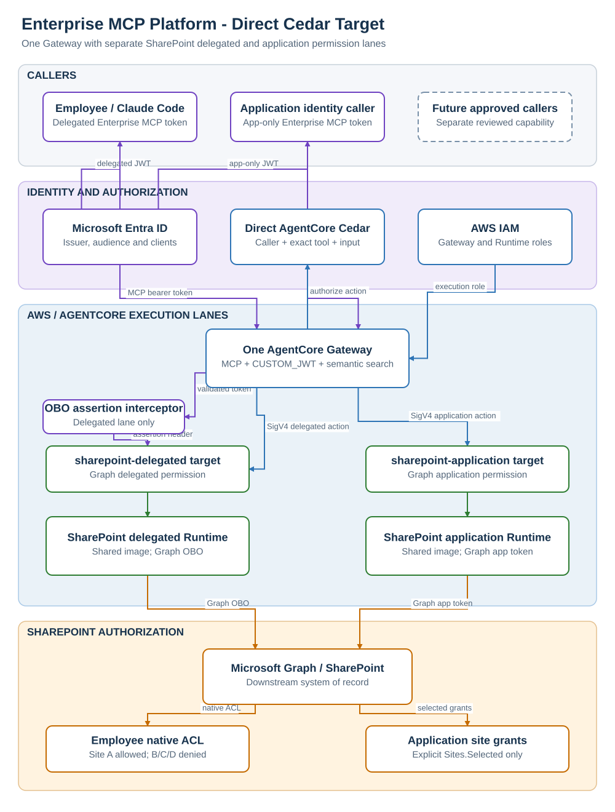
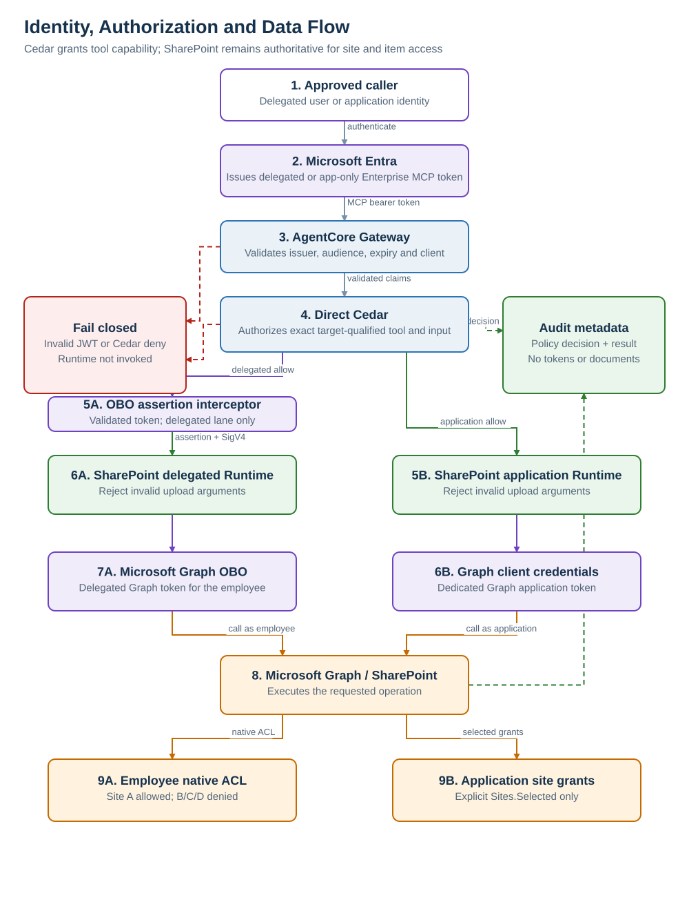
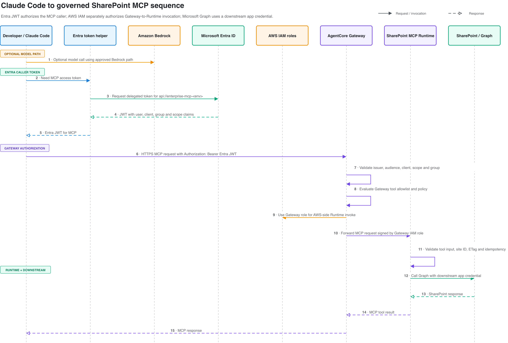

# Enterprise MCP Platform on AWS

## Developer Architecture Guide

**Status:** Living technical guide

**Last updated:** 22 July 2026

**Maintainer:** Cloud Platform Team

**Implementation root:** `examples/enterprise_mcp_platform`

---

## 1. Platform overview

The platform provides one governed internal Model Context Protocol (MCP) entry point on AWS. Amazon Bedrock AgentCore Gateway is the shared MCP front door. Each downstream system is isolated behind the Gateway as its own MCP server, container image, AgentCore Runtime, policy boundary, deployment unit and operational owner. SharePoint is the first enabled system. CRM and internal-software servers remain disabled until their tool contracts and owners are implemented and validated.

Microsoft Entra ID remains the authoritative identity provider for human and service callers. Callers obtain an environment-specific Enterprise MCP API token and send it to Gateway. Gateway uses its `CUSTOM_JWT` authorizer, which AWS documents as an AgentCore Identity inbound-authorizer capability, to validate the token. Gateway policy then determines whether the caller may discover or invoke a tool. Gateway invokes the selected Runtime with its AWS IAM role and Signature Version 4. Runtime uses a separate downstream Microsoft Entra application credential to access Microsoft Graph; the inbound MCP token is not reused as a Graph token.

The repository contains representative Terraform, policy and MCP server code. Treat it as a PoC reference implementation: real Gateway-to-Runtime invocation, caller-claim propagation, Claude Code token refresh, Microsoft Graph operations, idempotency persistence, Cedar enforcement, PrivateLink behaviour and production CI/CD controls still require implementation or target-environment validation.

## 2. Repository map

| Path | Developer use |
| --- | --- |
| `examples/enterprise_mcp_platform/clients` | Local, Claude Code and Gateway validation clients, including the Windows Entra token helper. |
| `examples/enterprise_mcp_platform/servers/sharepoint_mcp` | SharePoint MCP server, tool contracts and Graph client boundary. |
| `examples/enterprise_mcp_platform/common/mcp_runtime` | Shared authorization, validation and audit helpers used by Runtime-hosted servers. |
| `examples/enterprise_mcp_platform/policy` | Human-maintained allowlist, schema, generated runtime policy and validation script. |
| `examples/enterprise_mcp_platform/identity/entra` | Environment-specific Entra API, client, role and assignment configuration. |
| `examples/enterprise_mcp_platform/infra` | Shared Terraform root for Gateway, Runtime targets, IAM and private access. |
| `examples/enterprise_mcp_platform/pipelines/azure-devops` | MCP server and policy validation pipeline examples. |
| `docs/architecture` | Architecture diagrams, sequences and this generated developer guide. |
| `docs/adr` | Durable architecture decisions and their history. |

Start with `examples/enterprise_mcp_platform/README.md` for local commands. Use the ADRs for decision history and `IN_PROGRESS.md` for work that is not yet complete.

## 3. Developer workflow

### 3.1 Run the SharePoint server locally

Use dry-run mode while developing tool contracts and authorization behaviour. From the repository root:

```bash
cd examples/enterprise_mcp_platform
python -m venv .venv
. .venv/bin/activate
pip install -r requirements.txt
export GRAPH_DRY_RUN=true
export MCP_SUBJECT=local-dev-user
export MCP_CLIENT_ID=claude-code-mcp-client-id
export MCP_GROUPS=mcp-sharepoint-readers
export MCP_APP_ROLES=MCP.SharePoint.Read
export MCP_SCOPES=mcp.invoke
python -m servers.sharepoint_mcp.src.server
```

In another terminal, activate the same environment and run `python clients/local_client.py`.

### 3.2 Validate policy changes

The YAML allowlist is the human-maintained source. Regenerate the runtime JSON and confirm it is current before committing:

```powershell
Set-Location examples/enterprise_mcp_platform
python policy/validate_policy.py
python policy/validate_policy.py --check
```

Policy changes should include positive and negative cases for the affected caller, tool and resource combinations.

### 3.3 Acquire a Claude Code caller token on Windows

Use the delegated Entra helper for developer validation. Do not store the returned token in source control or static configuration.

```powershell
Set-Location examples/enterprise_mcp_platform
$env:ENTRA_TENANT_ID = "<tenant-id>"
$env:ENTRA_CLIENT_ID = "<interactive-mcp-public-client-id>"
$env:ENTRA_MCP_AUDIENCE = "api://enterprise-mcp-nonprod"
$env:ENTRA_ACCESS_TOKEN = & .\clients\entra_token_helper.ps1 delegated
```

Claude Code sends this token to the Gateway as `Authorization: Bearer <Entra JWT>`. Do not SigV4-sign the caller request; AWS IAM is used for Gateway-to-Runtime and other AWS-side service actions.

## 4. Design principles

1. **One governed entry point.** Clients connect to one AgentCore Gateway URL rather than directly to individual MCP servers.
2. **Separate server boundaries.** Each downstream system has a separate Runtime, image, target, policy and owner.
3. **Identity separation.** Entra identifies the MCP caller; AWS IAM authorizes AWS service actions; a separate downstream credential authorizes Microsoft Graph.
4. **Deny by default.** Callers, clients, tools, sites, paths and write operations require explicit allow rules.
5. **Narrow tools.** Tools express approved business operations, not generic transport or code execution.
6. **Controls outside the model.** Deterministic policy and runtime validation, not model instructions, enforce access.
7. **No direct Runtime bypass.** Runtime resource policy permits invocation only by the Gateway role.
8. **Private where supported.** VPC callers use the AgentCore Gateway interface endpoint and private DNS; network location supplements but does not replace identity.
9. **No secrets or sensitive content in logs.** Audit metadata is recorded without bearer tokens, credentials or full documents.
10. **Validate before promotion.** A change moves forward only after its code, policy, infrastructure and operational checks pass.

## 5. Implementation status

The repository is a planning and proof-of-concept workspace. The following maturity terms are used throughout this document:

- **Decided:** captured in an accepted or PoC-validation ADR.
- **Example implemented:** representative code or Terraform exists but has not necessarily run in the target environment.
- **Validation required:** behaviour must be demonstrated with evidence before production.
- **Planned:** not implemented or enabled in the first slice.

### 5.1 Status matrix

| Area | State | Evidence or gap |
| --- | --- | --- |
| Shared Gateway and separate Runtime architecture | Decided; example implemented | Terraform creates one Gateway, one Runtime per enabled server and one target per Runtime. Real target behaviour is not yet validated. |
| Inbound Entra JWT | Decided; example implemented | Gateway `CUSTOM_JWT` configuration and Entra Terraform exist. Enterprise-tenant deployment and token flows remain unvalidated. |
| AgentCore Identity | Clarified | Managed inbound JWT validation is used through Gateway. No outbound credential provider or token-vault workflow is proposed. Service-managed workload identities may be created automatically but are not granted credential-vending permissions. |
| Gateway policy | Example implemented | Policy engine exists and defaults to `LOG_ONLY`. Cedar generation and `ENFORCE` behaviour remain open. |
| Runtime authorization | Partial example | Policy code supports client, role, group, scope, site and path rules. Per-request trusted claims are not yet wired from Gateway headers into FastMCP request context. |
| SharePoint tools | Dry-run example | Four narrow tools exist. Real Graph calls, text extraction, selected permissions, throttling and error handling are not implemented. |
| Write safety | Contract only | Change ticket, idempotency key and ETag inputs exist. Persistent idempotency and real conditional writes are not implemented. |
| Private access | Example implemented | Interface endpoint Terraform exists. DNS, endpoint policy and developer/AWS workload routing require target-account testing. |
| Observability | Partial example | Runtime permissions and structured audit events exist. Gateway log destinations, retention, SIEM integration, alarms and sensitive-data verification remain open. |
| CI/CD | Example implemented | Azure DevOps pipeline examples and policy branch-gate design exist. Real agents, variable groups, signing, SBOM, environments and promotion controls are not configured. |
| Production configuration | Placeholder | Non-production and production tfvars contain placeholder IDs, subnets, security groups and image URIs. Provider versions are not yet pinned. |

## 6. Architecture



**Figure 1 - Target architecture and trust boundaries.** Editable source: `enterprise-mcp-platform-review.drawio`, page “Target Architecture”.

### 6.1 Logical components

| Component | Responsibility | Security boundary |
| --- | --- | --- |
| Claude Code / approved developer client | Obtains a delegated Entra token and invokes approved MCP operations | User, managed device and approved token-helper controls |
| AI agent or AI application running in AWS | Optionally obtains an app-only Entra token for governed SharePoint reads | AWS workload IAM role plus separate Entra service principal |
| Microsoft Entra ID | Issues environment-specific Enterprise MCP API tokens and manages client, scope, role and group assignments | Enterprise identity control plane |
| AgentCore Gateway | Terminates MCP, validates JWTs, applies policy, supports semantic tool discovery and routes to targets | Primary external authorization boundary |
| AgentCore Identity inbound authorizer | Uses OIDC discovery metadata and configured claims to validate bearer tokens | Managed token-validation capability used by Gateway |
| Gateway Policy Engine | Deterministically allows or denies tool actions using caller context and inputs | Tool authorization boundary outside model/runtime code |
| Gateway IAM role | Signs calls to enabled Runtime targets | AWS service-to-service authorization |
| SharePoint Runtime | Hosts only SharePoint MCP tools and validates tool/resource inputs | Downstream-system service boundary |
| Runtime IAM role | Pulls the approved image, emits telemetry and accesses approved AWS-side secrets | Least-privilege AWS workload role |
| Microsoft Graph credential | Obtains a Graph token independently from the inbound caller token | Downstream application identity |
| Microsoft Graph / SharePoint | Enforces selected site permissions and SharePoint resource controls | Microsoft 365 data boundary |
| Central ECR | Stores final immutable service images | Software supply-chain boundary |
| Azure DevOps and TFE | Validate source/policy/images and apply identity/infrastructure changes | Change-control and deployment boundary |

### 6.2 Deployment shape

- One Gateway per environment.
- One environment-specific Entra Enterprise MCP API audience.
- Separate allowed client lists for non-production and production.
- One Runtime and Gateway target per enabled MCP server.
- SharePoint enabled first; CRM and internal software disabled.
- One shared Terraform root instantiated through separate non-production and production state.
- Final service image URI passed to Runtime; no Runtime deploys a base-image URI.
- Gateway policy remains `LOG_ONLY` only during controlled validation and must be `ENFORCE` before production use.

## 7. Identity and request flows



**Figure 2 - Identity, authorization and data flow.** Editable source: `enterprise-mcp-platform-review.drawio`, page “Identity and Data Flow”.



**Figure 3 - Claude Code caller identity and governed SharePoint MCP sequence.** Editable source: `claude-code-sequence.drawio`.

### 7.1 Human caller flow

1. An approved developer uses an approved token helper on a managed device.
2. The helper requests a delegated token for the environment-specific Enterprise MCP API and `mcp.invoke` scope.
3. Entra applies its normal authentication, assignment and Conditional Access controls.
4. Claude Code sends the bearer token to the AWS-managed Gateway MCP URL.
5. Gateway `CUSTOM_JWT` validation checks signature, issuer/discovery metadata, audience, allowed client and configured scope or custom claims.
6. Gateway policy evaluates the requested MCP action and relevant inputs.
7. Gateway uses its IAM role to sign the Runtime invocation.
8. Runtime validates the tool schema, site/path constraints and write controls.
9. Runtime obtains a separate downstream Graph token and calls only approved SharePoint resources.
10. The response returns through Runtime and Gateway. Audit records use correlation identifiers and exclude tokens and full document bodies.

### 7.2 Service caller flow

An approved AI agent or AI application running in AWS uses the same Gateway authorization model but obtains an app-only token through the client-credentials grant and is assigned a read-only application role. Its AWS workload role remains separate and is used for workload execution, logs and approved credential retrieval. The service caller does not obtain write access in the first slice unless separately approved.

### 7.3 AgentCore Identity usage

AgentCore Identity is involved in the current architecture in two limited ways:

- AWS documents the Runtime/Gateway inbound `CUSTOM_JWT` authorizer as an AgentCore Identity capability. It validates externally issued tokens; it does not replace Microsoft Entra ID.
- Runtime and Gateway may create service-managed workload identities automatically. These identities are not a reason to grant outbound credential access.

The first slice does **not** create AgentCore Identity OAuth/API-key credential providers, use its token vault, or grant Runtime workload-token permissions. A later proposal may evaluate outbound brokering if the platform needs user-delegated SaaS access, OAuth refresh-token custody, on-behalf-of exchange or consistent credential vending across multiple third-party systems.

### 7.4 Authorization layers

Authorization is deliberately layered:

1. **Entra assignment:** who may obtain a token and which scope/app role is present.
2. **Gateway JWT validation:** whether the token is valid for this environment and client.
3. **Gateway policy:** whether the caller may discover or invoke the requested tool with the supplied parameters.
4. **Runtime validation:** whether identifiers, paths, sizes, tickets, idempotency keys and concurrency values are valid.
5. **Graph selected permissions:** whether the downstream application may access the selected site.
6. **SharePoint controls:** native permissions, versioning, retention and audit controls.

No single layer is treated as sufficient by itself.

### 7.5 Trusted caller context

If Runtime requires caller-specific policy, it must consume claims derived from the validated Gateway identity context. Client-supplied identity headers and MCP tool arguments are untrusted. A request interceptor may inject sanitized headers, but the production implementation must prove:

- the values originate only from validated claims;
- client-provided values cannot override them;
- only an explicit header allowlist is propagated;
- scopes and roles required by Runtime policy are included;
- the Runtime framework reads the values per request rather than from static environment variables;
- raw bearer tokens are not forwarded or logged.

The current example does not yet complete this mapping and therefore cannot support production Runtime identity decisions as written.

## 8. Network and trust boundaries

### 8.1 Inbound access

The client endpoint is the AWS-managed Gateway URL:

```text
https://{gateway-id}.gateway.bedrock-agentcore.{region}.amazonaws.com/mcp
```

Approved VPC clients use the interface endpoint `com.amazonaws.<region>.bedrock-agentcore.gateway` with private DNS. For OAuth requests through this endpoint, the endpoint policy may require a wildcard principal because VPC endpoint policies evaluate IAM principals rather than OAuth users. Compensating controls are exact Gateway resource scoping, security-group restrictions, routing controls, `CUSTOM_JWT` validation and Gateway policy.

Corporate workstation routing to PrivateLink must be proven through the enterprise network path. Private connectivity is exposure reduction, not caller authentication.

### 8.2 Gateway-to-Runtime

Gateway signs Runtime requests using the Gateway IAM role. The Runtime resource policy allows `InvokeAgentRuntime` only from that role. Direct client-to-Runtime access is not an approved fallback. Runtime IAM trust is restricted with source-account and source-ARN conditions.

### 8.3 Runtime egress

Runtime operates in VPC mode with private subnets and restricted security groups. Egress should be limited to required AWS endpoints, Microsoft identity endpoints and Microsoft Graph. The final design must document whether Graph egress uses controlled NAT/proxy, firewall and DNS controls, and how certificate inspection or proxy behaviour affects OAuth and Graph traffic.

### 8.4 Endpoint and domain choice

CloudFront and other CDN-backed custom domains are excluded. Clients use the AWS-managed Gateway hostname. A vanity domain requires a new architecture decision demonstrating supported TLS termination, OAuth discovery behaviour, regional routing and absence of an unapproved global edge layer.

## 9. Tool and data contracts

### 9.1 First-slice tools

| Tool | Purpose | Default authorization |
| --- | --- | --- |
| `sharepoint_list_site_content` | List metadata below an approved site/path | Approved human and service read callers |
| `sharepoint_get_file_text` | Read bounded text from one approved file | Approved human and service read callers |
| `sharepoint_insert_site_page_content` | Create approved page content | Publisher role only; disabled until write gate |
| `sharepoint_update_file_content` | Update one approved file | Publisher role only; disabled until write gate |

The platform must not expose generic HTTP request, arbitrary URL, shell, SQL, file-system or permission-management tools.

### 9.2 Data classification and handling

SharePoint content may contain internal, personal, security-sensitive or regulated information. The platform does not change the source classification. Data owners must approve each site and allowed path. Tool responses must be bounded, and callers remain responsible for handling returned content according to its classification.

The following are prohibited from application logs, traces and policy logs:

- bearer tokens, refresh tokens, client secrets or certificates;
- full SharePoint documents or large content fragments;
- full sensitive MCP inputs or outputs;
- secret-bearing HTTP headers;
- unnecessary personal attributes from Entra claims.

Allowed audit metadata includes correlation ID, timestamp, caller subject identifier or approved pseudonymous identifier, client ID, matched policy role, tool, approved resource identifier, decision, reason code, change ticket, idempotency key hash, latency and result code.

### 9.3 SharePoint authorization

The downstream Graph application should use `Sites.Selected` or a narrower selected-permission model and receive explicit grants only to approved sites. Broad tenant permissions such as `Sites.Read.All` or `Sites.ReadWrite.All` are not approved for the first slice. Read and write identities may be separated if that materially reduces risk and operational complexity.

### 9.4 Write controls

Write tools remain disabled until all of the following are implemented and tested:

- explicit caller, client, role, site and path allow rules;
- approved change ticket with validated format and, where possible, status;
- durable idempotency storage keyed by caller, tool, resource and request key;
- optimistic concurrency using the current ETag or equivalent;
- bounded content type and size validation;
- structured before/after metadata without logging full sensitive content;
- data-owner approval and documented recovery/version-restore procedure;
- policy engine in `ENFORCE` mode;
- negative tests for replay, stale ETag, wrong site/path, missing ticket and unauthorized caller.

## 10. Policy, build and deployment

### 10.1 Policy as code

YAML is the human-maintained authorization source, validated by JSON Schema and embedded positive/negative tests. Generated JSON is the Runtime artifact. Gateway Cedar policy must be generated from or reconciled with the same source to prevent divergent enforcement.

Production policy changes require:

- path-scoped Azure DevOps build validation;
- policy-owner and security/data-owner review where access expands;
- generated artifact freshness checks;
- negative authorization tests;
- Terraform plan visibility where Gateway resources change;
- explicit promotion and rollback evidence.

### 10.2 Images

Each Runtime deploys a final service image from central ECR. Production images must use immutable digests or immutable version tags and pass dependency, malware and vulnerability scanning, SBOM generation and signature/provenance verification. Runtime roles receive pull access only to approved repositories.

### 10.3 Environment separation

Non-production and production use the same Terraform root but separate state, tfvars, Entra applications/audiences, client IDs, AWS resources, image references, policy promotion and approvals. A token issued for one environment must not be accepted by another.

## 11. Observability and audit

The operational design requires end-to-end correlation from client to Gateway, policy decision, Runtime and Graph call without propagating sensitive credentials.

Required telemetry includes:

- Gateway invocation, authentication failure, target error and latency metrics;
- Gateway policy allow/deny decisions and reason codes;
- Runtime startup, tool call, validation failure, downstream status and latency events;
- Graph throttling, retry, permission and concurrency failures;
- deployment, identity, policy and selected-site permission changes;
- unusual denied-tool, cross-site, replay and data-volume patterns.

CloudWatch Transaction Search and relevant AgentCore log destinations must be configured. Retention, encryption, SIEM forwarding, alert thresholds, operational dashboards and on-call ownership must be defined and tested before production. Observability testing must include a deliberate check that tokens, secrets and document bodies do not appear in logs or traces.

## 12. Reliability and performance

The platform depends on AgentCore Gateway, Runtime, Entra ID, Microsoft Graph/SharePoint, network connectivity, ECR and observability services. The first slice should fail closed on identity, policy or downstream permission uncertainty.

Required resilience behaviours:

- bounded timeouts at client, Gateway/Runtime and Graph layers;
- retries only for safe/transient cases with exponential backoff and jitter;
- honour Microsoft `Retry-After` for Graph/SharePoint throttling;
- no automatic retry of non-idempotent writes without durable idempotency protection;
- circuit-breaking or controlled degradation for repeated downstream failures;
- immutable previous image and policy versions for rollback;
- a kill switch that removes a client, denies a tool or disables a target without a direct-Runtime bypass.

Service-level objectives, expected concurrency, payload limits, peak usage, recovery time objective and recovery point objective are not yet defined. SharePoint remains the system of record; this platform does not maintain a separate authoritative content copy.

## 13. Security reference

### 13.1 Method and assumptions

The threat model uses STRIDE categories across the data-flow trust boundaries. Ratings are qualitative because the enterprise risk-scoring standard and workload classification have not yet been supplied. **Inherent risk** assumes the proposed capability without the listed controls. **Residual risk** assumes all proposed controls are implemented and validated. Reconcile these provisional ratings with the organisation's risk method before production use.

Threat actors considered include an external attacker with a stolen token, a compromised managed device, a malicious or over-privileged insider, a compromised client/service principal, malicious content in SharePoint, a compromised build dependency or image, and accidental administrator or policy error.

Primary assets are caller identity, authorization policy, downstream credentials, SharePoint content, write integrity, audit evidence, service availability, source code, images, Terraform state and deployment approvals.

### 13.2 Trust boundaries

- **TB1:** managed user/device to Microsoft Entra ID.
- **TB2:** caller network to AgentCore Gateway.
- **TB3:** Gateway identity validation and policy enforcement.
- **TB4:** Gateway IAM role to Runtime resource policy.
- **TB5:** Runtime container to VPC/AWS services and downstream credential source.
- **TB6:** AWS Runtime to Microsoft identity and Graph/SharePoint.
- **TB7:** source control/build pipeline to ECR and Terraform deployment.

### 13.3 Threat register

| ID | STRIDE | Threat and impact | Required controls | Inherent | Residual | Validation / owner |
| --- | --- | --- | --- | --- | --- | --- |
| T01 | Spoofing | Stolen or copied bearer token is replayed to Gateway. | Short token lifetime; approved refresh helper; Conditional Access; exact audience/client validation; network restrictions; rapid revocation; no token logging. | High | Medium | Token replay/revocation test; Identity and Security |
| T02 | Spoofing | Token from the wrong tenant, environment, audience or client is accepted. | Tenant-specific discovery; exact audience; allowed clients; required scope/claims; separate prod/nonprod registrations; negative tests. | High | Low | Cross-environment and wrong-client tests; Identity/Platform |
| T03 | Tampering | Caller supplies trusted-looking identity headers or tool arguments to impersonate another caller. | Do not trust client identity headers; interceptor derives claims from validated context; overwrite precedence; allowlist headers; Runtime reads per-request context; Gateway policy primary. | High | Low-Medium | Header spoofing and missing-claim tests; Platform/Security |
| T04 | Repudiation | Caller or operator disputes a tool action and evidence is incomplete. | Correlation ID; immutable central audit; subject/client/tool/resource/decision metadata; change ticket; time synchronization; retention and SIEM controls. | Medium | Low-Medium | Trace one request end to end; Operations/Security |
| T05 | Information disclosure | Tokens, credentials, personal claims or document bodies appear in logs/traces. | Structured allowlisted logging; redaction; no raw headers/body; log scanning tests; least claim propagation; protected log access. | High | Low-Medium | Automated secret/content log scan; Platform/Security |
| T06 | Elevation of privilege | A caller invokes a tool, site or path outside its approved role. | Entra assignment; Gateway policy `ENFORCE`; deny-by-default Cedar; Runtime site/path validation; selected Graph permissions; negative tests. | Critical | Low-Medium | Authorization matrix test pack; Policy/Data owner/Security |
| T07 | Elevation of privilege | Runtime is invoked directly, bypassing Gateway authentication and policy. | Runtime resource policy allows only Gateway IAM role; role least privilege; no direct client URL; negative IAM tests. | High | Low | Direct invocation denial test; AWS Platform |
| T08 | Tampering | Prompt injection or malicious SharePoint content persuades an agent to call an unsafe tool. | Narrow tools; deterministic external policy; bounded inputs; read/write role separation; writes disabled by default; model output never grants authority. | High | Medium | Adversarial content/tool-use tests; App/Security |
| T09 | Information disclosure | Graph application has tenant-wide permissions or selected grants drift. | `Sites.Selected` or narrower; explicit grant inventory; periodic access review; separate environments; automated drift detection; no broad Graph roles. | Critical | Low-Medium | Graph permission evidence; M365/Data owner |
| T10 | Tampering | Site/path identifiers exploit traversal, encoding or IDOR weaknesses. | Canonicalization; explicit site IDs and paths; reject ambiguous encoding; server-side lookup; negative tests for separators, case and encoded traversal. | High | Low-Medium | Path and identifier fuzz tests; MCP server owner |
| T11 | Tampering | Write is duplicated, replayed or overwrites a newer version. | Durable idempotency; ETag/`If-Match`; change ticket; no unsafe retries; versioning/restore; audit. | Critical | Low-Medium | Replay and stale-ETag tests; MCP/M365 owners |
| T12 | Spoofing | Downstream application secret or certificate is stolen. | Approved secret store; preferably certificate/workload federation where supported; short rotation; Runtime least privilege; no Terraform plaintext; detection and revocation runbook. | High | Medium | Rotation and revocation exercise; Identity/Platform |
| T13 | Tampering | Policy source, generated policy or deployed Cedar diverges or is maliciously changed. | Single policy source; schema/tests; generated-artifact freshness; required reviewers; signed build evidence; promotion comparison; `ENFORCE` gate. | Critical | Low-Medium | Policy consistency and rollback test; Policy/DevOps |
| T14 | Tampering | Compromised dependency or container image executes in Runtime. | Pinned dependencies; scan; SBOM; signature/provenance; immutable digest; restricted ECR; non-root image; patch SLA. | Critical | Medium | Supply-chain evidence and signature verification; DevOps/Security |
| T15 | Denial of service | Excessive MCP calls, semantic search, large files or Graph throttling exhaust capacity. | Payload/result limits; quotas/rate controls; timeouts; bounded concurrency; cache where safe; `Retry-After`; alarms; per-client controls. | High | Medium | Load/throttle/failure tests; Operations/App owners |
| T16 | Information disclosure | Tool returns more content than the caller needs or content crosses data boundaries. | Data-owner approved sites/paths; bounded text extraction; output filtering; classification handling; no generic search; least-privilege roles. | High | Medium | Data-volume and cross-site tests; Data owner/Security |
| T17 | Elevation of privilege | Administrator, pipeline or Terraform state compromise expands access. | Separate state and roles; least-privilege CI/TFE identities; protected branches; path reviewers; approval gates; state encryption/access logging; break-glass monitoring. | Critical | Medium | Access review and deployment audit; Cloud/DevOps/Security |
| T18 | Denial of service | Gateway, Runtime, Entra, Graph, network or region dependency is unavailable. | Dependency timeouts; fail closed; clear error handling; service health monitoring; rollback/disable plan; agreed SLO/RTO; tested recovery. | High | Medium | Dependency-failure game day; Operations |

### 13.4 Highest residual risks

The most material expected residual risks are stolen caller tokens, prompt-injection-driven misuse within otherwise valid permissions, downstream credential compromise, software supply-chain compromise, data over-disclosure and dependency availability. These risks cannot be eliminated by the Gateway alone. They require enterprise identity/device controls, narrow permissions, controlled write enablement, supply-chain assurance, monitoring and incident response.

## 14. Security implementation checklist

| Control | Requirement | Verification |
| --- | --- | --- |
| IAM-01 | Separate Entra API audiences, app registrations, assignments and allowed clients for nonprod and prod. | Entra export and negative cross-environment test |
| IAM-02 | Validate issuer/discovery, audience, client, scope and required role/group claims at the appropriate layer. | Gateway configuration and token test matrix |
| IAM-03 | Use an approved delegated token/refresh flow for Claude Code; do not paste long-lived tokens into static configuration. | Endpoint/client demonstration and security review |
| IAM-04 | Use a separate Graph application credential; never reuse the inbound MCP token. | Token audience evidence and code/config review |
| IAM-05 | Do not grant AgentCore Identity credential-vending permissions unless separately approved. | Runtime/Gateway IAM policy review |
| NET-01 | Restrict Gateway private access with endpoint SG/routing and exact Gateway resource scope. | Network test and Terraform plan |
| NET-02 | Restrict Runtime subnets, SGs and egress to approved dependencies. | VPC flow evidence and firewall/proxy approval |
| AUTHZ-01 | Run Gateway policy in `ENFORCE` before production and deny unknown caller/tool/resource combinations. | Cedar tests and denial logs |
| AUTHZ-02 | Trusted claims must be derived from validated context and consumed per request. | Spoofing test and Runtime trace |
| TOOL-01 | Expose only narrow, bounded tools with strict schema, identifier and path validation. | Tool contract and negative test suite |
| WRITE-01 | Require ticket, durable idempotency, optimistic concurrency, audit and recovery for writes. | Write pilot evidence |
| DATA-01 | Grant selected SharePoint permissions only to approved sites and paths. | Graph/SharePoint permission inventory |
| LOG-01 | Centralize authentication, policy, tool and deployment audit with agreed retention and SIEM alerts. | Dashboard, alarm and sample trace |
| LOG-02 | Prove that logs/traces do not contain tokens, secrets or full documents. | Automated scan and manual sample review |
| SUP-01 | Deploy scanned, SBOM-attested and signed immutable images with pinned dependencies. | Build provenance and ECR digest |
| OPS-01 | Apply timeouts, bounded retries, throttling handling, kill switches and rollback runbooks. | Failure and rollback tests |

## 15. Operations and rollback

| Trigger | Immediate containment | Recovery / rollback |
| --- | --- | --- |
| Caller token or client compromise | Remove client/assignment; revoke sessions/credential; deny subject/client in policy | Investigate audit trail, rotate credentials and re-enable only after incident review |
| Incorrect policy decision | Set explicit deny or disable affected tool/target | Revert policy artifact, rerun negative tests, redeploy through approved path |
| Runtime/image defect | Disable target if unsafe; stop new cohort rollout | Redeploy last known-good immutable image and verify smoke tests |
| Graph credential compromise | Revoke credential and selected grants | Rotate credential, review Graph audit, regrant only approved sites |
| Unauthorized or incorrect write | Disable write tool and publisher role | Use SharePoint version history/restore, reconcile idempotency record and incident evidence |
| Gateway/AgentCore outage | Fail closed and communicate service unavailability | Restore service/dependency; no direct Runtime bypass |
| Excessive throttling/load | Reduce cohort/rate, disable expensive tools, honour backoff | Tune quotas/concurrency after measurement and change review |
| Sensitive data in logs | Restrict log access and stop affected telemetry path if required | Purge according to policy, fix redaction, rotate exposed credentials and notify Security/Privacy |

Every kill switch must have a named operator, tested command/change path, audit trail and maximum execution time.

## 16. Developer verification guide

### 16.1 Functional tests

- MCP initialize, list, semantic search and approved read calls.
- Correct routing to the SharePoint Runtime.
- Bounded content extraction by supported file type.
- Graph throttling, timeout and permission error mapping.
- Optional AWS AI service-caller read flow.
- Write create/update, idempotency, stale ETag and recovery tests before enabling writes.

### 16.2 Security tests

- Invalid signature, issuer, audience, client, expired token, missing scope/role and cross-environment token.
- Client-supplied trusted-header spoofing and missing trusted claims.
- Unauthorized tool, site, path and write operation.
- Direct Runtime invocation.
- Encoded path traversal, malformed IDs, oversized inputs/results and prompt-injection scenarios.
- Secret/token/content leakage in logs.
- Downstream permission inventory and cross-site denial.

### 16.3 Operational tests

- End-to-end correlation across client, Gateway policy, Runtime and Graph.
- Dashboards, alarms, SIEM events and on-call runbooks.
- Dependency timeout, Graph throttling and partial-failure scenarios.
- Client revocation, tool/target kill switch, policy rollback and image rollback.
- Production-like load and agreed latency/error objectives.

### 16.4 Deployment checks

- Required Azure DevOps branch policies and reviewers.
- Passing policy schema, generation and negative tests.
- Immutable image digest, vulnerability results, SBOM and signature/provenance.
- Approved TFE plan/apply records and separate environment state.
- Entra app/assignment export and Graph selected-permission evidence.
- Provider/dependency versions and configuration without placeholders.

## 17. Known gaps and open implementation work

The following items are not complete. Treat them as implementation or validation work, not as behaviour already provided by the PoC:

1. Validate the Gateway MCP target invoking the AgentCore Runtime endpoint with IAM signing in the target AWS account and region.
2. Validate Runtime resource-policy denial of direct invocation.
3. Select and demonstrate the supported Claude Code bearer-token acquisition and refresh experience without static token storage.
4. Complete per-request caller-claim propagation or move all identity-specific authorization to Gateway; remove reliance on static Runtime environment variables for caller identity.
5. Generate or reconcile Gateway Cedar with the policy source, test it and set production policy to `ENFORCE`.
6. Implement real Microsoft Graph read behaviour with selected permissions, output bounds, supported file types, throttling and safe error handling.
7. Implement the selected downstream credential type, custody, rotation, revocation and Runtime access pattern. Do not store plaintext secrets in source or normal Terraform variables/state.
8. Implement and validate durable idempotency, ETag conditional writes and recovery before enabling any write tool.
9. Validate PrivateLink, private DNS, endpoint policy and corporate/AWS workload routing, including the compensating controls required for OAuth callers.
10. Configure Gateway/Runtime/Identity observability, retention, SIEM forwarding, alarms and sensitive-data leakage tests.
11. Configure real Azure DevOps agents, variable groups, required reviewers, image scanning, SBOM, signing and publish approvals.
12. Replace all environment placeholders, pin provider/dependency versions and validate non-production/prod TFE workspaces.
13. Define data classification, allowed sites/paths, data owners and periodic Graph permission review.
14. Define SLO, RTO/RPO, capacity assumptions, support hours, incident ownership and tested kill-switch execution times.
15. Validate the threat register against the organisation's risk method and record the resulting residual risks.

## 18. Component ownership

| Capability | Accountable owner | Key responsibilities |
| --- | --- | --- |
| Shared Gateway, Runtime pattern and AWS IAM | Cloud Platform | Infrastructure, least privilege, Runtime isolation, network and platform lifecycle |
| Entra Enterprise MCP API and clients | Microsoft Identity | Registrations, assignments, token policy, Conditional Access, credential governance |
| Gateway/Runtime authorization policy | Platform Policy Owner with Security/Data Owner approval | Policy source, Cedar/runtime consistency, reviews, tests and access recertification |
| SharePoint tools and Graph client | SharePoint MCP service owner | Tool contracts, validation, Graph behaviour, tests, safe errors and releases |
| SharePoint selected permissions and content | Microsoft 365 and site data owners | Approved sites/paths, grants, classification, retention and recovery |
| Azure DevOps image/policy CI | DevOps / Cloud Platform | Branch gates, builds, SBOM, scanning, signing and ECR promotion |
| Terraform workspaces and applies | Central TFE administration and Cloud Platform | Workspace/state isolation, plan/apply workflow and approvals |
| Monitoring and incidents | Operations with Platform/Security | Dashboards, alarms, SIEM, on-call, containment and evidence preservation |
| Client integrations | Developer Experience / application owners | Supported token flow, client configuration, user support and client-side logging controls |

## 19. References

### 19.1 Repository decisions and implementation

- `README.md` - current platform overview and implementation links.
- `END_GOAL.md` - target outcome and success criteria.
- `IN_PROGRESS.md` - outstanding validation and implementation work.
- `docs/adr/0001-agentcore-runtime-mcp-platform.md` - shared Gateway and separate Runtime-hosted MCP servers.
- `docs/adr/0003-azure-devops-cloud-owned-platform-repo.md` - repository and pipeline ownership.
- `docs/adr/0004-claude-code-entra-jwt-mcp-boundary.md` - Entra caller token and AWS IAM separation.
- `docs/adr/0005-path-scoped-policy-pr-validation.md` - required policy PR validation.
- `examples/enterprise_mcp_platform` - current example code, policy and Terraform.

### 19.2 Authoritative external sources

- AWS, “Deploy MCP servers in AgentCore Runtime”: https://docs.aws.amazon.com/bedrock-agentcore/latest/devguide/runtime-mcp.html
- AWS, “MCP server targets”: https://docs.aws.amazon.com/bedrock-agentcore/latest/devguide/gateway-target-MCPservers.html
- AWS, “Configure inbound JWT authorizer”: https://docs.aws.amazon.com/bedrock-agentcore/latest/devguide/inbound-jwt-authorizer.html
- AWS, “Policy in Amazon Bedrock AgentCore”: https://docs.aws.amazon.com/bedrock-agentcore/latest/devguide/policy.html
- AWS, “Resource-based policies for AgentCore”: https://docs.aws.amazon.com/bedrock-agentcore/latest/devguide/resource-based-policies.html
- AWS, “AgentCore interface VPC endpoints”: https://docs.aws.amazon.com/bedrock-agentcore/latest/devguide/vpc-interface-endpoints.html
- AWS, “Header propagation with Gateway”: https://docs.aws.amazon.com/bedrock-agentcore/latest/devguide/gateway-headers.html
- AWS, “AgentCore Identity credential providers”: https://docs.aws.amazon.com/bedrock-agentcore/latest/devguide/identity-outbound-credential-provider.html
- AWS, “Add observability to AgentCore resources”: https://docs.aws.amazon.com/bedrock-agentcore/latest/devguide/observability-configure.html
- Microsoft, “Microsoft Graph permissions reference”: https://learn.microsoft.com/en-us/graph/permissions-reference
- Microsoft, “OAuth 2.0 on-behalf-of flow”: https://learn.microsoft.com/en-us/entra/identity-platform/v2-oauth2-on-behalf-of-flow
- Microsoft, “Avoid getting throttled or blocked in SharePoint Online”: https://learn.microsoft.com/en-us/sharepoint/dev/general-development/how-to-avoid-getting-throttled-or-blocked-in-sharepoint-online

External service capabilities must be rechecked in the selected AWS region and enterprise Microsoft tenant during implementation. This document reflects official documentation reviewed on 10 July 2026.
