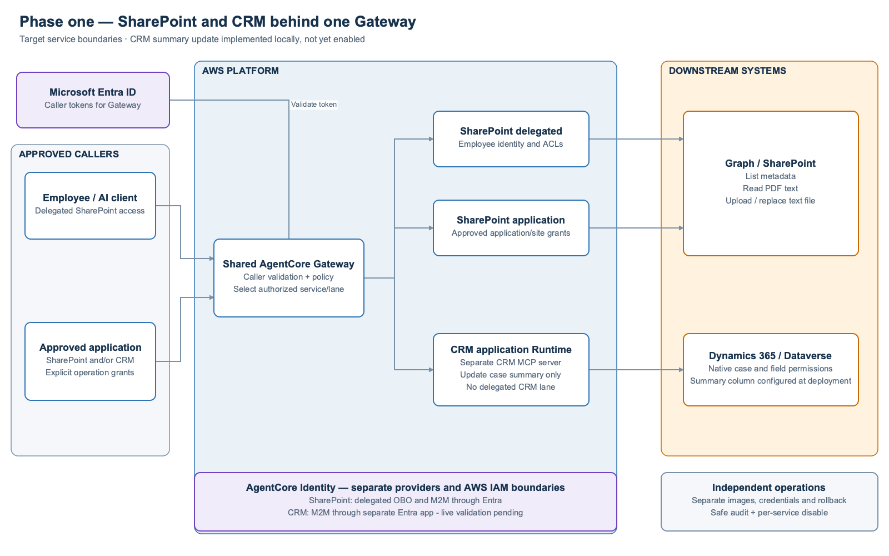
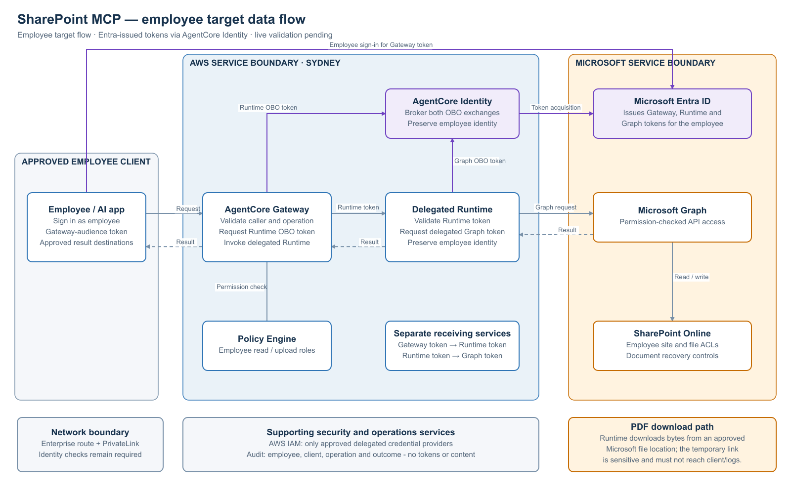
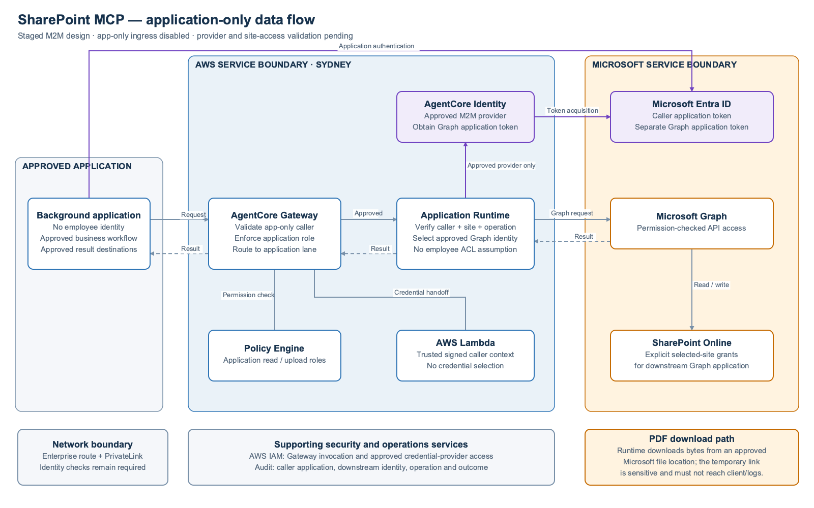
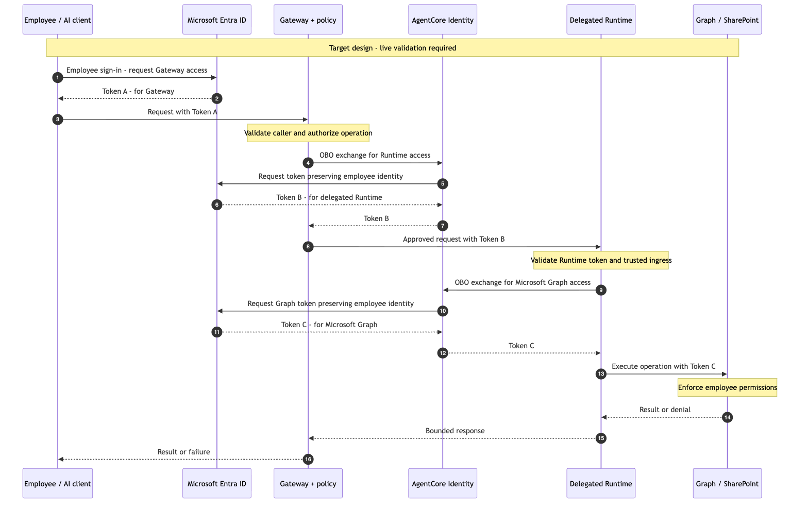
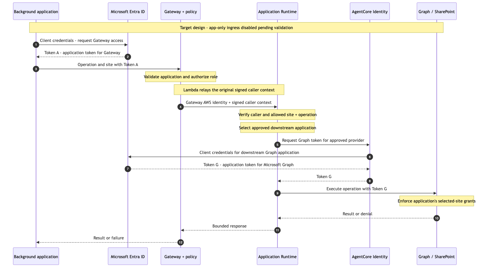
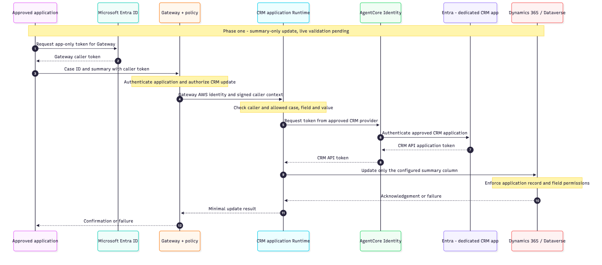

# Enterprise MCP — Phase-One Internal Architecture Review

**Scope:** SharePoint and CRM case-field update

**Audience:** Security, architecture, platform operations and business/data owners

**Updated:** 1 October 2026

**Status:** Target architecture for review. Target downstream OAuth flows use AgentCore Identity; CRM provider compatibility remains to be confirmed. Live end-to-end validation remains outstanding.

## 1. What this service does

The service gives approved employees and approved autonomous applications controlled access to SharePoint. Employee requests use delegated access; background workflows use application-only access (M2M), with no employee security subject. The SharePoint server supports three operations:

- List file and folder information.
- Read text from a PDF.
- Upload or replace a UTF-8 text file in the site's default document library.

The CRM server adds exactly one operation: update one approved field on one authorized CRM case. CRM uses application-only access, with its own service, Runtime and downstream credentials. Dynamics 365/Dataverse is the CRM system. The local implementation updates only case summary; the actual text column and length must be configured and approved before deployment. It is not yet enabled.

Amazon Bedrock AgentCore Gateway is the shared entry point. A dedicated SharePoint service runs on AgentCore Runtime and accesses SharePoint through Microsoft Graph. Microsoft Entra ID identifies the employee or calling application. SharePoint evaluates employee permissions for delegated requests, and explicit application site grants for M2M requests.

SharePoint remains the system of record. This integration is not a new document repository and does not give the AI application broader SharePoint permissions than the identity used for the request.

This review covers both employee and app-only workflows. App-only ingress remains disabled pending its approval and end-to-end validation; including it in the design does not imply it is enabled. Other internal systems and public documentation integrations remain outside this review. The two SharePoint workflows show the same target design: AgentCore Identity brokers tokens from Entra. CRM uses a separate AgentCore Identity M2M provider and a dedicated downstream Entra application, linked to a Dataverse application user. This is separate from both the Gateway caller app and SharePoint app. The current employee PoC still exchanges tokens directly from the Runtime; that is a temporary implementation difference, not the architecture shown here.

## 2. Services and security boundaries

**Figure 1 — Phase-one scope.** One shared Gateway routes to separate SharePoint and CRM MCP services. SharePoint has delegated and application lanes; CRM has only an application lane with one case-field update operation. SharePoint and CRM use separate service images, Runtime roles and credential providers; the two SharePoint lanes reuse the same SharePoint image. CRM has a local implementation; cloud deployment and validation remain outstanding.

**Figure 2A — Employee target data flow.** Solid arrows show requests and identity checks; the dashed return path carries the result back through the Gateway to the approved client. Supporting services handle credentials and audit metadata. Boundaries shown are design requirements, not evidence that deployment controls have passed validation.

**Figure 2B — App-only target data flow (gated).** A background application has its own caller identity. The application Runtime checks which site and operation that caller may use, then obtains a separate Graph application credential through AgentCore Identity. Employee permissions do not apply to this lane.

| Service or environment | Role in the workflow | Information handled |
| --- | --- | --- |
| Approved AI application / employee device | Presents the user's request and receives the result | User question, selected file/site, returned metadata or document text; upload content when requested |
| Approved background application / workflow | Runs an authorized business task without an employee identity | Site/file references, returned data and any upload content; storage and onward processing require approval |
| Microsoft Entra ID | Authenticates employees or applications and issues access credentials | Employee/application identity, permissions and time-limited tokens |
| Enterprise network and AWS PrivateLink | Provides the intended private route to the Gateway | Encrypted service requests and responses |
| AgentCore Gateway | Validates the caller, checks the requested operation and routes approved requests | Caller token, operation, request parameters, upload content and returned results |
| AgentCore Policy Engine | Decides whether the caller may use the requested read or upload operation | Trusted identity/role information and authorization context |
| AWS Lambda request interceptor — app-only target | Passes signed application caller context through the Gateway to the application Runtime | Sensitive identity token; no document-processing role |
| AgentCore Runtime — SharePoint service | Separate delegated and application lanes perform approved operations; the M2M lane also checks caller/site/operation permissions | Request parameters, temporary Graph credential, downloaded PDF bytes/text or upload content |
| AgentCore Identity — both target lanes | Brokers employee OBO exchanges and M2M application-token requests to Entra using separate approved providers | Protected provider credentials and access tokens for the intended receiving service; live validation pending |
| AWS IAM and Secrets Manager | Control AWS service access and protect the credential needed for Microsoft authentication | AWS roles and the service's confidential credential |
| Microsoft Graph and SharePoint Online | Check downstream permissions and read/write the source content | File metadata, document content and Microsoft access token |
| AgentCore Runtime — CRM service | Independently performs the single permitted case-field update using application identity | Signed caller context, case reference, proposed value and minimal result |
| Microsoft Entra ID — downstream CRM app | Issues an application token for the CRM API through the approved M2M provider | Dedicated CRM application credentials and Dataverse-audience token |
| Dynamics 365 / Dataverse case store | Enforces record and field permissions and updates the selected field | Authorized case reference and field value; CRM remains the system of record |
| CloudWatch and enterprise audit/SIEM | Support monitoring, incident investigation and access review | Approved operational and security metadata; tokens and document bodies must be excluded |

The approved AI application's model provider and conversation storage are a **separate data-processing boundary**. If the client sends returned SharePoint content to a model or saves it in a conversation, that destination and retention must be approved by the data owner. AgentCore hosting does not itself determine where the client processes data.

## 3. Request workflows

The downstream security subject determines the lane. An employee-facing AI application uses delegated access when the employee's permissions must apply. A scheduler, daemon or autonomous workflow uses app-only access only when it acts under an explicitly approved application identity. An application being hosted on AWS or running asynchronously does not by itself make it M2M.

| Question | Employee / delegated | Application-only / M2M |
| --- | --- | --- |
| Who is represented? | Signed-in employee using an approved client | Approved autonomous application; no employee identity |
| Who may call the operation? | Gateway checks employee/client and read/upload permissions | Gateway checks caller application and application roles |
| Who may access the site? | SharePoint checks the employee's native permissions | Runtime checks the caller's approved site/operation mapping; SharePoint checks the downstream application's selected-site grant |
| Which credential reaches Graph? | Separate delegated token representing the employee | Separate application token representing the selected downstream application |
| Current status | Target OBO brokering not yet live-validated; PoC currently uses direct Runtime token exchange | Target design with a staged adapter; app-only ingress disabled and provider/token/grant validation outstanding |

### 3.1 Employee / delegated request

**Figure 3A — Employee target request.** Entra issues Token A for the Gateway, Token B for the delegated Runtime and Token C for Graph. AgentCore Identity brokers both OBO exchanges while preserving the employee identity. A token for one receiving service must not be used as another service's access token.

This target uses a Runtime-specific delegated token on the Gateway-to-Runtime hop. The current PoC instead uses the Gateway's AWS identity with a copied employee assertion, and obtains Graph access directly in Runtime. The target replaces that path only after the exchanges, receiving audiences and Gateway-only access are validated. Neither path may fall back to application access when employee authorization fails.

### 3.2 Application-only / M2M request

Example: an approved scheduled workflow reads a PDF from a designated SharePoint site. The caller application and the downstream Graph application are separate security identities, even though no employee signs in.

**Figure 3B — Application-only request.** The app-only Gateway token proves which application is calling MCP. It is not forwarded to Graph as the access token. Microsoft Entra ID issues a separate downstream Graph application token, obtained through AgentCore Identity; AWS IAM limits which credential providers the Runtime may use. The caller cannot choose credentials or broaden its approved sites by changing request parameters.

There are two distinct authorization checks: **caller application → allowed site and operation**, followed by **downstream Graph application → selected SharePoint site grant**. A site grant to a shared Graph application does not automatically authorize every MCP caller to that site. Requests outside either boundary fail.

The repository also retains a fixed Graph application-credential baseline. That baseline alone does not provide per-caller site isolation and must not be mistaken for the gated per-application workflow above. Provider setup, credential method, token acquisition, isolation and site grants remain to be validated before app-only ingress is enabled. Employee access must never fall back to this lane after an authorization failure.

### Who issues the SharePoint tokens?

**Microsoft Entra ID issues the access tokens. AgentCore Identity is the broker, not the issuer.** An Entra app registration identifies a caller or a protected API; the token is requested from the tenant's Entra token endpoint for a particular receiving API.

| Access boundary | Employee target | M2M target |
| --- | --- | --- |
| Client → Gateway | Employee sign-in obtains Entra Token A for the Gateway | Calling application authenticates to Entra using client credentials to obtain Token A for the Gateway |
| Gateway → Runtime | Identity brokers an Entra OBO exchange for Token B addressed to the delegated Runtime | Gateway invokes with its AWS identity and carries the signed application caller context |
| Runtime → Graph | Identity brokers another Entra OBO exchange for Token C representing the employee | Identity uses the approved downstream application's client credentials to obtain Entra Token G for Graph |

The two application identities in M2M have distinct purposes: one is authorized to call MCP, the other is authorized to access SharePoint through Graph. Possessing the first token does not grant the second identity's site permissions. Logical token-acquisition arrows may be served by a valid cached token; they do not imply contacting Entra on every request.

### 3.3 CRM application-only request

**Figure 3C — CRM update, app-only target.** The caller first obtains an Entra token for the shared Gateway. After Gateway authorization, the separate CRM Runtime verifies the caller's approved case scope and the permitted field/value. AgentCore Identity obtains a separate CRM API token from Entra using a CRM-specific provider and separate downstream app. CRM applies its own application permissions before changing the case.

Only the approved field may be changed. This is not a generic CRM edit capability: no arbitrary field selection, bulk changes, case creation/deletion or general read/search tool is included. An authorized SharePoint caller is not automatically authorized for CRM. The CRM Runtime must not obtain SharePoint credentials, and the SharePoint Runtime must not obtain CRM credentials.

**Data flow:** case reference and proposed value → shared Gateway → CRM Runtime → CRM API. The acknowledgement returns along the reverse path. No full case record should be returned or logged. Only nonempty summary text is accepted. The CRM owner must approve the actual column, maximum length and explicit caller-to-case grants before deployment. CRM case notes and values remain untrusted data.

**Identity boundary:** Gateway caller authentication uses Entra. The downstream issuer is Entra, the token audience is the Dataverse environment, and a dedicated Dataverse application user enforces CRM permissions. Do not route CRM through Microsoft Graph or assume SharePoint site grants apply. AgentCore Identity M2M compatibility is a release gate, not an assumed capability already proven for this CRM.

### 3.4 What travels through the system

| Operation | Request sent into AWS | Downstream-to-AWS data | Result returned to the client |
| --- | --- | --- | --- |
| List content | Site, folder and requested listing scope | File/folder metadata | A bounded list; users must be told when it is incomplete |
| Read PDF | Site, library and file reference | File metadata, then PDF bytes from the SharePoint download location | Extracted text within an agreed limit; unsupported or partial extraction must be clear |
| Upload text | Site, destination path and text content | Write acknowledgement and file metadata | Confirmation or failure; only necessary metadata should be exposed |
| CRM case-field update | Authorized case reference and permitted new value | Minimal update acknowledgement from the CRM API | Confirmation/failure and necessary case/update identifiers, not a full case |

The SharePoint data categories apply to its two lanes; CRM has the separate update-only flow. In M2M, results return to the approved background application and its approved processing/storage destinations.

For a PDF read, Microsoft Graph supplies a short-lived download link. The SharePoint service retrieves the PDF directly from the approved Microsoft download location, then returns extracted text through the Gateway. The download link is a sensitive access capability and must not be exposed to the caller or retained in logs.

This data movement means SharePoint content is processed in AWS before it reaches the client. The selected AWS deployment region is Sydney. This does **not** establish end-to-end Australian data residency: Microsoft tenant location, model processing, client storage and telemetry destinations require their own review.

## 4. Security boundaries and required outcomes

| Boundary | Required outcome | Evidence needed before pilot use |
| --- | --- | --- |
| Employee/device → service | Only approved identities and client applications can enter | Valid sign-in succeeds; wrong tenant/client, expired token and unauthorized users are rejected |
| Background application → service | Only an approved application with the required role can use the app-only lane | Unknown application, wrong tenant/audience, employee token and missing application role are rejected |
| Gateway → operation | Reading and uploading are separately controlled | A read-only caller cannot upload, even if their SharePoint account has write access |
| Gateway → Runtime | Neither lane can be invoked around the approved Gateway | Delegated target validates its Runtime-audience token and trusted ingress; app-only validates the Gateway AWS identity and signed caller context. Direct bypass attempts must fail for both |
| Runtime → Microsoft | Each employee request keeps its employee identity | Different employees receive results matching their own SharePoint permissions; no switch to shared application access |
| App-only Runtime → site/operation | Each caller remains within its own approved site and operation scope | An application cannot use another application’s grant, even when both share a Runtime or downstream identity |
| Workload → credential provider | Each lane can obtain tokens only from its approved providers | AWS IAM isolates delegated OBO providers from M2M providers; caller-controlled selection and cross-lane access fail |
| Graph application → SharePoint | Application access is limited to explicitly granted sites | Ungranted sites and disallowed writes fail; employee ACLs are not used as the M2M boundary |
| CRM caller → case/field/value | Only approved applications can update the authorized case population and fixed field | Unknown caller/case, another field, invalid value and wrong environment are denied |
| CRM Runtime → CRM provider/API | Separate credentials and CRM-native record/field permissions | Cross-service provider access fails; downstream grants do not allow broader CRM edits than approved |
| SharePoint → client/model | Content goes only to approved processing destinations | Data owner approves sites/classification, client/model destination and retention |
| Service → logs/audit | Operations are traceable without copying sensitive content | Read/write/failure records can be correlated; no tokens, download links or document bodies appear in telemetry |
| Platform operator → configuration | Changes to permissions, credentials and deployments are accountable | Named owners, reviewed changes, access records and a tested disable/recovery process |

**Current readiness:** Gateway-only invocation still needs stronger isolation and verification. The reference policy configuration currently observes decisions without blocking them; enforcement must be enabled and tested before role separation is relied upon. Credential propagation, downstream access, audit completeness and private routing also require end-to-end validation.

Private connectivity reduces network exposure but does not replace identity and permission checks. The central network/platform team owns PrivateLink, private DNS and routing. Runtime access to Microsoft must include both Graph and the approved SharePoint download locations. Whether the public Gateway route must be blocked is an explicit network review decision.

## 5. Write behavior and failure scenarios

SharePoint and CRM have different write semantics. The SharePoint operation creates/replaces a file; the CRM operation changes only the approved field on an existing authorized case. CRM concurrency rules, invalid/closed-case handling, automations triggered by updates and correction procedures must be agreed with the CRM owner.

The upload operation can create a file or replace an existing file at the same path. It does not provide a collaborative editing or approval workflow. This is an existing design choice; enabling uploads requires the SharePoint owner to accept it for the selected library.

| Scenario | Expected business/operational behavior |
| --- | --- |
| CRM update times out or is submitted twice | The first request may have succeeded or triggered automation; verify in CRM before deliberate retry |
| CRM case is closed, missing or outside the approved scope | Return a denial/failure; do not create a case or change another field |
| Another process updates the same CRM field | The current implementation is last-write-wins; release requires owner acceptance or an expected-version contract |
| Two users upload to the same path | A later write may replace the earlier content; use an approved library and prove version recovery |
| A write times out | The file may already have changed; inspect the result before deliberately retrying |
| Empty content is uploaded | It can create an empty file or replace existing content with an empty file |
| A file is locked or restricted by a site policy | Return a failure; do not bypass SharePoint controls |
| A PDF is too large, complex, encrypted or contains no extractable text | Fail or clearly identify unsupported/partial results; do not present them as complete |
| Microsoft or an AWS dependency is unavailable | Return a clear failure, limit repeated calls and alert the responsible team; do not bypass the Gateway |
| A document contains instructions to the AI application | Treat them as untrusted document content; they do not grant additional access or permission to upload |
| A caller or credential is compromised | Disable the affected access path, preserve safe audit evidence and follow the identity/security incident process |

Reviewers should also agree request-size, response-size, execution-time and usage limits. These protect both availability and cost; file-size limits alone are not sufficient for expensive document processing.

## Phase-one acceptance

SharePoint read/upload validation and CRM update validation are independent. The phase-one design includes both services, but CRM must stay disabled until the actual summary column, application permissions, provider compatibility and authorized case scope are confirmed. Acceptance requires one permitted update, denied cross-case/cross-field/cross-service attempts, safe audit, timeout/side-effect handling and independent credential rotation/disable/rollback. Successful SharePoint validation does not establish that CRM works.

## Official references

These sources explain the product authentication, authorization and update mechanisms used in this design. The proposed service boundaries, rollout decisions and local validation status are described in this review; the official documentation does not establish that our deployment has passed validation.

- [AWS: OBO token exchange through AgentCore Identity](https://docs.aws.amazon.com/bedrock-agentcore/latest/devguide/on-behalf-of-token-exchange.html) — downstream token exchange on behalf of an authenticated user.
- [AWS: Obtain OAuth 2.0 access tokens](https://docs.aws.amazon.com/bedrock-agentcore/latest/devguide/identity-authentication.html) — AgentCore Identity token retrieval, including M2M access through configured providers.
- [Microsoft: OAuth 2.0 On-Behalf-Of flow](https://learn.microsoft.com/en-us/entra/identity-platform/v2-oauth2-on-behalf-of-flow) — delegated user identity and receiving-API token boundaries.
- [Microsoft: OAuth 2.0 client credentials flow](https://learn.microsoft.com/en-us/entra/identity-platform/v2-oauth2-client-creds-grant-flow) — application-only access without an employee identity.
- [Microsoft: Selected permissions in OneDrive and SharePoint](https://learn.microsoft.com/en-us/graph/permissions-selected-overview) — explicit resource grants for selected-site access.
- [Microsoft: Dataverse server-to-server authentication](https://learn.microsoft.com/en-us/power-apps/developer/data-platform/use-single-tenant-server-server-authentication) — downstream application identities and Dataverse application users.
- [Microsoft: Update table rows through the Dataverse Web API](https://learn.microsoft.com/en-us/power-apps/developer/data-platform/webapi/update-delete-entities-using-web-api) — PATCH updates and prevention of unintended upsert with `If-Match: *`.
