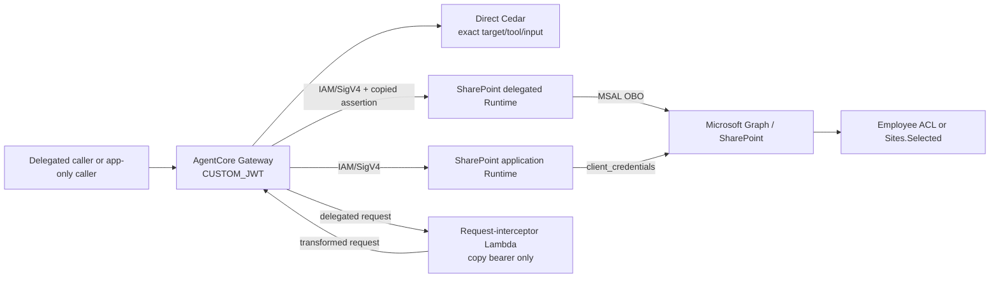
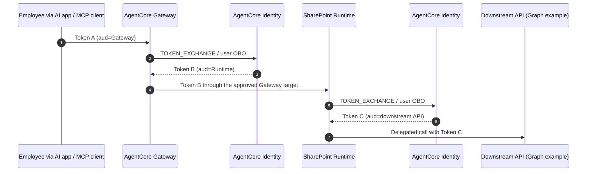
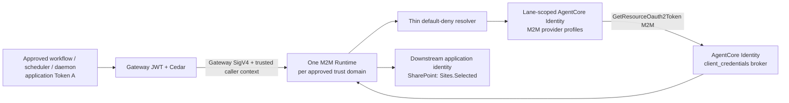

# Downstream Identity Routing: Current PoC and Target (SharePoint Example)

This document separates the implemented SharePoint identity path from the
platform-wide identity-routing target accepted for PoC validation. SharePoint
is the first worked example, not the only downstream server. It does not change
the SharePoint tool contract or claim that the target has been deployed.

Editable source: [`enterprise-mcp-platform-layered.drawio`](enterprise-mcp-platform-layered.drawio).
Preview pages: [current implemented PoC](enterprise-mcp-platform-current-poc.svg)
([PNG](enterprise-mcp-platform-current-poc.png)) and [target identity routing](enterprise-mcp-platform-target-identity.svg)
([PNG](enterprise-mcp-platform-target-identity.png)).

Regenerate the editable source and SVG pages with:

```bash
python3 docs/architecture/build_layered_architecture.py
python3 docs/architecture/build_layered_architecture.py --check
```

The PNG previews are 1920 x 1080 renders of those SVG pages. The builder embeds
the checked-in official AWS Q3 2026 architecture icons in the Draw.io source;
all connectors use orthogonal, square-corner routing. Double-headed connectors
represent a request and its response on the same path. Red dashed connectors on
the current page are gated rather than implemented ingress.

The deployment view separates the centrally owned Network / Platform AWS
Account from the MCP Workload AWS Account. The connectivity VPC contains the
Gateway interface endpoint, private DNS and endpoint controls. AgentCore
Gateway, Policy, Identity and Runtime remain AWS managed regional services;
they are not drawn inside the customer VPC. Runtime VPC mode is shown separately
as private-subnet ENIs and the controlled outbound path. The exact Graph/Entra
egress implementation remains a validation gate rather than an assumed NAT or
firewall design.

## Current PoC (implemented reference)



The current Terraform and code provide two fixed SharePoint lane resources.
Gateway `CUSTOM_JWT` and Cedar are the caller/tool boundary. Gateway invokes
both lanes with IAM/SigV4. The interceptor copies the validated delegated
bearer to `x-mcp-user-assertion`; it does not exchange tokens or retrieve
secrets. The delegated Runtime uses MSAL OBO. The application Runtime uses
Graph client credentials. App-only Gateway ingress is currently gated off.

The default current path has no live outbound AgentCore Identity provider
registration or token-exchange evidence. The opt-in staged branch does contain
the explicit app-only caller-context interceptor, default-deny resolver and
immutable `APP_ONLY_MAPPING_JSON` mapping (schema version 1, capped at 5000
characters). `app_only_provider_bindings` names an already-registered provider
ARN; it does not provision the provider or select its credential method. There
is no Configuration Bundle delivery or `resource_ref` in the SharePoint
contract. App-only Gateway ingress remains gated off.

## Target (Accepted for PoC validation; not live-validated)

### Lane selection rule

The downstream security subject determines the lane:

- An employee using Claude Code, a web AI application, an internal copilot, or
  another approved client uses delegated/OBO when downstream user permissions
  must apply.
- A scheduler, workflow, daemon, or service integration uses M2M only when no
  employee is the downstream security subject.

An AI application is not automatically app-only. A background process is not
automatically autonomous if it is still acting under an employee's authority.
The caller cannot select `auth_mode`, a credential provider, client ID, or
secret through MCP input. Entra grant-compatible claims, exact Cedar actions,
Gateway target routing, trusted caller context, and Runtime configuration fix
the lane.

AgentCore Identity is the target OAuth broker for both lanes. The lanes use
separate workload identities, provider profiles, and provider-ARN IAM
allowlists; they do not share a universal credential switch.

### Delegated user flow



The target has two receiving audiences: Runtime and the downstream API. Gateway
target authorization uses AgentCore Identity `TOKEN_EXCHANGE`, then invokes the
delegated Runtime with Token B through its OAuth/JWT authorization boundary. It
does not use the current PoC's IAM/SigV4 plus copied Token A assertion. The
Runtime must not accept a Gateway-audience token, and the downstream token must
not be sent to Runtime. OBO applies only to user-delegated access. The current
interceptor/MSAL path is replaced only after non-production validation of
target exchange, audiences, Entra parameters, Runtime JWT checks, provider IAM,
and live downstream access.

### Autonomous M2M trust-domain flow



The target has one M2M application Runtime per approved trust domain, not one per
caller or provider and not one universal Runtime for every provider. Runtimes
within a trust domain reuse the same immutable image. A new Runtime requires a
new approved audit/IAM/credential-isolation boundary.

The preferred PoC caller-context composition is a request-interceptor Lambda
that copies the original signed caller JWT to `x-mcp-caller-assertion`. It does
not exchange a token, retrieve a secret, or choose a provider. The Runtime
accepts only Gateway SigV4 ingress and revalidates `iss`, `aud=Gateway`, `exp`,
`tid`, version-specific `azp` or `appid`, and required `roles`. The official AWS
documentation does not provide the complete native no-code composition, and it
remains unverified. `JWT_PASSTHROUGH` is not the default because an original
token's audience and direct-Runtime interpretation would change the current
Gateway-policy risk model.

The platform resolver key is:

```text
validated caller client ID
+ target-qualified exact action
+ server-owned downstream resource key
+ environment
```

For SharePoint, the downstream resource key remains the existing `site_id` and
is passed to Graph unchanged. CRM and future servers may define a different
reviewed resource identifier without adding generic credential-selection fields
to their tools. The caller cannot supply an authentication mode, provider alias,
provider ARN, downstream client ID, secret, or alternate selection field. A
missing or mismatched key, unavailable mapping snapshot, unavailable provider,
or trust-domain mismatch fails closed without exposing provider details.

## Layered authorization

1. Gateway JWT validation and Cedar authorize the caller, grant-compatible lane,
   exact tool, and input.
2. Runtime/workload IAM allows only the OBO or M2M provider ARNs approved for
   that lane and trust domain.
3. Runtime resolver safety and credential routing select an approved provider
   profile only within the trust domain.
4. AgentCore Identity brokers the OBO or M2M token; it does not grant downstream
   data access.
5. The downstream API enforces the final user ACL or application grant. For
   SharePoint, those are native employee ACLs or `Sites.Selected`.

Delegated Runtime/workload IAM may access only approved OBO provider ARNs;
application Runtime/workload IAM may access only approved M2M provider ARNs.
Cross-lane, cross-server, wildcard, and cross-domain provider access must be
denied. Shared providers retain a union-of-grants blast radius within that
domain; Cedar does not reduce the underlying downstream credential privilege.

## Configuration and operations

For the staged PoC, Git/Terraform is the source of truth for the small catalog
and explicit provider-binding map. The deployment root delivers the immutable
schema-1 `APP_ONLY_MAPPING_JSON` Runtime value, capped at 5000 characters and
containing no provider secret. A pinned private S3 snapshot may be evaluated if
BAU size requires it; AgentCore Configuration Bundle delivery is optional and
deferred. Do not use weighted or A/B security mapping. Runtime cache, rollback,
kill switch, drift detection and audit evidence are required before production.

The documented default resource OAuth-provider quota is 50 per account and
Region, subject to adjustment. Provider and identity counts are managed by
audit and isolation requirements, not caller count.

Onboarding normally adds a caller scope/app role, Cedar action, resolver mapping,
and lane-scoped Identity-provider IAM permission. The catalog creates caller and
downstream registrations/service principals and roles, but caller application
credentials and downstream provider credentials require separate approved
implementations. Create a new downstream app or provider grant only for a
distinct identity, permission, or audit boundary. Create a new Runtime only
when that provider cannot remain inside an existing approved trust domain.
Every mapping version requires non-production negative tests and a production
approval.

For every future downstream MCP server, record whether it requires delegated,
M2M, both, AWS-native IAM, or no outbound credential. Do not deploy two lanes by
default, and do not force non-OAuth targets through AgentCore Identity.

## Validation status

The current flow is represented by the existing code and Terraform. The staged
app-only resolver/adapter and mapping path are present locally but remain gated;
the target native OBO/M2M provider registration and exchanges are not live
validated. Required gates include native OBO audiences, Identity M2M,
grant-type lane separation, app-only caller-assertion revalidation, resolver
fail-closed cases, provider-ARN least privilege, mapping snapshot rollback,
quota confirmation, cross-domain denial, live downstream permissions, caller
credential provisioning, and the managed Gateway MCP dialect.

## References

- [ADR 0012](../adr/0012-agentcore-identity-for-delegated-and-m2m-lanes.md)
- [Superseded ADR 0011](../adr/0011-trust-domain-runtime-and-app-only-identity-resolver.md)
- [AgentCore Identity user-delegated and M2M tokens](https://docs.aws.amazon.com/bedrock-agentcore/latest/devguide/identity-authentication.html)
- [AWS OBO token exchange](https://docs.aws.amazon.com/bedrock-agentcore/latest/devguide/on-behalf-of-token-exchange.html)
- [AWS sample: Entra OBO through Gateway](https://github.com/awslabs/amazon-bedrock-agentcore-samples/tree/8f929e64911e0beb6c7ee4b458d5506d94b973d9/01-features/05-authenticate-and-authorize/obo-training/3-examples/02-agent-via-gateway/entra/real-world)
- [AWS sample: Entra OBO MCP Runtime](https://github.com/awslabs/amazon-bedrock-agentcore-samples/tree/8f929e64911e0beb6c7ee4b458d5506d94b973d9/06-workshops/03-AgentCore-identity/13-entra-obo-mcp-runtime)
- [AWS blog: extending MCP support for AgentCore Gateway](https://aws.amazon.com/blogs/machine-learning/extending-mcp-support-for-amazon-bedrock-agentcore-gateway-2/)
- [Gateway interceptors](https://docs.aws.amazon.com/bedrock-agentcore/latest/devguide/gateway-interceptors.html)
- [Gateway target authorization](https://docs.aws.amazon.com/bedrock-agentcore/latest/devguide/gateway-building-adding-targets-authorization.html)
- [Credential-provider least privilege](https://docs.aws.amazon.com/bedrock-agentcore/latest/devguide/scope-credential-provider-access.html)
- [Gateway headers](https://docs.aws.amazon.com/bedrock-agentcore/latest/devguide/gateway-headers.html)
- [AgentCore interface VPC endpoints](https://docs.aws.amazon.com/bedrock-agentcore/latest/devguide/vpc-interface-endpoints.html)
- [Runtime VPC security best practices](https://docs.aws.amazon.com/bedrock-agentcore/latest/devguide/runtime-security-best-practices.html)
- [Configuration Bundles](https://docs.aws.amazon.com/bedrock-agentcore/latest/devguide/configuration-bundles.html)
- [AWS Architecture Icons](https://aws.amazon.com/architecture/icons/)
- [Microsoft OBO](https://learn.microsoft.com/en-us/entra/identity-platform/v2-oauth2-on-behalf-of-flow)
- [Microsoft access-token claims](https://learn.microsoft.com/en-us/entra/identity-platform/access-token-claims-reference)
- [Microsoft Sites.Selected](https://learn.microsoft.com/en-us/graph/permissions-selected-overview)
