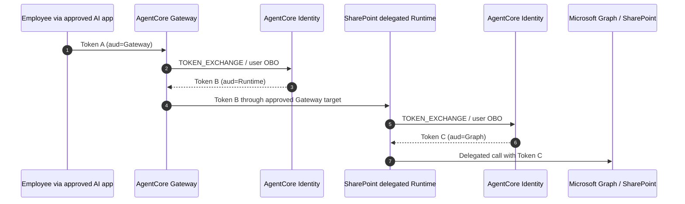
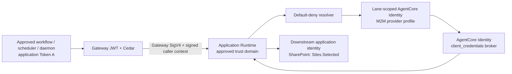

# Downstream Identity Routing: Current PoC and Target (SharePoint Example)

This is the engineer-facing reference for the implemented SharePoint identity
path, the accepted target routing, and the release gates. SharePoint is the
first worked example; the target pattern also defines how later MCP servers
separate caller identity, AWS workload identity, and downstream credentials.
The target is accepted for PoC validation and is not deployed.

The current engineering findings and evidence backlog are in [the SharePoint
first-slice review](sharepoint-first-slice-review.md). Gateway-only Runtime
invocation remains an intended boundary, not a proven deployed control (SP-01).

Phase one also includes a separate CRM MCP server and `crm-application` Runtime
with one `crm_update_case_summary(case_id, summary)` operation. The downstream
system is confirmed as Dynamics 365/Dataverse. CRM uses a separate downstream
Entra application and Dataverse application user through a dedicated
AgentCore Identity M2M provider and workload/IAM boundary. It has no delegated
CRM lane and never uses a Graph token. The actual summary column and length,
case map, downstream permissions, deployment and live validation remain gates.
See [ADR 0015](../adr/0015-dynamics-case-summary-app-only.md).

The editable architecture source is
[`enterprise-mcp-platform-layered.drawio`](enterprise-mcp-platform-layered.drawio).
Its current and target pages are [current PoC](enterprise-mcp-platform-current-poc.svg)
([PNG](enterprise-mcp-platform-current-poc.png)) and [target identity routing](enterprise-mcp-platform-target-identity.svg)
([PNG](enterprise-mcp-platform-target-identity.png)). Regenerate and check them
with:

```bash
python3 docs/architecture/build_layered_architecture.py
python3 docs/architecture/build_layered_architecture.py --check
```

The builder embeds the checked-in AWS architecture icons in the editable source
and SVGs. Connectors are orthogonal with square corners. The current page marks
gated ingress with red dashed paths. The deployment view keeps the centrally
owned Network / Platform AWS Account separate from the MCP Workload AWS Account;
the connectivity VPC contains the Gateway interface endpoint, private DNS and
endpoint controls, while AgentCore managed services remain regional services
outside the customer VPC. Exact Graph/Entra egress is still a validation gate.

## Current PoC

The repository and Terraform reference two fixed SharePoint Runtime lanes:

| Boundary | Current behavior | Status |
| --- | --- | --- |
| Caller → Gateway | Entra `CUSTOM_JWT`; Direct Cedar authorizes the caller, lane-qualified target/tool and input | Local reference; live Gateway enforcement remains open |
| Gateway → delegated Runtime | IAM/SigV4 invokes the Runtime; the interceptor copies the validated bearer to `x-mcp-user-assertion` | Current PoC path; Gateway-only isolation and header behavior require validation |
| Delegated Runtime → Graph | Runtime MSAL OBO exchanges the assertion for a delegated Graph token | Implemented locally; live audience, consent and downstream access remain open |
| Gateway → application Runtime | IAM/SigV4 path exists | App-only Gateway ingress is disabled |
| Application Runtime → Graph | Direct client credentials are the fixed reference path | App-only ingress and downstream grants remain gated |
| Outbound AgentCore Identity | No live provider registration or token-exchange evidence in the default path | Target and opt-in staged work only |

The opt-in application path includes a caller-context interceptor, a default-
deny resolver and immutable schema-1 `APP_ONLY_MAPPING_JSON` capped at 5000
characters. `app_only_provider_bindings` names an existing provider ARN; it
does not provision a provider or select a credential method. No Configuration
Bundle delivery or generic `resource_ref` field is part of the SharePoint
contract. Invalid configuration and identity failures must propagate or fail
closed; they must not select a fallback identity.

The inbound MCP token targets the Gateway. It is not a Graph or Dataverse
token. The current interceptor copies the validated delegated bearer only as an
assertion for the Runtime's MSAL OBO exchange; it does not pass that bearer to
Graph as the downstream access token. The target uses audience-specific tokens
and never reuses one receiving service's JWT at another receiving service.

## Target routing

### Select the lane by downstream security subject

- Use delegated/OBO when an employee is the downstream security subject and
  SharePoint must apply that employee's ACLs.
- Use M2M only when an approved scheduler, workflow, daemon or service
  integration acts without an employee security subject.

An AI product name or asynchronous execution does not choose the lane. Callers
cannot supply `auth_mode`, a provider alias or ARN, a downstream client ID, a
secret, or another credential-selection field through MCP input. Entra claims,
exact Cedar actions, target routing, trusted caller context and Runtime
configuration determine the lane.

AgentCore Identity is the target OAuth broker for both lanes. Each lane has a
separate workload identity, provider profile and provider-ARN IAM allowlist.
AgentCore Identity brokers tokens; it does not grant SharePoint or Dataverse
data access. The downstream API remains the final authorization boundary.

### Delegated user flow


```mermaid
sequenceDiagram
    autonumber
    participant Caller as Employee via approved AI app
    participant Gateway as AgentCore Gateway
    participant GIdentity as AgentCore Identity
    participant Runtime as SharePoint delegated Runtime
    participant RIdentity as AgentCore Identity
    participant Graph as Microsoft Graph / SharePoint

    Caller->>Gateway: Token A (aud=Gateway)
    Gateway->>GIdentity: TOKEN_EXCHANGE / user OBO
    GIdentity-->>Gateway: Token B (aud=Runtime)
    Gateway->>Runtime: Token B through approved Gateway target
    Runtime->>RIdentity: TOKEN_EXCHANGE / user OBO
    RIdentity-->>Runtime: Token C (aud=Graph)
    Runtime->>Graph: Delegated call with Token C
```

Token A, Token B and Token C have different receiving audiences. The Runtime
must reject a Gateway-audience token, and the Graph token must not be sent to
the Runtime. OBO applies only to user-delegated access. Replacing the current
assertion-copy/MSAL path requires non-production evidence for exchange,
audiences, Entra parameters, Runtime JWT checks, provider IAM and Graph ACLs.

### Autonomous M2M flow


```mermaid
flowchart LR
    Caller["Approved workflow / scheduler / daemon\napplication Token A"] --> Gateway["Gateway JWT + Cedar"]
    Gateway -->|Gateway SigV4 + signed caller context| Runtime["Application Runtime\napproved trust domain"]
    Runtime --> Resolver["Default-deny resolver"]
    Resolver --> Profiles["Lane-scoped AgentCore Identity\nM2M provider profile"]
    Profiles --> Identity["AgentCore Identity\nclient_credentials broker"]
    Identity --> Runtime
    Runtime --> Downstream["Downstream application identity\nSharePoint: Sites.Selected"]
```

One M2M Runtime may serve multiple approved callers inside one trust domain and
reuse the immutable service image. A new Runtime requires a distinct approved
audit, IAM or credential-isolation boundary. The interceptor may relay signed
caller context, but it does not exchange tokens, retrieve secrets or choose a
provider.

The Runtime must revalidate the trusted caller context before resolving a
provider. The required claims are `iss`, `aud=Gateway`, `exp`, `tid`, the
version-specific `azp` or `appid`, and the required application `roles`.
Application tokens must not be accepted as delegated assertions. The resolver
key is:

```text
validated caller client ID
+ exact target-qualified action
+ server-owned downstream resource key
+ environment
```

For SharePoint, the server-owned resource key remains `site_id` and is passed
to Graph unchanged. Missing or mismatched mappings, unavailable providers,
invalid claims, and trust-domain mismatches fail closed without exposing
provider details.

## Security boundaries and release gates

1. Gateway JWT validation and Direct Cedar authorize the caller, grant-
   compatible lane, exact tool and input. `ENFORCE` is required before relying
   on role isolation for real data.
2. Gateway-only Runtime invocation and exact Gateway role trust must deny direct
   or unrelated AgentCore principals. SP-01 remains open.
3. Each Runtime/workload IAM role may access only the provider ARNs approved for
   its lane and trust domain. Delegated roles use OBO providers; application
   roles use M2M providers. Wildcard, cross-lane, cross-server and
   cross-domain access must be denied and tested.
4. The Runtime validates trusted claims and input before credential acquisition.
   Ordinary MCP arguments never select identity, provider or secret.
5. AgentCore Identity brokers acquisition of audience-specific Entra OBO or
   M2M tokens. No inbound Gateway JWT is reused as a Graph or Dataverse token,
   and no token is shared across receiving services.
6. SharePoint enforces native employee ACLs or `Sites.Selected`. Dataverse
   applies the dedicated application user's record and field permissions.

The remaining validation gates are native OBO audiences, Identity M2M and
provider registration, application caller-context revalidation, resolver
fail-closed cases, provider-ARN least privilege, mapping rollback and quota,
cross-domain denial, live SharePoint/Dataverse permissions, credential
provisioning, Gateway MCP dialect, and private network/egress behavior. Local
code, Terraform, diagrams and image builds do not establish live AWS, Entra,
Graph or Dataverse validation.

## References

- [ADR 0012: delegated and M2M lanes](../adr/0012-agentcore-identity-for-delegated-and-m2m-lanes.md)
- [ADR 0013: staged app-only catalog and BAU rollout](../adr/0013-staged-entra-app-only-catalog-and-bau-rollout.md)
- [ADR 0015: Dynamics 365 case summary](../adr/0015-dynamics-case-summary-app-only.md)
- [AgentCore Identity authentication](https://docs.aws.amazon.com/bedrock-agentcore/latest/devguide/identity-authentication.html)
- [AWS OBO token exchange](https://docs.aws.amazon.com/bedrock-agentcore/latest/devguide/on-behalf-of-token-exchange.html)
- [Credential-provider least privilege](https://docs.aws.amazon.com/bedrock-agentcore/latest/devguide/scope-credential-provider-access.html)
- [Gateway headers](https://docs.aws.amazon.com/bedrock-agentcore/latest/devguide/gateway-headers.html)
- [Microsoft access-token claims](https://learn.microsoft.com/en-us/entra/identity-platform/access-token-claims-reference)
- [Microsoft Sites.Selected](https://learn.microsoft.com/en-us/graph/permissions-selected-overview)
